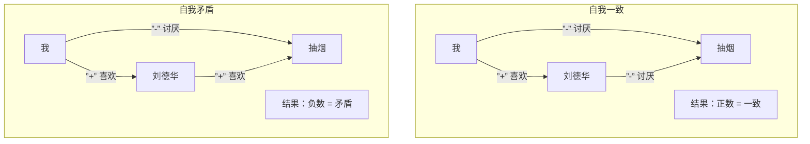
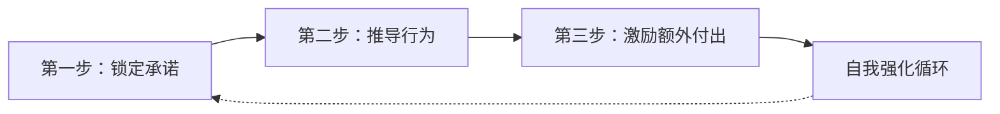

# 第19课：一致性原理

## 学习目标

- 理解一致性原理（海德平衡三角）的心理学机制
- 掌握主动承诺与被动承诺的区别与应用
- 学会通过锁定"人设"来引导对方行为
- 理解"额外付出"如何强化一致性——行为改变态度
- 警惕过度付出的危险性

## 核心概念

### 海德的平衡三角

一致性原理的核心是**海德的平衡三角**：我们的内心需要保持认知的和谐一致。当三个认知之间存在矛盾时，会产生内在压力，驱使我们修正"最薄弱"的那一边。

**计算方法**：将三角形三条边的正负号相乘，正数 = 一致（和谐），负数 = 矛盾（需要修正）

**当陷入矛盾时，人会修正最薄弱的一边**：

| 矛盾情境 | 修正方式 | 条件 |
|---------|---------|------|
| 我喜欢刘德华，讨厌抽烟，但刘德华爱抽烟 | 改变对刘德华的态度（粉转黑） | 对刘德华的感情不深 |
| 同上 | 改变对抽烟的态度（抽烟没那么糟） | 对抽烟的厌恶不深 |
| 同上 | 否认事实（刘德华没有抽烟，那是假新闻） | 对前两者都深信不疑 |

> [!TIP] 关键洞察
> 人最强大的说服永远是**自我说服**。所有的说服动力，都是那个人希望维持内在均衡，希望晚上能睡得着觉。

### 主动承诺

让对方主动说出一个承诺，从而锁定三角形的一边，然后用这个承诺去牵引其他行为。

**募款实验**对比三种模式：
- **传统模式**：直接问是否愿意听公益项目 → 18%愿继续听，其中捐款比例低
- **简单承诺模式**：先问"今天过得如何？"回答"还不错" → 33%愿继续听，其中89%愿意捐款
- **被迫承诺模式**："我想你今天应该过得不错"（替对方回答） → 15%愿继续听（产生反效果）

> [!IMPORTANT] 两个常见误区
> 1. **太急——直接问最终目标**：不应该问"你愿意996吗？"，而应该问"你愿意成为阿里人吗？"，再推导出"阿里人不会抱怨996"
> 2. **被迫承诺**：把承诺塞进对方嘴里会产生反效果，必须让对方**主动**说出承诺

### 被动承诺

从对方**既有的行为**出发，让对方意识到自己已经做出了承诺。

**万圣节实验**：
- 孩子在糖果和苹果之间选择，95%选糖果
- 在桌子上贴一行字"蝙蝠侠会怎么选？" → 选苹果的人从5%暴涨到40%
- 原理：孩子打扮成超级英雄的行为已经是一种承诺，这个海报**唤醒**了那个承诺

**葛丽去柬埔寨案例**：
- 中介没有要求葛丽承诺什么
- 中介只说："杨小姐，看得出你是个勇于跳出舒适圈的人"
- 葛丽的行为（想转行）本身就是"跳出舒适圈"的承诺
- 去柬埔寨采购机票，只是为了证明"我真的是这样的人"——不是证明给对方看，是**证明给自己看**

**服装店销售高手**：
- 顾客说"好奇来看看" → "看来您是对新东西很感兴趣的人" → 必须表现出对新款感兴趣
- 顾客说"随便看看" → "看来您是喜欢随性的人" → 必须表现得随性
- 顾客说"不买就看看" → "看来您是很知道自己要什么的人" → 必须说出自己要什么

> [!TIP] 关键洞察
> 重点永远不在**东西**上，重点在**人**身上。关键不是"糖果vs苹果"，而是"你是什么人"。

### 额外付出——行为改变态度

一旦做出了付出，行为会反过来改变态度。

**一苦思甜沙漠行**：走了那么辛苦的沙漠，如果不承认有收获，岂不是承认自己是傻蛋？所以每个人都觉得"有收获"。

**苦行僧的原理**：
- 不是因为虔诚才去苦修
- 而是苦修让他们变得更加虔诚
- 付出了那么多，如果没有佛祖，那不成傻子了吗？

**恋爱中的付出**：
- 分手后忘不掉对方，往往不是因为对方有多好
- 而是因为自己**付出太多**，忘不了自己的付出
- 越是苦恋（罗密欧朱丽叶效应），分手后越难以自拔

**家暴案例**：
- 为男友与家人决裂、远离家乡 → 如果男友是渣男，那自己就是天字第一号傻瓜
- 所以必须认为"他是爱我的，只是方式特别"
- 如果母亲说"你随时可以回来"，则更容易脱离

> [!WARNING] 关键警示
> 比起"态度改变行为"，更多的其实是**"行为改变态度"**。做出的付出越多，就会越相信这件事是对的。

## 案例分析

### 案例一：葛丽差点被骗去柬埔寨

**进程复盘**：
1. 葛丽表达想转行做房地产 → 对方说"看得出你是个勇于走出舒适圈的人"
2. 葛丽对去柬埔寨有疑虑 → 对方说"踏出舒适圈确实需要勇气"
3. 对方不解释安全问题，只反复强调"舒适圈"
4. 三角形锁死：我是跳出舒适圈的人 × 去柬埔寨是跳出舒适圈的事 × 我还没去 → 矛盾！
5. 为了保持一致，她只有一条路——去柬埔寨

**拉停的方法**：在还没付出之前解释三角形原理。一旦去了柬埔寨（付出了），三角形会自我强化——"我自愿去的，所以一定是有收获的"，然后会被要求去马尼拉、越南……

### 案例二：罗振宇"我辈中人"

在跨年演讲上，罗振宇不说"你们想成为我辈中人吗？"
而是说："你们在这跨年夜没去看烟火，选择坐在这里听演讲——这个行为本身就已经做出了承诺。你们是直面挑战、躬身入局的人，你们是我辈中人。"

这就是**被动承诺**的最高境界。

### 案例三：罗密欧朱丽叶效应

越是受反对的恋情，越坚固——因为付出了巨大的代价才在一起，这个恋爱必须"有意义"。

## 实战应用

### 一致性说服三步骤

**第一步：锁定承诺**
- 主动承诺：问出"你是不是xxx样的人？"
- 被动承诺：从你的行为可以看出"你是xxx样的人"

**第二步：推导行为**
- 你是xxx样的人，所以你会xxx（做特定行为）
- 不做就会产生自我矛盾

**第三步：激励额外付出**
- 付出越多，内在一致性越强
- 行为会反转过来改变态度

### 一致性原理的防御

了解一致性原理，也要知道如何保护自己：

1. **警惕过度标签化**：当别人给你贴"你是xxx样的人"时，思考你是否真的接受了这个标签
2. **警惕逐步升级**：当承诺被一步步推高时，问自己"回到第一步，我还会做这个选择吗？"
3. **警惕过度付出**：为某件事付出太多时，觉察自己是否因为付出而失去客观判断
4. **保持旁观者视角**："如果我朋友处在我这个位置，我会建议他怎么做？"

> [!QUESTION] 自测练习
> 你是一个健身教练。一位新学员走进来说："我想减肥，但一直坚持不下来，之前办了好几张卡都没用完。"请运用一致性原理，设计你从第一次见面到第一节课结束的引导话术。

查看答案

**参考设计：**

**第一步：锁定承诺（第一次见面）**
问开放式问题，让对方做出主动承诺：
- "您这次下定决心，是发生了什么事情让您觉得真的需要改变？"
- "看来对自己有要求的人，才会在反复失败后还愿意再来尝试。"（被动承诺——从"反复来尝试"的行为推导出"对自己有要求"）
- "您是个想要做出改变的人，对吗？" → "对"（主动承诺）

**第二步：推导行为（第一次见面）**
- "一个真正想要改变的人，其实最怕的不是辛苦，而是方法不对。"
- "我是不是可以这样理解——您这次愿意按照我们的计划来执行？" → 锁定后续配合度

**第三步：小付出（第一节课）**
- 不急着让办卡，先让他做一次体验课
- 课后不急着推销，先要求他做一件小事："今天回去，拍一下你三餐的照片发给我，我帮你看一下饮食结构"
- 这一步小付出很重要——他付出了，就会开始为自己的选择辩护

**第四步：额外付出强化**
- 如果你帮他设计了饮食建议，他照做了 → "您果然是个对自己有要求的人"
- 他每天发三餐照片 → 付出越来越多 → 越来越觉得"我来对地方了"
- 两周后，他自己就会觉得"应该继续办卡"——不是因为你说服他，而是他**自己说服自己**

**关键**：永远不要直接说"你该办卡"，而是让他通过行为和付出来自己得出这个结论。

## 下一步

- **[第17课：互惠法则](./0017-hu-hui-fa-ze.md)**：互惠法则是说服的"启动器"，一致性原理是说服的"强化器"
- **[第18课：高球策略与低球策略](./0018-gao-qiu-ce-lve-yu-di-qiu-ce-lve.md)**：低球策略中的"鼓励做出承诺"就是一致性原理的具体应用