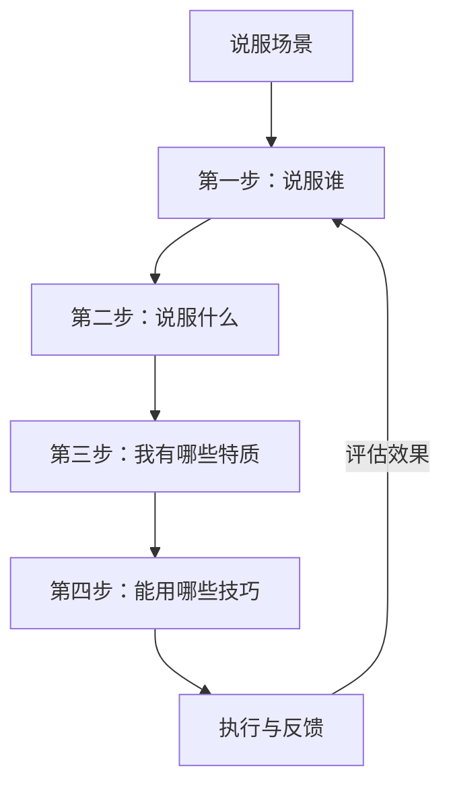
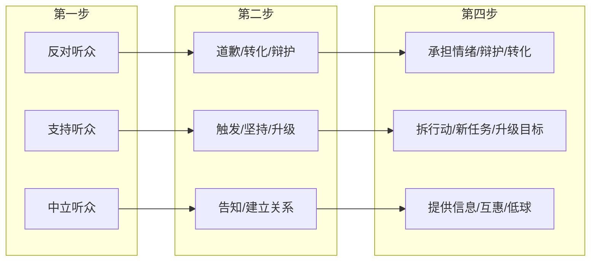

# 第20课：核心工具——说服四步骤

## 学习目标

- 掌握说服四步骤：说服谁、说服什么、我有哪些特质、能用哪些技巧
- 学会在遇到说服场景时，先判断对象和目标，再选择技巧
- 避免常见的"上来就想技巧"的错误思维

## 核心概念

在面对任何说服场景时，不要急于寻找话术或技巧。先按照四个步骤依次思考，就能让思路变得清晰有序。

### 第一步：说服谁 —— 分类听众

说服的第一步永远不是想"我要说什么"，而是想"我要对谁说"。

**三种听众类型**：

| 听众类型 | 特征 | 核心策略 |
|---------|------|---------|
| 反对听众 | 抗拒、怀疑、不认同 | 削弱抗拒、承担情绪 |
| 支持听众 | 认同、愿意配合 | 触发行动、激励坚持 |
| 中立听众 | 无知、冷漠、犹豫 | 提供信息、建立关系 |

> [!TIP] 关键洞察
> 很多说服失败的原因不是技巧不好，而是选错了说服对象。同一个场景中，你可以选择不同的说服对象——比如在家庭冲突中，你可以说服父母，也可以说服自己，还可以说服亲戚作为中间人。选对对象，事半功倍。

### 第二步：说服什么 —— 设定目标

确定对象后，要明确你的说服目标是什么。目标不同，策略天差地别。

**常见的目标类型**：

- **道歉**：不是为了辩解，而是为了修复关系
- **转化**：改变对方对某件事的看法
- **触发行动**：让对方做出某一具体行为
- **坚持行动**：让对方持续做某件事
- **升级行动**：让对方加大投入
- **预防针**：提前防止对方产生负面反应

> [!WARNING] 常见错误
> 很多人把"说服他接受新观念"作为目标，其实你需要的是"让他不要给我压力"。目标设定错了，整个过程都会很辛苦。

### 第三步：我有哪些特质 —— 评估标签

在说服过程中，对方对你的印象取决于三个核心特质：

| 特质 | 含义 | 说服优势 |
|------|------|---------|
| **专业** | 你在这个领域有知识、有能力 | 适合解释、告知、论证 |
| **诚实** | 你值得信任、不说谎 | 适合道歉、承认错误 |
| **讨喜** | 对方喜欢你、觉得你友善 | 适合建立关系、请求配合 |

这三个特质中，你至少需要占一个，否则说服会非常困难。

> [!TIP] 关键洞察
> 在父母面前，你最有利的特质是诚实和讨喜，而不是专业。子女在父母面前扮演"专家"往往适得其反——爸妈会觉得"你懂个屁"。放弃专业标签，用好你的诚实和讨喜，反而更有效。

### 第四步：能用哪些技巧 —— 选择方法

只有在明确了前三步之后，技巧才能发挥作用。

## 实战案例

**案例**：平行部门的两位领导，其中一位没经过对方同意，直接借用了对方的下属帮忙处理紧急案子，导致对方大怒。

**四步骤分析**：

1. **说服谁**：生气的那位领导（A）
2. **说服什么**：不是澄清误会，而是道歉
   - 对方真正生气的点：不被尊重、权力被挑战、人情没做到
   - 不是一句"我忘了"就能解决的
3. **我有哪些特质**：诚实和讨喜更适合这个场景，不要用专业感
4. **能用哪些技巧**：承担情绪——点出对方真正的情绪点（不被尊重），而不是轻描淡写地说"误会了"

## 练习

回想你最近遇到的一个说服困境，用四步骤重新分析：

1. 你要说服的对象是谁？（有没有其他可选对象？）
2. 你真正想要达成的目标是什么？（有没有更省力的目标？）
3. 你在对方眼中最占优势的特质是什么？（专业？诚实？讨喜？）
4. 根据以上三点，最适合的技巧是什么？

> [!QUESTION] 自测练习
>
> 妈妈希望你早点结婚，每次讨论都吵架。你很想说服妈妈接受"婚姻不是人生的必要选项"这个新观念。请问按照说服四步骤，你应该怎么重新思考这个问题？

查看答案

**第一步：说服谁**？说服妈妈。

**第二步：说服什么**？不一定非要让妈妈接受新观念。你的真正目标可能是"不要吵架"或"不要给我压力"。妈妈背后的情绪是担心你过得不好、怕你不幸福。只要你向她证明你过得很好，她的压力自然就会减轻。

所以目标可以调整为：说服妈妈相信"我现在过得很好""我已经在往这个方向努力了"。

**第三步：我有哪些特质**？作为子女，你在妈妈面前最有优势的是诚实和讨喜，而不是专业。不要用"专家说婚姻不是必需品"这种专业路线，这反而会让妈妈觉得你幼稚。

**第四步：能用哪些技巧**？考虑到目标是让妈妈安心，可以使用承担情绪（理解她的担心）+ 承诺改变（告诉她你在努力）的组合。

## 下一步

学习完四步骤框架后，接下来我们将针对三种不同类型的听众，深入学习具体的实战技巧：

- **第21课**：反对听众——澄清误会、面对质疑、观念对抗
- **第22课**：支持听众——触发行动、坚持行动、升级行动
- **第23课**：中立听众——细化分类、建立关系