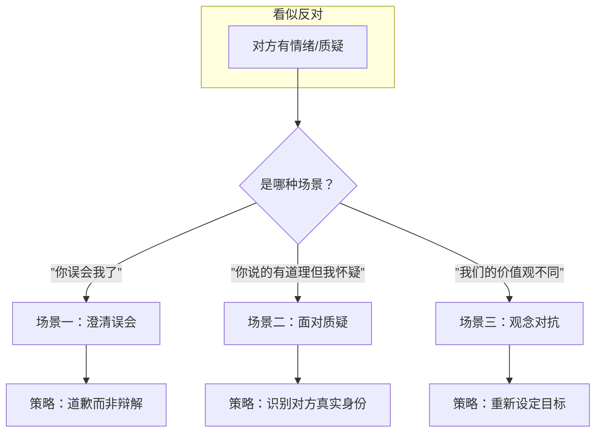
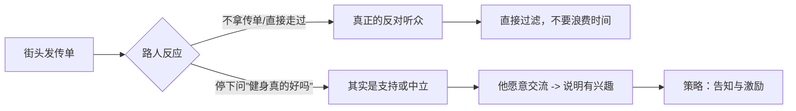
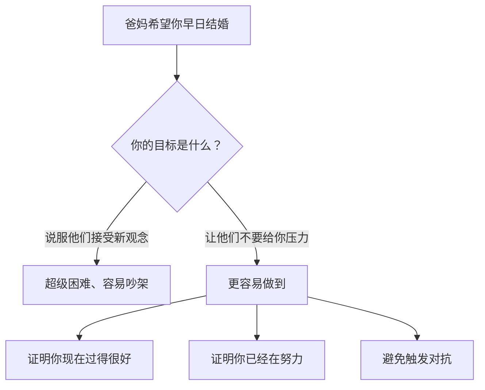

# 第21课：实战——反对听众

## 学习目标

- 区分三种反对场景：澄清误会、面对质疑、观念对抗
- 掌握每种场景的核心策略和常见误区
- 学会重新定义问题，避免陷入不必要的对抗

## 核心概念

反对听众是三种听众类型中最棘手的一种。但很多时候，你以为的"反对"并不一定是真正的反对。

### 场景一：澄清误会

对方其实误解了你的意思，你觉得只要解释清楚就好了。

**常见错误**：上来就解释"不是这样的，你误会了"。一旦你开始辩解，对方反而更生气。

> [!TIP] 关键洞察
> 不要轻易把对方的不满定义成"误会"。当你觉得这是误会的时候，说话会不自觉地理直气壮，反而让情况更糟。有时候根本就不是误会，而是你确实做错了。

**正确策略**：道歉，而不是辩解。

**道歉的三个要点**：

1. **找出真正的情绪点**：生气是第二情绪，背后一定有第一情绪（委屈、担心、不被尊重等）
2. **针对第一情绪道歉**：不要只道歉表面的事
3. **承担情绪**：让对方感觉你理解了他为什么生气

**案例**：你没经过同事同意就借用了他的下属帮忙。对方大怒。

- **错误道歉**："对不起我忘了，下次会记得跟你说。"（对方：我没说你要挖人）
- **正确道歉**："真的非常抱歉，我没有知会你就请B帮忙，这是非常不尊重人的，让你处于一个很难做人的处境。忘了不是理由，这件事本来就不该做。"（点出对方真正在意的——不被尊重、权力被挑战）

> [!NOTE]
> 生气是第二情绪。生气背后可能有：委屈、担心、失望、嫉妒、感觉不被尊重、感觉被背叛。找出第一情绪，你的道歉才能命中要害。

### 场景二：面对质疑

对方对你的产品、观点或能力提出质疑。

**常见错误**：立刻进入辩护模式，拼命解释和证明。

**关键判断**：对方真的是在质疑你吗？

**核心洞察**：愿意停下来问你问题的人，往往不是反对听众，而是支持听众或中立听众。

**为什么？**

> [!TIP] 关键洞察
> 一个会问你"保险是不是智商税"的人，恰恰是对保险有兴趣的人。真正反对的人根本不会跟你说话。把你的"疑问"从"质疑"重新定义为"好奇"，你的说服策略就会完全不同。

**业务员的核心服务**不是介绍产品，而是：

- 帮助客户发现自己的问题
- 消除客户的困惑
- 让客户更安心、减少顾虑
- 提供资讯与比较，让客户不再犹豫

> [!TIP] 关键洞察
> 价格从来不是购买的最重要因素。我们买一个东西，是因为它让我们安心、不用再花力气做比较。你提供的服务是"减轻判断压力"，而不是"证明产品最好"。

**案例**：客户问"保险是不是智商税"

- 你以为他是反对听众，其实他是好奇/犹豫/无知的中立听众，甚至是支持听众
- 策略：不要辩护，而是去了解他为什么这么问，他遇到了什么问题
- 真正遇到问题的人才是你的客户，幸福美满的人不需要你的服务

### 场景三：观念对抗

对方的价值观和你的价值观发生冲突，比如父母希望你早点结婚、接受他们的传统观念。

**常见错误**：把目标设定为"说服对方接受新观念"。

**核心洞察**：你不需要让对方接受新观念，你需要的是他不要给你压力。

**案例**：裹小脚的比喻——你不需要说服妈妈"裹小脚是封建糟粕"，你只需要向她证明"不裹小脚也能嫁得出去"就行了。关键不是观念，是结果。

**三个可替换的目标**：

| 错误目标 | 正确目标 |
|---------|---------|
| 说服爸妈接受新观念 | 证明我现在过得很好/很开心 |
| 说服爸妈不要催婚 | 证明我已经在努力找对象了（拆成100个步骤） |
| 说服他们改变想法 | 让他们不要给我压力/不要吵架 |

> [!WARNING]
> 很多人学完说服后冲突反而增加了，是因为以前会退让回避，现在觉得"打得过了"就勇于面对。但不要把每件事都搞成对抗。换个目标，可能根本不需要冲突。

**特质提醒**：在父母面前，你最有利的特质是诚实和讨喜，不是专业。子女在父母面前秀专业只会适得其反。

## 实战案例

**案例一**（澄清误会）：你忘了知会平行部门领导，直接借用了他的下属帮忙。

- 四步骤分析：
  - 说服谁：A领导
  - 说服什么：道歉（不是澄清误会）
  - 特质：诚实、讨喜（不要用专业）
  - 技巧：承担情绪——他生气是因为不被尊重、权力被挑战、人情没做到

**案例二**（面对质疑）：客户问你"保险是不是智商税"

- 四步骤分析：
  - 说服谁：客户（不是反对听众！是支持/中立）
  - 说服什么：不是辩护，而是了解他的问题和顾虑
  - 特质：诚实、专业都可以
  - 技巧：告知与激励，帮助他发现自己的问题

**案例三**（观念对抗）：爸妈催婚催回家

- 四步骤分析：
  - 说服谁：爸妈
  - 说服什么：不是"接受新观念"，而是"不要给我压力"或"相信我已经在努力"
  - 特质：诚实、讨喜（不要用专业）
  - 技巧：承担情绪（理解他们的担心）+ 承诺行动

## 练习

下次遇到有人对你表示反对时，先问自己三个问题：

1. 他真的是反对听众吗？还是他有兴趣只是有顾虑？
2. 我是不是把目标定得太难了（说服他接受新观念）？有没有更省力的目标？
3. 我在他面前最有利的特质是什么？

> [!QUESTION] 自测练习
>
> 你在朋友圈分享了一个观点，有个朋友在评论区反驳你，说你的想法太天真了。按照今天所学的，你应该如何分析这个场景？

查看答案

**首先判断**：这位朋友真的是反对听众吗？不一定。愿意在你的评论区留言的人，至少是对这个话题有兴趣的。真正反对的人可能直接就划走了。

**可选策略**：

1. 如果他平时和你关系不错，他可能只是中立听众（有不同看法），或者甚至是支持听众（关心你所以提醒你）
2. 你可以选择不回复（过滤真正的反对听众），也可以选择私聊了解他的真实顾虑
3. 目标不要设定为"说服他认同我"，而是"了解他为什么这么想"

**关键提醒**：分类是说服的开始。不要看到反对就立刻进入战斗模式。

## 下一步

掌握了反对听众的处理方法后，接下来学习如何对待支持听众——那些愿意配合你的人。如何让他们从顺从走向投入，从一时行动走向持续行动。