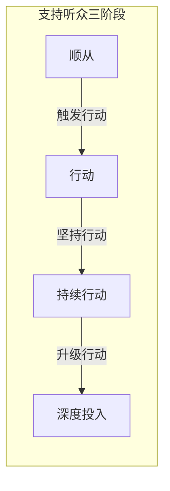
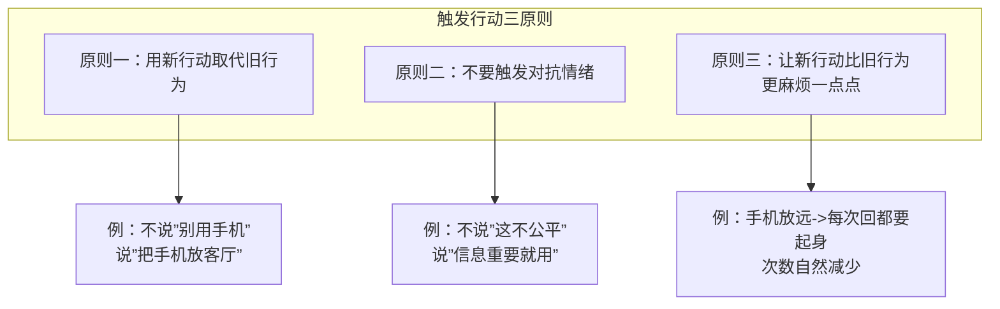
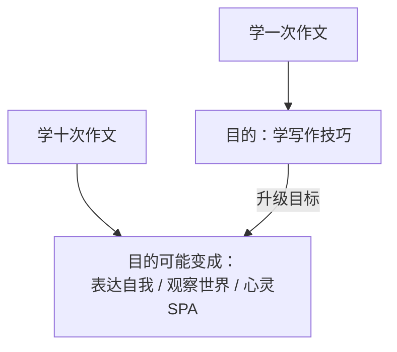

# 第22课：实战——支持听众

## 学习目标

- 掌握触发行动的三原则：用新行动取代旧行为、避免对抗、让行动变麻烦
- 理解"坚持行动"的核心秘密：用不同的内容替代重复
- 学会"升级行动"的本质：升级目标而非升级行动

## 核心概念

支持听众已经认同你，你的任务不再是说服他们"要不要做"，而是帮助他们"如何做"以及"持续做"。



### 第一阶段：触发行动

让对方从"愿意"走向"开始做"。

**三个原则**：



**原则一：用"要做什么"代替"不要做什么"**

不要说"吃饭别用手机"，这是消极的禁止（死人法则——死人也能做到的事不要用来当说服目标）。要说"我们把手机放在客厅茶几上"。

> [!TIP] 关键洞察
> 不要说服对方做一件死人都能做到的事（比如"不要用手机"）。说服的目标应该是让他去做某件新的事（比如"把手机放客厅"）。

**原则二：不要触发对抗情绪**

如果对方感觉到你的说服带有报复或抱怨的情绪（"上次我用手机你还说我呢"），他就会用"区隔否认"来辩解（"我这是在处理工作信息，不一样"），这样对话就变成了争吵。

**原则三：让行动变麻烦一点点**

不是禁止，而是增加阻力。手机放客厅，他仍然可以回信息，但每次都要走过去再走回来。几次之后，他自己就嫌麻烦了。

> [!TIP] 关键洞察
> 你不必让对方完全不用手机。只要让用手机变得麻烦一点点，他的使用频率自然会下降。这比禁止有效得多——因为没有反弹。

**额外技巧**：提供一个替代方案。比如吃饭时主动聊一个话题，当两个人开始对话时，中途去做别的事情的成本就变高了。

### 第二阶段：坚持行动

让对方持续做某件事，比如健身、学习、打卡。

**核心秘密**：没有人能靠"坚持做同一件事"而坚持下来。

```mermaid
flowchart TD
    subgraph 为什么”坚持”行不通
        A[每天做同样的事] --> B[枯燥、无聊]
        B --> C[需要强大的自律]
        C --> D[绝大多数人做不到]
    end
    subgraph 正确的做法
        E[每天做不同的事] --> F[新鲜、有趣]
        F --> G[好奇驱动]
        G --> H[自然而然地持续]
    end
```

**案例：手游的启发**

手游不会告诉你"请坚持玩我们的游戏"。它的做法是：

- 每天登录都有新的小任务
- 每天都有不同的反馈和奖励
- 每个关卡都不一样
- 每次都有新鲜感

**健身教练的启示**：

- 同一组肌肉可以用多种不同的动作训练
- 同样的有氧运动可以换跑步机、脚踏车、划船机
- 慢跑也可以换不同的路线
- 每次的挑战都不相同

> [!TIP] 关键洞察
> 你说服一个人坚持，不是在说服他做同一件事很多次，而是在说服他接受"下一件事和这一件不一样"。不同的挑战、不同的目标、不同的体验——这才是坚持的真正秘密。

### 第三阶段：升级行动

让对方从"做一次"到"做更多次"或"投入更多"。

**核心秘密**：升级的不是行动，是目标。



**案例：大语文老师的复报难题**

同样一门作文课，第一次学是为了"学技巧"，但第二次来就不能再用同样的目标了。

| 次数 | 目标 | 说服方向 |
|------|------|---------|
| 第一次 | 学习写作技巧 | 告知课程价值 |
| 第二次 | 表达自我、心灵SPA | 这里是可以表达自我的空间 |
| 第三次 | 观察世界、终身修行 | 培养观察习惯，写作是红尘中的修行 |

**如何升级目标**：

1. 问自己：写作（或任何产品）只是手段，真正的目的是什么？
2. 帮对方延伸目标：从"学技术"到"自我表达"到"观察世界"到"终身修行"
3. 正如篮球场——没有人因为"学会打篮球"就再也不去球场，因为球场不是学篮球的地方，是展示和锻炼的地方

> [!TIP] 关键洞察
> 麦当劳做汉堡的人能一路做到店长，是因为他们不觉得自己是在"煎汉堡"。第一次煎汉堡是打工，第十次煎汉堡是在"体验职场""为顾客节省时间"。目的不同，坚持的动力就不同。

## 实战案例

**案例一**（触发行动）：伴侣吃饭时总回工作信息，让你觉得不被重视。

- 四步骤分析：
  - 说服谁：伴侣
  - 说服什么：不是"禁止用手机"，而是"换一种方式处理手机"
  - 特质：讨喜（用关心替代抱怨）
  - 技巧：拆行动——"把手机放客厅茶几上，想回就随时过去回"

**案例二**（坚持行动）：健身客户进入深水区，效果趋缓，如何保持时间投入？

- 四步骤分析：
  - 说服谁：客户
  - 说服什么：不是"再坚持坚持"，而是"下一次的挑战会不同"
  - 特质：专业（设计不同的训练方案）
  - 技巧：换动作、换路线、换目标，保持新鲜感

**案例三**（升级行动）：作文课结束，希望家长复报。

- 四步骤分析：
  - 说服谁：家长
  - 说服什么：不是"再学一次同样的课"，而是"这次的目标不一样了"
  - 特质：专业+诚实
  - 技巧：升级目标——从"学习技巧"升级到"表达自我""观察世界"

## 练习

找一件你希望别人坚持去做的事（健身、学习、早睡等），试着回答：

1. 你原来是怎么说的？（"要坚持哦""加油"？）
2. 你能为他设计哪些"不一样"的挑战，让他每次都有新鲜感？
3. 如果你希望他持续投入，你能帮他"升级目标"到什么层次？

> [!QUESTION] 自测练习
>
> 你是英语培训班的老师，学生学完初级班后，很多人就不续报了。你觉得中级班和初级班内容差不多。按照升级行动的思路，你应该怎么做？

<details>
<summary>查看答案</summary>

**核心思路**：升级目标，而不是升级课程。

初级班的目标是"学会基础英语"或"通过考试"。

中级班虽然内容看起来差不多，但目标可以升级：

1. **从"学英语"到"用英语"**：初级是学，中级是用
2. **从"应付考试"到"打开世界"**：英语是看世界的窗口，中级班帮你真正用英语看美剧、读新闻
3. **从"单向输入"到"社群交流"**：中级班不只是上课，是加入一个英语爱好者社群

**关键**：第一次学英语和第二次学英语，目的是不一样的。帮学生找到升级后的目标，续报自然就顺理成章了。
</details>

## 下一步

支持听众的问题解决后，我们来面对最需要耐心的群体——中立听众。他们不反对也不支持，如何让他们从"无感"走向"有感"？