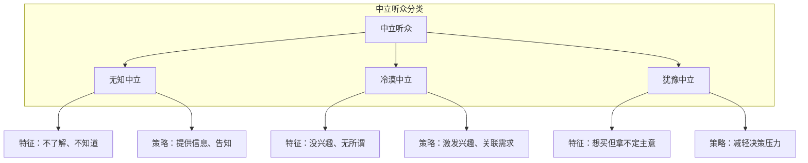
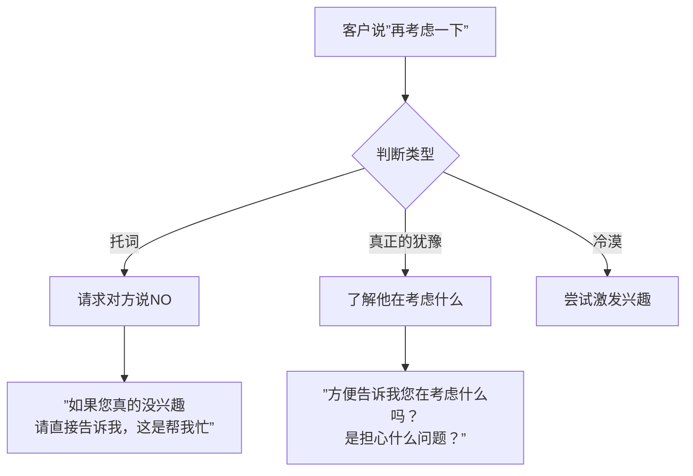
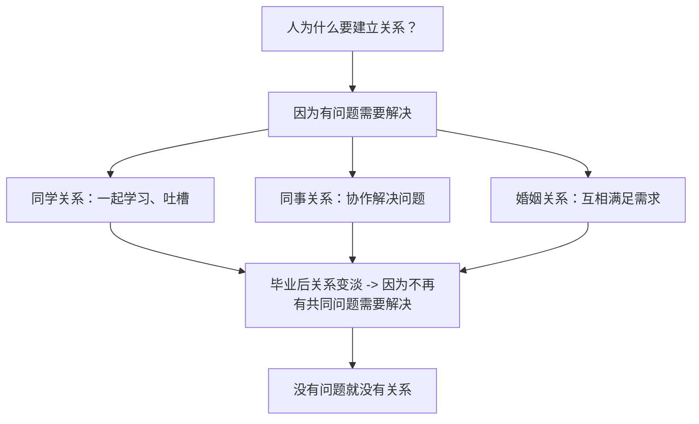

# 第23课：实战——中立听众

## 学习目标

- 掌握中立听众的三种细分类型及对应策略
- 学会在客户说"再考虑一下"时获取更多信息
- 重新理解"建立关系"的本质：解决问题才是最好的关系

## 核心概念

中立听众不是铁板一块，他们可以分为三种截然不同的类型，每种需要不同的应对策略。

### 第一种：无知中立

对方不了解你的产品或观点，因此没有立场。

**策略**：提供信息，帮助对方理解。

**注意**：提供信息≠推销产品。你的服务是"帮助对方了解"，而不是"证明我最好"。

### 第二种：冷漠中立

对方不感兴趣，觉得事不关己。

**策略**：把他的需求和你提供的东西关联起来。让他意识到"这件事和我有关"。

### 第三种：犹豫中立

对方有兴趣，但拿不定主意。

**策略**：帮助对方减轻决策压力，找出他真正在犹豫的是什么。

### 当客户说"再考虑一下"时怎么办？

这是最典型的中立场景。客户说"再考虑一下"，可能有三种情况：

1. **托词**（其实不想买，只是不好意思直接拒绝）
2. **真正的犹豫**（真的是想再想想）
3. **冷漠**（无所谓，先拖着）

**核心技巧**：无论哪种情况，你的目标都不是立刻成交，而是获取更多信息。

**技巧一：请求对方说NO**

> "如果您对这个产品真的拿不定主意，要再考虑，当然没问题。可是如果您是真的不感兴趣，那可不可以请您帮我一个忙——直接告诉我您不要。这样我就不会继续打扰您，也能知道我产品的问题出在哪里。"

这个要求的妙处在于：

- 如果对方真的说NO——恭喜你，省下了浪费时间
- 如果对方不是NO——他就必须告诉你他真正在考虑什么

**技巧二：了解真正的顾虑**

当客户真的在犹豫时，他考虑的往往不是你的产品，而是他自己的问题。

> [!TIP] 关键洞察
> 客户犹豫时，他考虑的从来不是你的产品好不好，而是**他自己的问题严不严重**。
> - 小孩在玩具店犹豫，不是在想"这个玩具好不好玩"（早就知道了），而是在想"买回去会不会被妈骂"
> - 客户犹豫买车，不是在想"车好不好"（不好就不会坐在这里了），而是在想"买了会不会常用、养车会不会太贵"
> - 客户犹豫养狗，不是在想"狗不可爱"，而是在想"万一搬家了怎么办"

所以正确的做法是：**关注人，而不是关注产品**。

> "您方便告诉我，您主要是在担心什么问题吗？也许我帮不上忙，但至少让我知道我的产品在您看来有哪些不足。"

### 建立关系的本质

很多人在学了说服后问："怎么跟地位比自己高很多的人建立深度关系？"

**核心答案**：能解决对方的问题，就是最好的关系。

> [!TIP] 关键洞察
> 我们不能说"因为建立了关系，所以能成交"。正确的顺序是"因为能成交（解决问题），所以建立了关系"。关系是结果，不是原因。

**与地位高的人打交道的两个原则**：

1. **节省对方的时间**：这是你给地位高的人最好的礼物。不要上来就套近乎、称兄道弟。直接告诉他你能帮他解决什么问题。
2. **关注他的问题，而不是你的产品**：不管对方地位多高，每个人都有自己的困扰。你能解决他的问题，就是最牢靠的关系。

> "您好陈先生，我是做XX的。如果您公司目前遇到了XX方面的问题，我们可以提供一项服务帮您解决。"

就是这样简单直接，不需要先喝酒称兄道弟。

## 实战案例

**案例一**（再考虑一下）：客户说"我再考虑考虑"。

- 四步骤分析：
  - 说服谁：客户（中立听众中的犹豫型）
  - 说服什么：不是成交，是获取信息
  - 特质：诚实+专业
  - 技巧：请求对方说NO + 了解真实顾虑

**案例二**（建立关系）：怎么跟比自己地位高的人介绍产品？

- 四步骤分析：
  - 说服谁：地位高的人
  - 说服什么：让他知道你能解决他的什么问题 - 特质：专业（节省他的时间就是最大的讨喜）
  - 技巧：直接、高效、聚焦他的问题

## 练习

下次听到"我再考虑一下"时，练习以下回应：

1. 首先判断：这是托词、犹豫还是冷漠？
2. 如果是托词，请求对方直接说NO
3. 如果是犹豫，问"您主要是在担心什么问题？"

> [!QUESTION] 自测练习
>
>
> 你是房产中介，客户看了一套房之后说"我回去考虑一下"。你知道这个小区各方面都不错，客户也表现出兴趣了。这个时候你应该怎么办？

查看答案

**第一步**：判断类型。客户表现出兴趣了，更像是"犹豫中立"，不是托词。

**第二步**：不要急着逼单，也不要不要再介绍房子有多好（他已经知道了）。

**第三步**：尝试了解他在犹豫什么：
> "王先生，我看您对这套房子挺感兴趣的。方便问一下，您主要是在顾虑什么呢？是价格方面，还是户型、位置，或者其他方面的问题？"

**他真正的顾虑可能**：
- 不是房子不好，而是担心"买了会不会降价"
- 不是不喜欢，而是担心"房贷压力会不会太大"
- 不是想再比较，而是担心"这个决定是不是太仓促了"

**了解后**，针对他的顾虑提供信息和安心的理由——这才是你作为房产中介真正提供的服务。

## 下一步

中立听众需要更多的耐心发和细致的观察。"再考虑一下"往往不是拒绝，而是一个了解对方真实需求的机会。

接下来，我们将通过一篇直播答疑精华，回顾整门课程中同学们最常问到的问题和回答，帮助你巩固所有知识点。