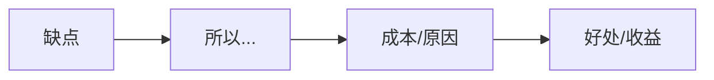
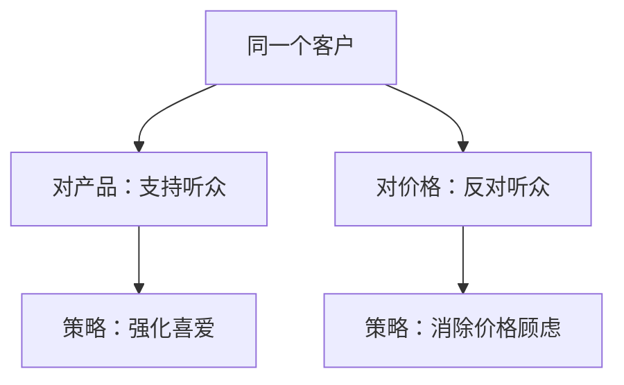

# 第24课：直播答疑精华

## 学习目标

- 巩固说服、辩论、谈判三者的权力区别
- 复习道歉的核心：承担情绪与换位思考
- 辨析辩护的三种方式及其适用场景
- 掌握转化的本质：缺点变成本，但是变所以
- 理清听众分类的逻辑：按观点分，不按人分

## 核心概念

### 一、说服 vs 辩论 vs 谈判

这是最基础也最容易混淆的概念。它们的区别在于**权力在谁手上**：

| 类型 | 权力在谁 | 示例 |
|------|---------|------|
| **说服** | 单方（被说服者自己决定） | 劝朋友戒烟、让自己早点睡 |
| **辩论** | 第三方（裁判/评委决定） | 法庭辩论、辩论赛 |
| **谈判** | 双方（各自有筹码，互相博弈） | 商务谈判、薪资谈判 |

> [!WARNING] 常见错误
> 很多同学会把"他方"和"第三方"混淆。**说服的对象可以是他人，也可以是自己**。权力在"被说服者"这一方，所以是"单方"。
>
> 另外，不要以为所有家庭冲突都只能用说服来解决。你和父母在相亲这件事上，如果你也有说"不"的权利，那也可以使用谈判——坐下来商量各自的条件。

### 二、道歉的核心：承担情绪

道歉分两步：**承担情绪** + **承诺改变**。

**承担情绪比承诺改变更重要**。

#### 如何找出对方的情绪点？

**换位思考句式**："如果我是你，我会有**什么感觉**？"

> [!TIP] 关键洞察
> 注意：不是"如果我是你，我会怎么做"——每个人的经历不同，做法可能不同。重点在于体会对方的**感受**。

**生气是第二情绪**，背后一定有第一情绪。生气的第一情绪可能包括：

- 委屈
- 担心
- 失望
- 嫉妒
- 不被尊重
- 被背叛
- 感觉被冷落（失宠）

**案例**：老客户发现新客户也享受了同样的折扣，非常生气。

- 表面的情绪：生气
- 背后的第一情绪可能是：
  - **背叛**：我以为我们之间有特殊关系
  - **嫉妒/失宠**：你对新客户也这么好，我"失宠"了
  - **担心**：产品是不是卖不出去了才打折？
  - **失望**：我以为你会对我更特别

> [!NOTE]
> 有时候客户和商家之间长期的高频接触会产生"友情错觉"。当客户发现"老朋友"和"新朋友"受到同样待遇时，会产生类似"吃醋"的情绪。不要把人和人的关系简化成纯粹的利益关系。

### 三、辩护的三种方式

| 方式 | 含义 | 适用场景 | 示例 |
|------|------|---------|------|
| **不是这样** | 区隔否认 | 事实被误解时 | "这不是偷懒，这是在做市场调研" |
| **都是这样** | 唤起同理心 | 希望对方理解你的处境 | "如果你是我，在那个情况下也会这样做" |
| **只能这样** | 不可抗力 | 外部因素导致 | "因为疫情，我们不得不延期交货" |

> [!WARNING] "都是这样"不是"比烂"
> "别人家小孩也考不到100分，所以我考不到也很正常"——这是比烂，不是"都是这样"。
> "都是这样"的核心是换位思考——**如果你是我，你也会做出同样的选择**。

**三种方式没有高下之分**，关键看场景：

- 疫情导致的延期 → "只能这样"
- 原料涨价 → "都是这样"
- 被误会动机 → "不是这样"

### 四、转化的本质

转化的核心：**缺点变成本，但是变所以。**

**示例**：

| 缺点 | 转化（因为...所以...） | 收益 |
|------|----------------------|------|
| 产品太贵 | 因为用料好所以贵 | 质量好、耐用 |
| 女朋友化妆太久 | 因为她重视这次约会 | 你很有面子 |
| 脾气暴躁 | 因为对人真诚不伪装 | 真实、坦率 |
| 专业就业率一般 | 因为分数线低 | 容易考上好学校 |

> [!WARNING] 转化不是同时说一个优点和一个缺点
> "我规划能力差，但我执行力不错"——这不是转化。这是两个不相干的品质。
>
> 转化必须建立**因果关系**：因为规划能力差，所以只能听领导的，所以执行力反而强。这才是转化。

**不规则动词表**：把坏形容词变成好形容词

- 易怒 → 真性情、坦诚、直率
- 固执 → 坚持、有原则
- 拖延 → 完美主义、深思熟虑

### 五、听众分类的黄金原则

> **听众分类是按"观点"分的，不是按"人"分的。**

一个客户对你的**产品**是支持听众（看了很久、很喜欢），但对你的**价格**是反对听众（觉得太贵）。你需要同时处理两种不同分类。

## 常见问题 FAQ

**Q1：承担情绪等于道歉吗？**

A：承担情绪是道歉的第一步。完整的道歉还需要第二步：**承诺改变**。但很多时候，当你准确说出对方的情绪时，对方的情绪就已经缓解了一大半。

**Q2：如何精准找到第一情绪？**

A：换位思考——想一想对方刚才经历了什么。比如领导因为PPT演示出错而发火，你想想他刚才经历了什么——他在客户面前丢了面子。所以第一情绪是"丢面子"+"担心公司形象受损"，而不是"你们犯错了"。

**Q3：先辩护还是先道歉？**

A：永远先承担情绪，再辩护。如果你先辩护，对方的对抗情绪会加剧。先让他感觉到"你理解我"，他才愿意听你解释。

**Q4：对不愿意交流的客户怎么办？**

A：先按中立听众处理。反对听众是有情绪的（怀疑或抗拒），不说话可能是内向或冷漠。用中立听众的方式去接触他，如果没有效果，再考虑他是否是抗拒听众。

**Q5：为什么对外人客气，对亲近的人反而脾气差？**

A：因为对亲近的人，你觉得"不需要使用说服"。你对他们的包容感到理所应当，但其实他们承担你的情绪时也很累。建议用互惠的思路——过度馈赠反而让人感受不到价值，要珍惜亲近的人为你承担的情绪。

**Q6：对方不说话，怎么判断他的情绪？**

A：从行为入手。他的穿着、动作、微表情都会透露信息。比如他穿着漫威的衣服，你可以从漫威开始聊起，引导他开口。

**Q7：被冤枉的时候，为什么还要我先承担情绪？**

A：因为你先迈出这一步。你学了说服，你知道承担情绪有多重要。你先承担他的情绪，等双方冷静下来后，他也会来承担你的情绪。总要有人先走出第一步。

## 练习

分析以下场景，运用今天学到的知识点：

1. 朋友说你的方案"太保守了不够创新"——这是质疑还是好奇？如何回应？
2. 客户对产品不满意——应该先道歉还是先解释原因？
3. 想说服自己早睡早起——这是说服、谈判还是自我管理？

> [!QUESTION] 自测练习
>
> 你在面试中被问到"你最大的缺点是什么"，请用今天学到的转化技巧，把以下缺点进行转化：
> 1. 我这个人比较固执
> 2. 我有时候太追求细节
> 3. 我说话比较直

查看答案

**关键思路**：用"因为...所以..."建立因果关系，把缺点转化成成本的代价。

1. **固执** → 因为我有自己坚持的原则和标准，所以不会轻易妥协，这确保了我交付的工作质量始终如一。
2. **太追求细节** → 因为我对结果负责，所以会关注每一个细节，这让我在项目中没有出现过重大遗漏。
3. **说话比较直** → 因为我注重效率，不喜欢弯弯绕绕，所以沟通直接，这让我能快速发现问题并推动解决。

**注意**：转化一定要有因果关系，而不是"虽然我固执，但我工作质量好"——这是两个独立的事情，不是转化。

## 下一步

恭喜你完成了说服力实战专题课的全部内容！回顾整个课程，记住最核心的一句话：**先想说服谁和说服什么，再想特技和技巧**。这个四步骤框架能帮你应对生活中的绝大部分说服场景。