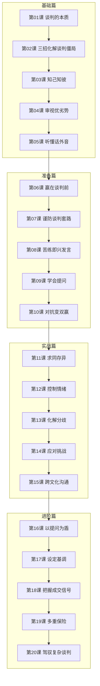

# 课程地图

```mermaid
flowchart TD
    subgraph 基础篇
        A[第01课 谈判的本质]
        B[第02课 三招化解谈判僵局]
        C[第03课 知己知彼]
        D[第04课 审视优劣势]
        E[第05课 听懂话外音]
    end

    subgraph 准备篇
        F[第06课 赢在谈判前]
        G[第07课 谨防谈判套路]
        H[第08课 苦练即兴发言]
        I[第09课 学会提问]
        J[第10课 对抗变双赢]
    end

    subgraph 实战篇
        K[第11课 求同存异]
        L[第12课 控制情绪]
        M[第13课 化解分歧]
        N[第14课 应对挑战]
        O[第15课 跨文化沟通]
    end

    subgraph 进阶篇
        P[第16课 以提问为盾]
        Q[第17课 设定基调]
        R[第18课 把握成交信号]
        S[第19课 多重保险]
        T[第20课 驾驭复杂谈判]
    end

    A --> B --> C --> D --> E
    E --> F --> G --> H --> I --> J
    J --> K --> L --> M --> N --> O
    O --> P --> Q --> R --> S --> T
```

## 学习建议

- **基础篇**是前提，建议按顺序学习，建立谈判的基本认知框架
- **准备篇**侧重谈判前的准备工作，可与基础篇交叉学习
- **实战篇**需要前两篇的知识积累
- **进阶篇**整合所有技巧，建议在完成前三篇后再学习