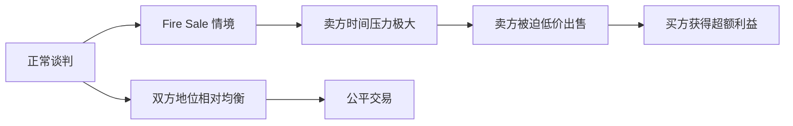
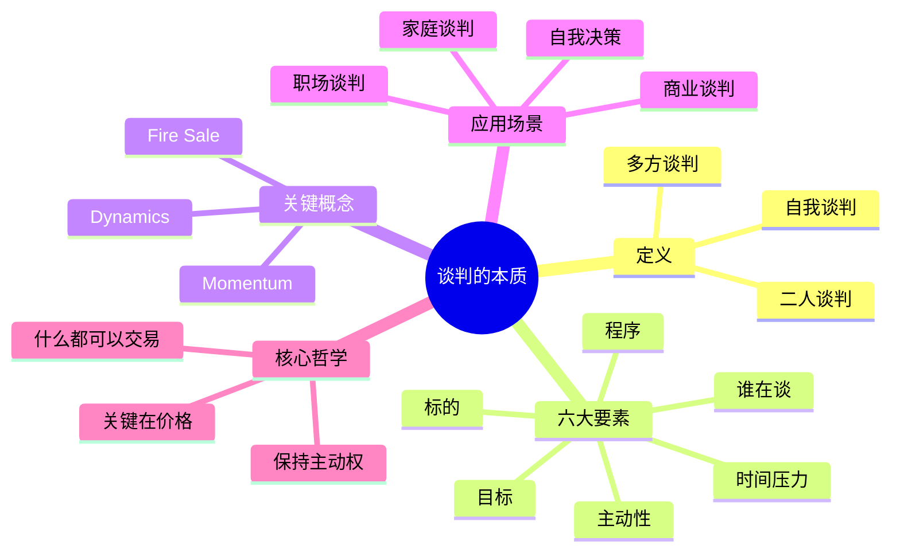

# 第01课：谈判的本质

## 学习目标

- 掌握谈判的广义定义：从自我谈判到多方谈判
- 理解谈判六大要素及其相互关系
- 认识 Fire Sale（着火拍卖）概念及其对谈判地位的影响
- 能够在日常生活和工作中识别谈判场景

## 核心内容

### 一、谈判的广义定义

很多人一提起谈判，想到的就是甲方乙方坐在会议桌前，就某一个商业标的进行讨价还价。这种理解并没有错，但它只是谈判的一种形式。从更广义的角度来看，谈判可以分为三个层次：

1. **自我谈判**：一个人自己做决定。比如，周末是外出还是在家，是考北大还是考清华，是出国还是留在国内。这些看似平常的决策过程，本质上是自己与自己谈判，最终做出一个决定。

2. **二人谈判**：最常见的谈判形式，甲方与乙方之间就某一事项进行沟通、协商，使双方的期望值趋合趋同，最终达成协议。

3. **多方谈判**：涉及三个或更多参与方的谈判，如联合国安理会。安理会有15个理事国（5个常任理事国、10个非常任理事国），每个常任理事国都有一票否决权。同样在会议室里，不同成员国的权力、作用、风格完全不同。

### 二、谈判六大要素

任何一场谈判，无论规模大小，都包含以下六大要素：

| 要素 | 说明 | 关键问题 |
|------|------|----------|
| 谁在谈 | 参与方的身份、权力、义务 | 谁是决策者？谁有否决权？ |
| 程序 | 谈判的规则和流程 | 按什么顺序谈？用什么方式？ |
| 内容标的 | 谈判的具体事项 | 谈的是什么？范围在哪里？ |
| 目标 | 期望达成的结果 | 为什么要谈？想要什么结果？ |
| 时间压力 | 紧迫性和时间尺度 | 有没有 deadline？谁更着急？ |
| 主动性 | 谈判地位的主动与被动 | 是卖方市场还是买方市场？ |

> [!TIP] 关键洞察
> 谈判不是存在于真空之中的。谈判有内涵和外延，有上下左右前后。谈判桌上的几个人并不代表谈判的全部——甲方有顾问团队、董事会、股东，甚至还有监管部门和公众舆论。你需要看到"会议桌之外"的全景。

### 三、Fire Sale —— 着火拍卖

Fire Sale 直译为"着火拍卖"，指的是当卖方被迫紧急出售资产时，往往卖不出好价钱。

这个概念的启示是：
- **对己**：避免把自己逼到着火拍卖的窘境
- **对人**：警惕对方是否在制造"着火"假象来压价
- **防范**：对方是否会做文章、做手脚，把正常交易变成 Fire Sale

### 四、谈判动力（Dynamics / Momentum）

谈判的动力是动态变化的。一场谈判可能因为以下因素而发生方向性转变：

- 准备是否充分
- 对自身优劣势的认知是否清晰
- 是否做到了"知己知彼"
- 外部环境的变化
- 时间压力的变化

### 五、谈判无处不在

谈判并不仅限于商业和政治领域。在以下场景中，谈判每时每刻都在发生：

- **家庭**：夫妻之间关于家务、消费、子女教育的"日常谈判"
- **亲子**：父母与子女关于学习、作息、兴趣班的"隐性谈判"
- **职场**：上下级之间关于工作分配、权责边界的"非正式谈判"
- **自我决策**：个人在面对人生重大选择时的"内心谈判"

> [!WARNING] 常见误区
> 很多人认为"谈判就是吵架"或"谈判就是勾心斗角"。实际上，谈判是一种中性的沟通工具。能否运用好谈判，取决于你的认知水平、准备程度和沟通技巧。

### 六、李嘉诚的谈判哲学

李嘉诚先生有一句口头禅："什么事都可以做交易，关键是个价格问题。"这句话蕴含了深刻的谈判智慧：

- 没有绝对不可谈的事，只有价格（代价）是否合适
- 如果我没有时间压力，就不必非卖给你不可
- 如果价格不合适，我可以选择另一个买家、另一个程序、另一个时间尺度
- 关键在于保持选择的自由和主动权

## 案例分析

> [!EXAMPLE] 卖房谈判：有无时间压力的天壤之别
> 
> **场景一**：你不急着卖房，可以挂在市场上慢慢谈，一年、两年都行。你有充分的主动权，可以选择出价最高的买家。
> 
> **场景二**：你必须搬到另一个城市，急需落实新住房。你的谈判地位就发生了根本性变化——虽然你有选择（可以多看几套房子），但时间紧迫性使你的主动性大打折扣。
> 
> **启示**：时间压力是谈判六要素中最容易被忽视但又最具杀伤力的因素。在进入谈判前，先问自己：谁的时间更紧迫？对方的 deadline 是什么？

### 思维练习

假设你是一家初创公司的创始人，正在与投资方进行融资谈判。请对照六大要素，分析你在谈判中的位置：

1. 谁在谈？（你的团队构成 vs 投资方的决策流程）
2. 程序是什么？（尽职调查流程、Term Sheet 条款）
3. 标的和内容是什么？（估值、股权比例、董事会席位）
4. 目标是什么？（融资额 vs 控制权）
5. 时间压力如何？（资金能撑多久？投资方的投资周期？）
6. 主动性在哪里？（有没有其他投资方在竞争？）

## Mermaid 图表：谈判全景图

## 实战练习

> [!QUESTION] 思考题
> 
> 请回顾你最近一周内遇到的任何一个"谈判"场景——哪怕是你自己跟自己做的决定。用本节课的六大要素框架逐一分析：
> 
> 1. 这个场景中有"谁在谈"？（可能是你内心的两个声音）
> 2. 程序是什么？有没有清晰的规则？
> 3. 内容标的明确吗？
> 4. 你的目标是什么？
> 5. 你有时间压力吗？
> 6. 你占据主动性还是被动性？
> 
> 完成分析后，思考：如果重新来过，你能用本节课的知识谈得更好吗？

参考思路

**示例**：决定是否接受一份新工作 offer。

1. **谁在谈**：你内心的"安稳现状"与"冒险求变"两个声音在对话，同时你也在和雇主"谈"
2. **程序**：没有固定程序，主要依靠自我权衡和与家人商量
3. **标的**：你的时间、技能、职业发展前景 vs 薪资、福利、平台资源
4. **目标**：追求职业发展和生活质量的平衡点
5. **时间压力**：offer 通常有接受截止日期，但你可以申请延期
6. **主动性**：你有选择权——可以选择接受、拒绝或继续面试其他公司。关键在于不要把自己逼到"必须接受"的 Fire Sale 境地

通过六大要素分析，你会发现原本模糊的决策变得清晰，你能更有条理地评估各个环节的优劣，做出更理性的选择。

## 本节总结

本节课我们学习了谈判的本质。谈判不是只有在会议室里才发生的正式行为，它渗透在我们生活的方方面面——从自我决策到家庭沟通，从职场博弈到商业交易。谈判的六大要素（谁在谈、程序、内容标的、目标、时间压力、主动性）构成了分析任何谈判场景的基础框架。Fire Sale 概念提醒我们要警惕时间压力带来的被动地位，而李嘉诚"什么都可以交易，关键是个价格"的哲学则告诉我们：谈判的核心不是对抗，而是找到双方都能接受的价值交换点。

## 下节课预告

谈判中难免遇到僵局。下一节课我们将学习如何运用三招巧妙化解谈判僵局，从板门店谈判到中英香港问题，看高手们如何在悬崖边上创造突破。

继续学习 [[0002-hua-jie-jiang-ju]]