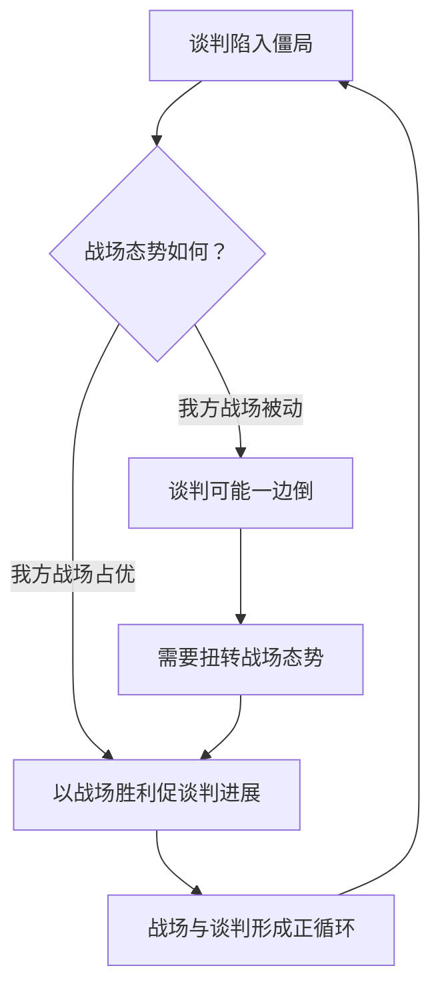
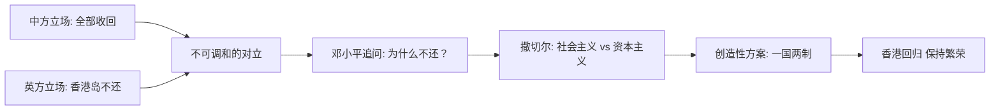
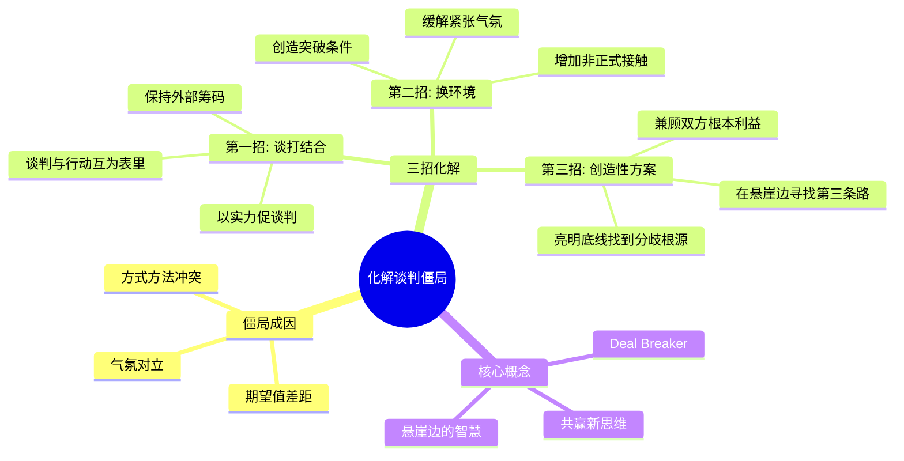

# 第02课：三招巧妙化解谈判僵局

## 学习目标

- 识别谈判僵局的三大常见成因
- 掌握化解僵局的三种核心策略：谈打结合、换环境、创造性方案
- 理解 Deal Breaker 的概念及其在谈判中的作用
- 学习在"悬崖边"寻找突破口的思维方法

## 核心内容

### 一、僵局的三大常见成因

谈判陷入僵局，通常不是单一原因造成的。以下三个因素常常同时出现：

1. **期望值差距过大**：甲方要一百万，乙方只肯出十万，双方底线相距太远，难以弥合。
2. **方式方法冲突**：一方习惯开门见山，另一方喜欢迂回试探；一方坚持先谈原则，另一方要求先谈细节。
3. **气氛对立**：谈判气氛紧张、互不信任，甚至到了"怒发冲冠、拂袖而去"的地步。

> [!TIP] 关键洞察
> 僵局不可怕，可怕的是不知道僵局因何而起。如果连僵局的根源都没找到，任何破解方案都是盲目的。

### 二、第一招：谈打结合 —— 以板门店谈判为例

1950年朝鲜战争爆发后，中美双方在板门店摆开谈判桌，主要涉及中国人民志愿军、美军、朝鲜人民军和韩国军队四方。谈判磕磕碰碰，僵局频发。

为什么经常陷入僵局？因为各方的底线和期望值差异太大。那怎么破解？

**板门店谈判的精髓**：谈判与战争互为因果、互为帮助、缺一不可。

核心逻辑：谈判桌上谈不拢，战场上见分晓。如果用打仗来促谈判，战场上的胜负直接影响谈判桌上的筹码。如果你只在谈判桌上谈，却在战场上受制于对方，谈判就会一边倒。

### 三、第二招：换环境 —— 基辛格与上海公报

1972年，中美就上海公报进行谈判。中方立场清晰明确，尤其是在台湾问题上——一个中国原则是红线中的红线。美方虽然希望打开中美关系的大门，但在原则性问题上总有自己的算盘。

谈着谈着，双方立场不可弥合，眼看就要不欢而散。

**周恩来的破局之举**：安排美方去杭州访问。

为什么换环境有效？

1. **缓解紧张气氛**：从对立性的谈判氛围换到山清水秀的环境中，双方更加冷静
2. **增加非正式接触**：在非正式场合，双方可以通过更自然的交流更好地了解对方
3. **创造共性**：优美的环境和轻松的氛围有助于建立共同的好感和信任基础
4. **找到突破点**：换个脑子、换个思路，更容易发现新的解决方案

最终的关键突破是基辛格提出的"台湾海峡两岸"这个中性表述，既避开了"中华人民共和国"的称谓，也避开了"中华民国"的称谓，使双方各退一步，打破僵局。

> [!WARNING] 换环境的误区
> 换环境不是逃避问题，而是为解决问题创造更好的条件。如果在杭州只是游山玩水而不思考如何突破，换环境就失去了意义。换环境的目的是"换脑子"，而不是"丢问题"。

### 四、第三招：创造性方案 —— 邓小平与香港问题

1980年代，中英就香港问题进行谈判。双方立场截然对立：

- **中方立场**：1997年6月30日午夜，香港（包括香港岛、九龙、新界）必须全部归还中国
- **英方立场**：新界租约1997年到期可归还，但香港岛是永久割让，不能归还

这是一个绝对的僵局。撒切尔夫人亮出了英国的底线，但这个底线是中国绝对不能接受的。

邓小平的回应掷地有声："如果到1997年香港还不回归中国，那中国政府就是满清政府，我就是李鸿章。"

**悬崖边的智慧**：双方亮明底牌后，发现立场不可弥合。这时邓小平展现出了非凡的智慧和勇气。他追问撒切尔：你说香港岛不还，究竟是什么原因？撒切尔回答：因为中国搞社会主义，香港搞资本主义。

社会主义和资本主义看起来水火不容，但邓小平说：问题解决了。香港继续搞资本主义，**五十年不变**。

这就是 **"一国两制"** ——一个创造性的解决方案，打破了看似不可化解的僵局。

> [!TIP] 关键洞察
> 在谈判中，双方亮明底线后，如果仍然对立，你还有两个选择：一是谈崩，二是在悬崖边上找到创造性的第三条路。一国两制就是第三条路的经典范例。它既捍卫了国家主权和领土完整这一根本利益，又提供了足够的灵活性使问题得以解决。

### 五、理解 Deal Breaker

**Deal Breaker**（交易杀手）是指那些一旦触发就会导致谈判完全破裂的底线问题。

在谈判中，你需要做到：

1. **探索对方的底线** — 了解什么条件是对方绝对不能接受的
2. **明确自己的底线** — 知道哪些利益是不能牺牲的
3. **在底线之上保持灵活** — 在不牺牲根本利益的前提下，尽可能适应对方的合理要求
4. **警惕"伪底线"** — 有些底线是谈判策略，有些才是真正的 Deal Breaker，需要分辨

### 六、悬崖边的智慧

谈判经常会走到悬崖边上——双方怒目相向，准备拂袖而去。但在这一瞬间，如果你有更大的智慧，能够：

- 让双方平静下来
- 先等一等、喝杯茶或咖啡
- 换一种心态、换一种思路
- 寻找摆脱僵局、克服僵局的突破口

最终可能创造出共赢的新局面。

## 案例分析

> [!EXAMPLE] 板门店谈判：谈打结合的经典实践
> 
> 在朝鲜战争谈判中，"谈"和"打"不是两个孤立的过程，而是一个硬币的两面：
> 
> - **谈判顺利时**：战事消停，双方坐下来认真谈
> - **谈判陷入僵局时**：战事加剧，用战场胜负来影响谈判筹码
> - **本质逻辑**：谈判桌上的底气来自战场上的实力
> 
> 这对商业谈判的启示是：谈判之外的"战场"同样重要。如果你在谈判之外没有制衡对方的筹码，谈判桌上的话语权就会大打折扣。比如在商业合作中，如果只有一家供应商可选，你的谈判地位就很弱；如果你有多个备选方案，你的"战场"就宽广得多。

## Mermaid 图表：化解僵局的三招

## 实战练习

> [!QUESTION] 思考题
> 
> 假设你是一家科技公司的采购经理，正在与一家关键芯片供应商进行年度合同谈判。对方突然在谈判桌上提出涨价30%，否则停止供货。你知道对方是市场上唯一能满足你技术要求的供应商（至少在短期内如此）。
> 
> 请运用本课学习的知识：
> 
> 1. 分析你面临的僵局属于哪种类型（期望值、方式方法、气氛，还是综合型）？
> 2. 你可以运用"谈打结合"的思路吗？你的"战场"在哪里？（提示：除了这家供应商，还有没有其他可以施加影响的方式？）
> 3. 如何通过"换环境"来缓解当前的紧张气氛？
> 4. 如果双方亮明底线后仍然对立，有没有可能找到一个"一国两制"式的创造性解决方案？

参考思路

1. **僵局类型**：主要是期望值差距（价格）、兼有气氛对立（对方用"停止供货"施压）
2. **谈打结合**：你的"战场"包括——寻找替代供应商的技术方案、自研备选方案、调整产品设计降低对这颗芯片的依赖、与对方其他业务部门建立联系施加影响。即便这些"战场"需要时间，但让对方知道你正在布局，就能改变谈判态势
3. **换环境**：暂停正式谈判，改为非正式的午餐或茶歇交流。不谈具体价格，先谈行业趋势、双方长期合作关系、未来的技术路线图。在轻松的氛围中重新建立互信
4. **创造性方案**：可以考虑——签署长期框架协议但价格分阶段调整；用更大的采购量换取价格优惠；调整付款条件降低对方资金压力；或探索技术合作等其他价值交换方式。关键是不在"涨价30%"这个单一维度上做零和博弈

## 本节总结

本节课我们学习了谈判僵局的成因和化解方法。僵局不可怕，它是谈判中的常态。关键在于识别僵局的根源，并有策略地应对：

- **第一招：谈打结合** — 谈判之外要有制衡力量，让谈判桌内外形成互动
- **第二招：换环境** — 通过环境的改变来缓解气氛、创造突破条件
- **第三招：创造性方案** — 在悬崖边上找到第三条路，兼顾双方的根本利益

中英香港问题的"一国两制"方案告诉我们：当双方亮明底线后，如果仍然对立的局面看似无解，创造性的思维往往能打开全新的局面。

## 下节课预告

谈判的基础是信息和认知。下一节课我们将学习如何做到"知己知彼"，深入理解自己和对手，掌握谈判中的信息优势。

继续学习 [[0003-zhi-ji-zhi-bi]]