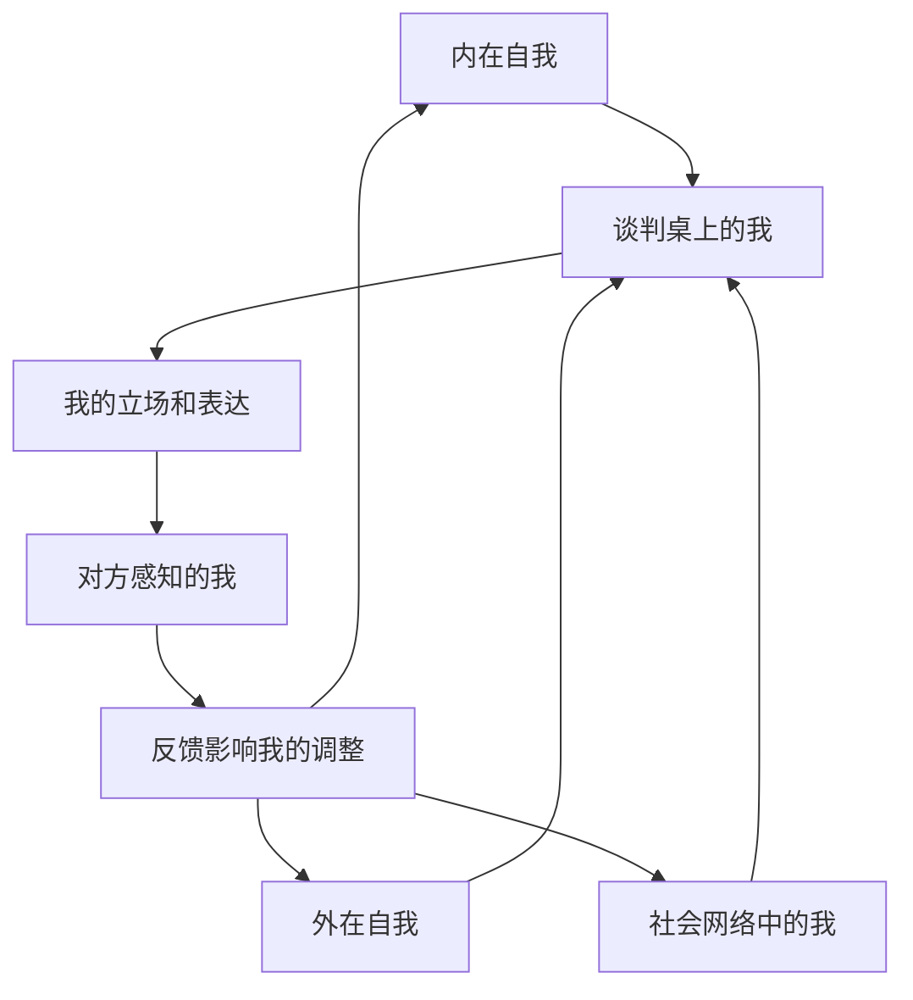
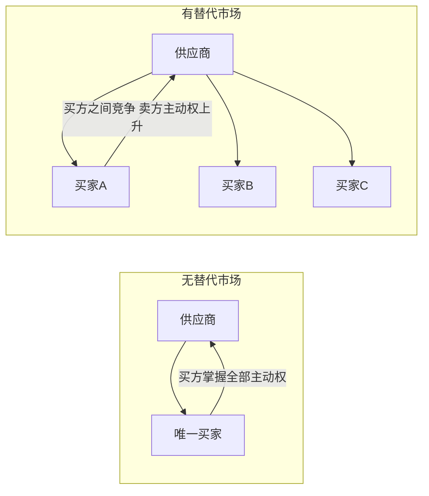
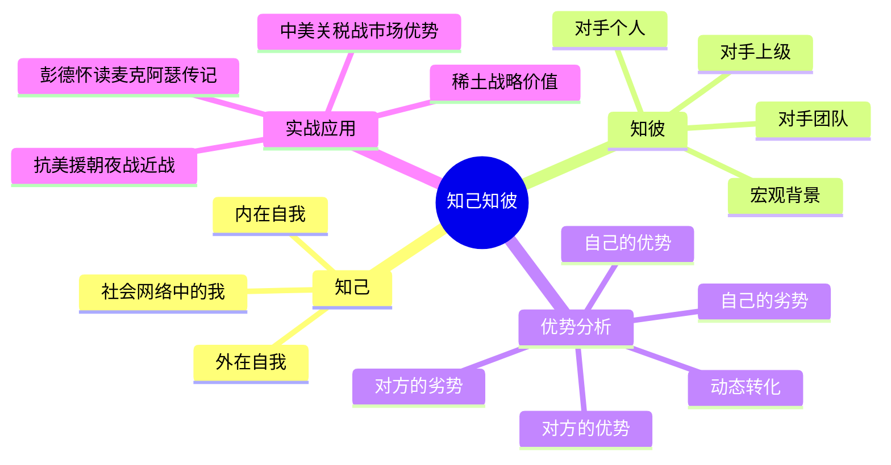

# 第03课：谈判中如何做到知己知彼

## 学习目标

- 理解"知己知己"的概念：内在自我与外在自我的区别
- 掌握"知我"的三层含义：自我、社会网络中的自我、谈判桌上的自我
- 学习"知彼"的四个层次：对手个人、团队、上级、背景
- 运用优势和劣势分析框架来评估谈判地位

## 核心内容

### 一、"知己"的三重境界

很多人认为"了解自己"是再简单不过的事情。高老师指出：错。往往你自己不知道"己"，或者你知道的"己"并不是真正的"己"，甚至不是此时此刻的"己"——因为"己"本身也在变化。

**第一重：知己 -- 内在自我与外在自我**

我们有一个内在的我，有一个外在的我。在外面与大家见面的"我"，和在家里关起门来的"我"，和在书房里的"我"是不一样的。同样一个人，在不同的场合有不同的表现、不同的想法、不同的呈现方式。

**第二重：知己知己 -- 知道"我的我"**

"不仅要知己，还要知己知己"——不仅要了解自己，还要知道自己对自己的了解是否准确。这种自我认知的元认知能力是谈判高手的必备素养。

**第三重：知我 -- 社会网络中的我**

人不是单独存在的，而是存在于一个社会网络之中。你有家庭、老师、同学、上级、同事，有社会的一面。所有这些因素都会汇聚到谈判桌上的"我"。

> [!TIP] 关键洞察
> 谈判桌上的"我"不是孤立的。你需要清楚地知道：此时此刻，是哪一层面的"我"在说话？是内在的我在坚持原则，还是外在的我在维护形象，还是社会网络中的我在顾及多方利益？只有分清楚这些层次，你才能真正做到"知己"。

### 二、"知彼"的四个层次

了解对方绝不是了解对方一个人就够了，"知彼"需要分层深入：

| 层次 | 内容 | 关键问题 |
|------|------|----------|
| 对手个人 | 性格、风格、习惯、特长、弱点 | 他是什么样的人？他的决策风格是快还是慢？ |
| 对手团队 | 团队构成、内部分歧、决策机制 | 他有谁在支持？团队内部意见一致吗？ |
| 对手上级 | 他的上级是谁？有什么态度和想法？ | 他的老板要什么？他有决策权还是需要请示？ |
| 宏观背景 | 历史、地理、政治经济环境、文化传统 | 更大的局势是什么？有哪些外部因素在影响他？ |

### 三、案例：彭德怀读麦克阿瑟传记

在抗美援朝战争中，"知彼"的差距决定了战场的走向。

**麦克阿瑟**：美国远东司令部司令，二战英雄，在日本当"太上皇"。但他根本不知道他的对手是谁——他以为中国人民志愿军只是"中国的小分队"来阻击美军。直到被杜鲁门总统解雇，他都不知道志愿军的领导是谁。

**彭德怀**：在他的床头柜上放着两本书——都是中文翻译的麦克阿瑟传记。他一边打仗，一边每天晚上仔细阅读，深入了解对方的将领是谁、性格如何、特征怎样、常用的手段是什么。

这就是"知己知彼"的差距。彭德怀不仅在了解麦克阿瑟个人，他还在了解麦克阿瑟背后的杜鲁门总统，了解整个东西方冷战的国际大背景。

### 四、优势分析：钢多 vs 气多

认清对手之后，更要认清自己的优势和劣势。毛主席对抗美援朝形势的分析堪称经典：

- **美国的优势**："钢多"——海军优势、空中优势、坦克大炮、钢铁洪流
- **中国的优势**："气多"——意志力、战斗精神、不怕牺牲

但"气多"不能只停留在口号层面，必须转化为具体的作战策略：

- **不打白天，打夜战**：白天有美国空军的轰炸优势，晚上才是我们的主场
- **不打远战，打近战**：远战对方有大炮坦克，无法近身；近战才能发挥我们的优势
- **不打空战，打突袭**：双腿跑过敌人的汽车轮子和坦克履带

> [!WARNING] 常见误区
> 分析优势时，最忌讳的是"我有优势"这种笼统的自我安慰。真正的优势分析要具体到"在什么条件下、针对什么场景、用什么方式"。同样的"气多"，在白天远战中是劣势，在黑夜近战中才是真正的优势。

### 五、现代案例：中美关税战

2025年4月，美国发动对华关税战。在这场谈判博弈中，中国的"知己知彼"体现在哪些方面？

#### 中国的优势分析

**优势一：市场优势**

中国拥有庞大的消费市场。以大豆为例：

- 美国大豆质量好、产量大，中国市场又特别适合美国大豆
- 如果没有政治干预，美国大豆最理想的市场就是中国
- 但美国对中国打贸易战，中国可以**不买美国大豆**

特朗普曾希望其他国家来购买美国大豆，但世界上没有任何一个国家有中国这么大的市场需求量。当中国不买美国大豆时，美国农民就面临巨大的销售困境。

**优势二：替代来源**

中国不是只有美国一个供应商：

- 大豆：巴西也产大豆，阿根廷也产大豆
- 有了替代来源，中国就有了谈判的主动权

**优势三：稀土优势**

- 中国稀土储量世界第一，品类最齐全
- 更重要的是，中国拥有稀土分离和精炼的核心技术和专利
- 从隐形战斗机到半导体芯片，高科技产品都离不开稀土
- 美国对中国制裁芯片，中国可以限制稀土出口——"以其之道，还治其之身"

#### 替代市场的概念

替代市场（Alternative Market）是谈判中的重要筹码。如果你只有一个买家，你的谈判地位就很弱；如果你有多个选择，你就有了主动权。同样，如果你只有一个供应商，你很被动；如果你有替代供应商，你的谈判地位就大大提升。

## 案例分析

> [!EXAMPLE] 大豆谈判中的"知己知彼"
> 
> 美国大豆出口协会会长在进博会上与高老师讨论：美国大豆最理想的市场就是中国，中国市场最欢迎的大豆产品就是美国的。
> 
> 但当中美关系紧张时，中国可以利用：
> - 替代供应源（巴西、阿根廷大豆）
> - 庞大的国内市场作为谈判杠杆
> - 农民选票对美国政治的影响力（中期选举）
> 
> 而美国在没有充分评估自身劣势的情况下发动关税战，最终发现自己对"知彼"做得远远不够。
> 
> **启示**：知己知彼不是一次性工作，而是贯穿整个谈判过程的持续工作。对方的优势可能在谈判过程中变成劣势，你的劣势也可能通过策略变成优势。

## Mermaid 图表：知己知彼全景

## 实战练习

> [!QUESTION] 思考题
> 
> 选择一个你即将面临或正在面临的谈判场景（可以是求职面试、薪资谈判、商业合作、家庭决策等），完成以下分析：
> 
> 1. **知己**：列出你的三层"我"——内在的你自己怎么看这件事？外在的你给别人什么印象？你的社会网络中谁在影响你？
> 2. **知彼**：列出四个层次——谈判对手的个人特点是什么？他的团队（如果有）情况如何？他的上级（决策链）是谁？宏观背景中有哪些因素影响他？
> 3. **优劣势**：列出你和对方的优劣势清单。然后问自己：这些优劣势是绝对的吗？有没有可能在特定条件下转化？
> 4. **替代方案**：你是否有替代方案（BATNA）？对方的替代方案是什么？谁的替代方案更强？

参考思路

以**求职薪资谈判**为例：

1. **知己**：内在的我认为自己值多少钱（基于能力和贡献）；外在的我需要表现得自信但不自负；社会网络中的我——有家人对我的期望、有前同事的薪资作为参照系

2. **知彼**：
   - 对手个人：HR的谈判风格如何？是温和型还是强硬型？
   - 对方团队：用人部门经理对候选人有什么期望？HR和用人部门之间意见一致吗？
   - 对方上级：最终的薪资审批权在谁手里？审批流程是怎样的？
   - 宏观背景：当前行业人才市场是供过于求还是供不应求？公司的招聘预算是否紧张？

3. **优劣势**：你的优势是某方面的稀缺技能（相当于"稀土"），劣势是经验年限不够（相当于"钢少"）。但如果岗位更需要创新和活力而非资历，劣势就不是劣势

4. **替代方案**：你有其他面试机会吗？（替代市场）公司有其他候选人吗？（对方的替代市场）谁的替代方案更强直接决定了谈判地位

## 本节总结

本节课我们学习了"知己知彼"在谈判中的深刻含义。"知己"不是简单了解自己，而是要理解内在自我、外在自我和社会网络中的我三重维度。"知彼"同样需要从个人、团队、上级和宏观背景四个层次逐层深入。

彭德怀读麦克阿瑟传记的故事告诉我们：了解对手不是可有可无的锦上添花，而是决定谈判成败的关键因素。毛主席对"钢多气多"的分析则展示了如何在实际情境中客观评估自身优劣势，并找到将劣势转化为优势的具体路径。

中美关税战中的市场优势和稀土优势提醒我们：替代方案（替代市场和替代供应）是谈判中最重要的筹码之一。你的选择越多，你的谈判地位就越强。

## 下节课预告

知己知彼之后，如何审视自己的优劣势？下一节课我们将学习如何正确审视谈判中的优劣势，从挪威与丹麦的北海划界谈判中领悟劣势变优势的转化之道。

继续学习 [[0004-shen-shi-you-lie-shi]]