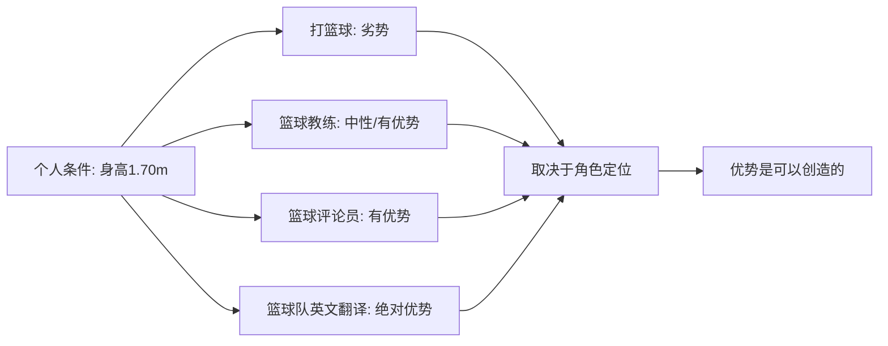
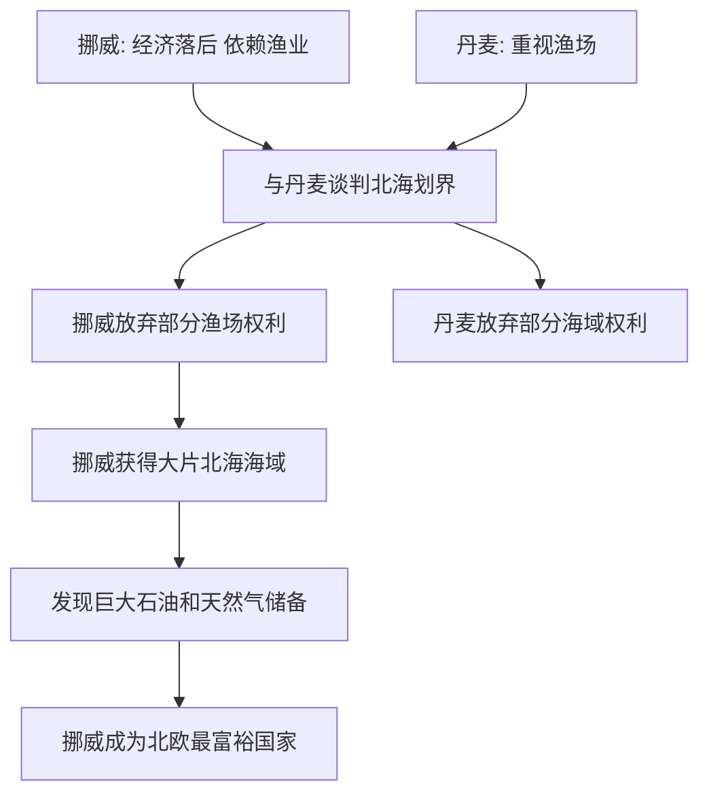
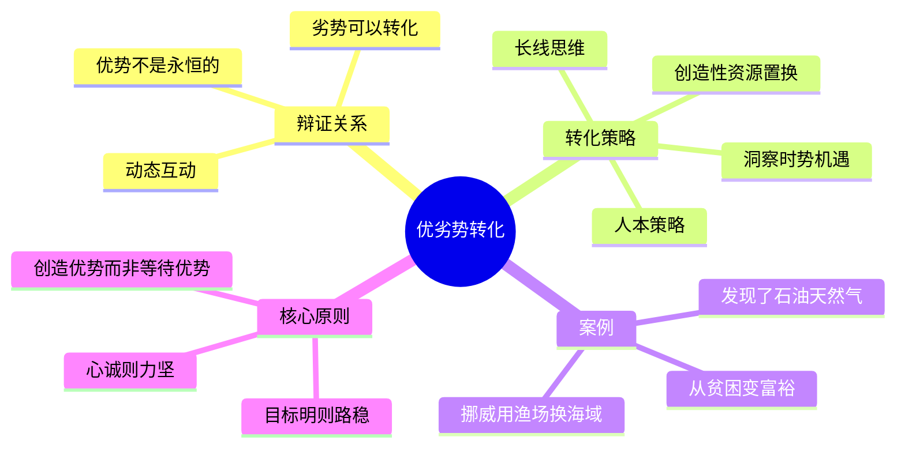

# 第04课：正确审视谈判优劣势

## 学习目标

- 理解优势和劣势的辩证关系：优势不是绝对的、永久的
- 掌握劣势变优势的转化技巧
- 学习挪威与丹麦北海划界谈判的核心经验
- 能够从个人层面到国家层面进行优劣势分析

## 核心内容

### 一、优势与劣势的辩证关系

很多人以为优势就是优势，劣势就是劣势，二者界限分明、不可逾越。这种认知是谈判中最大的陷阱之一。

**核心观点**：优势不是刻在石头上的。优势要靠你自己去奋斗出来、创造出来。优势本身也是动态的、互动的。

> [!TIP] 关键洞察
> 优势和劣势之间的关系是辩证的。今天的劣势，可能因为一个巧妙的选择变成明天的优势。今天的优势，如果固步自封，也可能变成明天的劣势。关键在于你有没有发现转化的时机和创造转化的能力。

### 二、个人层面的优势分析

以高老师自己的例子说明：身高1米70，打篮球没有优势（最多是娱乐）。但如果做篮球教练，劣势就少了很多；做篮球评论员，反而有优势；给中国篮球队做英文翻译，绝对有优势。

同样的一个人，同一项能力，在不同的角色定位中，优势和劣势是完全不同的。

**个人优劣势分析的三个维度**：

1. **客观条件**：你拥有什么（技能、经验、资源、人脉）
2. **角色匹配**：这些条件在什么样的角色定位下才是优势
3. **意愿与目标**：你愿不愿意做这件事？做这件事对你的人生目标是否有帮助？

### 三、经典案例：挪威与丹麦的北海划界谈判

这是谈判史上最精彩的劣势变优势案例之一。

**背景**：

丹麦、瑞典、挪威三个北欧国家，长期以来强弱分明：
- 瑞典：高度发达的工业化国家
- 丹麦：经济发达，工业化程度高
- 挪威：相对落后，制造业不发达，主要靠渔业

**转折点**：

《联合国海洋法公约》制定后，各国需要划定领海、专属经济区和大陆架。挪威和丹麦之间有大量重叠区域需要谈判划分。

**丹麦的立场**：更看重渔场（盛产鱼类的海域）。
**挪威的策略**：放弃部分渔场权利，换来丹麦放弃在另一片海域的权利。

**结果**：挪威用渔场换来了北海的大片海域。

**反转**：后来挪威在换来的海域中发现了巨大的石油和天然气储备。这一发现使挪威从一个相对落后的国家一跃成为北欧最富裕的国家，甚至赶超了瑞典和丹麦。

> [!EXAMPLE] 谈判中争议的"小手段"
> 
> 事后有一种说法（虽是"八卦"但值得玩味）：挪威人仔细分析了丹麦首席谈判代表的性格特点，经常请他喝酒，把他"伺候得很好"。无论这个说法是真是假，它揭示了一个道理：谈判中，人与人之间的关系、个人偏好和情感因素，有时比纸面上的条款更能决定谈判的走向。
> 
> 当然，谈判必须在合法合规的框架内进行。这里要学习的是：优势不仅存在于你能列出多少资源，也存在于你能否洞察人性、建立良好的合作关系。

### 四、劣势变优势的转化技巧

从挪威案例中，我们可以总结出以下几种转化策略：

**1. 洞察时势，抓住机遇**

挪威几百年来的劣势（落后于瑞典和丹麦）在海洋法公约这个新变量出现时，变成了一个改变命运的机会。谈判者要有敏锐的嗅觉，识别出"新规则可能改变旧格局"的时刻。

**2. 创造性地资源置换**

挪威用"已知的、丰富的渔场"换来了"未知的、未经勘探的海域"。从短期看，挪威似乎在用"确定的优势"换"不确定的未来"。但从长期看，这一置换彻底改变了国家的命运。

**3. 人本策略**

对谈判对手的了解（性格、偏好、沟通方式）本身就是一种优势。了解对方不代表要操纵对方，而是为了更好地找到双方都能接受的方案。

**4. 长线思维**

挪威的谈判者想的不只是"今天能得到什么"，而是"今后一百年、一千年能得到什么"。谈判的格局决定了谈判的结果。

> [!TIP] 关键洞察
> 如果你想真正扭转乾坤：第一，不仅看到今天、想到昨天，一定要想到明天、想到今后一百年、一千年。第二，如果你贫困、没有优势、都是劣势，你要抓住一次机会，把自己的劣势彻底摆脱，使得你这一代、你的子孙后代真正迈上一条全新的发展道路。

### 五、优势是动态的、可创造的

从挪威案例中，我们可以总结出关于优势的几个重要认知：

1. **优势不是永恒的**：几百年的贫困和落后，可以在一次正确的谈判之后彻底改变
2. **优势可以创造**：如果你认准了一个方向，愿意用五年、十年甚至更长的时间去完成这个目标，"你没有优势的时候，你也就创造了自己的优势"
3. **心诚则力坚，目标明则路稳**：当你的意志力坚定、目标明确时，即使没有天然优势，你也能走出一条路来
4. **优势是互动的**：你的优势和价值，是在与对手的互动中体现出来的

### 六、从国家到个人的启示

| 层面 | 劣势 | 转化策略 | 新优势 |
|------|------|----------|--------|
| 国家（挪威） | 经济落后、制造也弱 | 用渔场换取海域开发权 | 石油天然气成为经济支柱 |
| 个人（求职） | 经验不足、资历浅 | 选择需要创新和活力的岗位 | 年轻和学习能力成为竞争力 |
| 个人（谈判者） | 资源少、筹码有限 | 聚焦细分领域、深耕专业 | 专业深度成为不可替代的优势 |

## 实战练习

> [!QUESTION] 思考题
> 
> 场景：你在一家中小型企业担任销售主管，要与一家大型跨国公司的采购总监谈判。对方公司规模是你的100倍，对方有完善的法务团队和供应链体系。你的优势看起来明显处于劣势。
> 
> 请运用本课的知识回答：
> 
> 1. 你有哪些对方可能没有或者不如你的优势？（提示：灵活性、速度、专注度、服务深度）
> 2. 如果把你比作"挪威"，把大公司比作"丹麦"，你能想到用什么"渔场"来换"海域"？
> 3. 你需要了解对方采购总监的哪些个人特点，以便建立更好的合作关系？
> 4. 如果你只有"今天"的视角，你可能关心什么？如果你有"十年"的视角，你的谈判策略会有什么不同？

参考思路

1. **你的隐形优势**：
   - 决策速度快（不需要层层审批）
   - 服务深度高（可以投入更多时间和精力）
   - 灵活性大（可以定制化服务方案）
   - 创始人/高管可能直接参与谈判（对方采购总监背后还有层级）

2. **你的"渔场"和"海域"**：
   - "渔场"：你在小客户市场积累的行业经验和灵活服务能力
   - "海域"：与大公司建立长期战略合作伙伴关系的可能性
   - 交换逻辑：用你的灵活性和快速响应来换取对方的稳定订单和品牌背书

3. **了解采购总监**：
   - 他的个人偏好是什么？（效率优先还是关系优先？）
   - 他的KPI考核指标是什么？（成本控制？供应稳定性？创新价值？）
   - 他面临哪些内部压力？（采购流程、预算限制、上级期望）

4. **时间维度的差异**：
   - 今天视角：这一单能赚多少钱
   - 十年视角：这段合作关系能否成为公司发展的转折点，就像北海石油之于挪威一样

## Mermaid 图表：优劣势转化模型

## 本节总结

本节课我们学习了如何正确审视谈判中的优劣势。核心结论是：优势不是刻在石头上的，劣势也不是永恒的。挪威与丹麦的北海划界谈判告诉我们：一次正确的谈判、一个创造性的资源置换，可以彻底改变一个国家、一个民族几百年甚至更长时间的发展轨迹。

在个人层面同样如此：你的"劣势"可能只是放错了地方的"优势"。关键是要找到适合的角色定位，用长线思维来看待每一次谈判机会。如果你认准了一个方向，愿意用五年、十年甚至更长的时间去完成目标，那么你没有优势的时候，就已经开始创造自己的优势了。

## 下节课预告

认识自己和对手、分析优劣势之后，我们还需要听懂对方的真实需求。下一节课我们将学习如何听懂对方的真实需求、顾虑和话外音——这是谈判中"听"的艺术。

继续学习 [[0005-ting-dong-hua-wai-yin]]