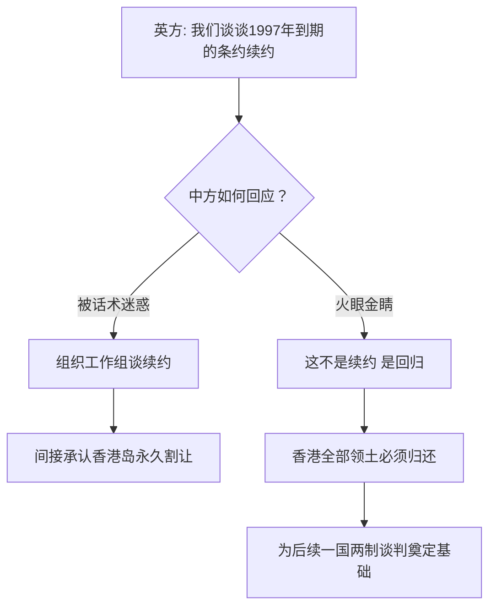
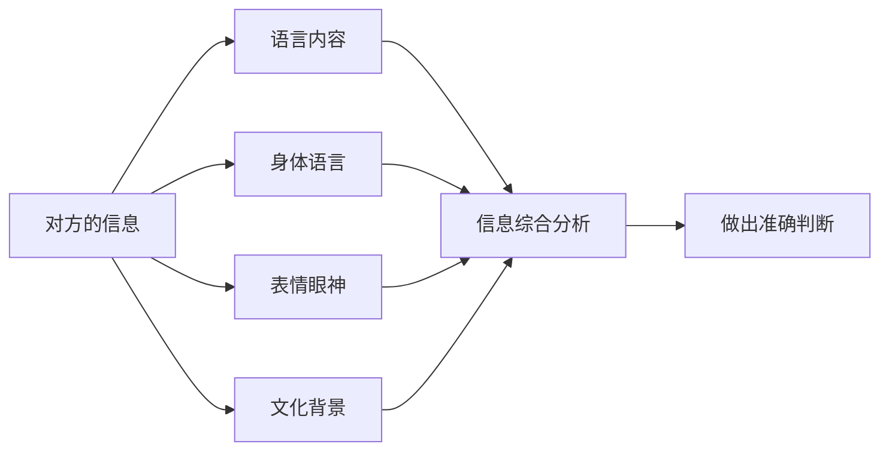
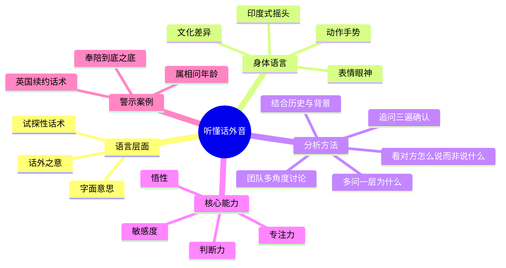

# 第05课：听懂对方真实需求、顾虑和话外音

## 学习目标

- 掌握"听话听声"的核心方法，理解语言之外的隐含信息
- 学会识别谈判中的"试探性话术"和"真实意图"
- 理解身体语言和文化差异对沟通的影响
- 提高个人"悟性"，培养洞察对方真实意图的能力

## 核心内容

### 一、语言之外的真实需求

在谈判中，对方说出来的话不一定代表他的真实想法。有时是试探，有时是策略，有时是掩饰。听懂"话外音"是谈判高手和普通谈判者的分水岭。

**核心方法**：不要被对方嘴巴里说出的话所迷惑，而是真正要辨明是非，了解他的真实用意。

> [!TIP] 关键洞察
> 有一位非常了不起的领导人，每次会见外宾后都会问陪同人员同一个问题："你觉得他刚才说的到底是什么意思？"
> 
> 不同的人会给出不同的答案——有人说是"甲乙丙"，有人说是"ABC"。领导会仔细琢磨后说："不，他说的是'一二三'。"
> 
> 同样一场会见、同样一段话，不同的人悟性不同，得出的结论完全不同。悟性，就是听懂话外音的能力。

### 二、中英谈判中的"续约"话术

这是外交史上最经典的"听音"案例之一。

**事件**：1980年代初，一位英国外交大臣要求会见中国最高领导人。按照级别，他是不够资格的，但他坚持要见。

**英国人的话**："中英之间有一个条约，到1997年就要到期了，所以我们希望能够跟中方谈该条约的续约问题。"

**普通人的反应**：既然提到了具体问题，那就组织一个联合工作组开始谈吧。

**中国领导人的火眼金睛**："这个怎么能续约？到1997年那是回归的问题，不是续约的问题。"

**真实的意图分析**：

关于香港，中英之间存在三个不同的条约：
- 香港岛：永久性割让（《南京条约》）
- 九龙：有租约
- 新界：99年租约，1997年到期

英国人说"1997年到期的条约"，指的只是新界的租约。他的真实意图是：通过谈新界的续约，来掩护香港岛和九龙的永久割让状态不被打破——如果你同意谈"续约"，就等于承认了英国对香港岛的永久占领。

这是一个精心设计的陷阱。如果中方没有看穿这个话术，组织一个工作组去谈"续约"，就上了英国人的当。

> [!WARNING] 关键警示
> 谈判中最危险的陷阱不是对方明说的要求，而是对方用"合理的建议"包装起来的真实意图。如果对方的提议听起来"很合理"、"很正常"，反而要多问自己一句：他为什么偏偏在这个时候、用这种方式、对这个人说这番话？

### 三、Read Between the Lines

英文中有一个重要的表达：Read between the lines（在字里行间阅读）。

字面上的文字是第一行、第二行、第三行，你看了自以为看懂了，实际上他真实的意思是在文字之间的空白处。你需要读出那些没有被写出来、没有被说出来的含义。

**常见的"话术"和"话外音"对照表**：

| 对方说的话 | 可能的话外音 |
|-----------|-------------|
| "我们回头再讨论这个问题" | 这不是优先事项，或者我不想现在正面回答 |
| "这个方案原则上没问题" | 细节上有很多问题 |
| "我需要跟团队商量一下" | 我无法做决定，或者我想拖延时间 |
| "你属什么？" | 他可能在问你的年龄（而不是真的对你的属相感兴趣） |
| "彼此彼此" | 含义取决于上下文，需要结合场景解读 |
| "好自为之" | 可能是警告，可能是劝诫，取决于关系和环境 |
| "奉陪到底" | "底"在哪里？不同的人有不同的理解 |

### 四、"语言的边界就是你的逻辑的边界"

这个命题包含两层含义：

1. **你的语言能力决定你的思维深度**：你的词汇量、表达方式、语言敏感度决定了你能思考多深、多精细的问题。如果词汇贫乏，逻辑的精细度就会受限。

2. **对方的语言边界也是你理解的边界**：要理解对方，你必须进入对方的语言系统和文化背景。谈判中的很多误解不是立场冲突造成的，而是语言和逻辑边界的错位造成的。

### 五、身体语言与文化差异

谈判不仅发生在语言层面，还发生在身体语言和文化的层面。

**典型案例：印度的摇头文化**

在印度，摇头不一定表示否定。印度人表示赞赏和同意时，往往会摇头。如果你不了解这一点，看到对方在摇头就以为他不同意你的提议，可能会产生严重的误判。

**关键提醒**：

- 语言本身 + 身体语言 + 表情语言 + 眼神眼光 + 动作手势 = 完整的信息
- 不要只看对方说了什么，还要看他**怎么说**
- 跨文化谈判中，对方的表达方式可能和你习惯的完全不同

### 六、提高悟性的方法

如何提高自己的"悟性"，让自己在谈判中能听懂对方的话外音？

**方法一：专注和认真**

同样一个课堂、50个学生、同一个老师教同一门课、老师说了一句话，50个同学的反应和掌握的信息都不一样。如果你专注、认真、全神贯注，你掌握的会很多；如果你马马虎虎、左耳进右耳出，你听了等于没听见。

**方法二：追问三遍的功夫**

一个真实的故事：一位德高望重的人接到一个电话，他连问三遍："你什么意思？"对方说了三遍，他还在琢磨对方到底是什么意思。连打电话都要反复确认对方的真实意图，面对面的谈判更要不厌其烦地确认理解。

**方法三：多问一层"为什么"**

在谈判中，听到对方的提议或要求后，先不要急着回答或反驳，而是问自己：

- 他为什么在这个时候提出这个问题？
- 他为什么要用这种方式表达？
- 他的真实关切是什么？
- 他有没有提到我没有注意到的问题？

**方法四：培养历史感和地理感**

中英谈判的案例告诉我们，要听懂对方的话外音，你必须了解历史（中英之间的条约背景）、地理（香港的三大区域）、政治（国际格局的变化）。没有足够的背景知识，你连"话"都听不懂，更谈不上"听音"了。

**方法五：团队多角度讨论**

给领导人做翻译和陪同的通常不止一个人。每个人听到的是同样的内容，但悟出的东西不同。通过多角度的讨论和碰撞，才能更接近对方的真实意图。

> [!TIP] 关键洞察
> 悟性不是天生的，是在实践中不断训练出来的。每一次谈判之后，花五分钟回顾一下：对方说的话有没有被我忽视的深层含义？我当时的理解是否准确？下次怎么做得更好？

## 案例分析

> [!EXAMPLE] 从"属相问话"看话外音
> 
> 场景：在一次社交活动中，一位生意伙伴问你："你属什么的？"
> 
> **表面理解**：他对你的属相感兴趣，想根据属相聊一些传统话题（比如属相的性格特征）。
> 
> **话外音分析**：他可能是在问你的年龄，但不想太直接——直接问年龄在有些文化中是不礼貌的。通过"你属什么"这个迂回的方式，他可以猜出你的年龄段。
> 
> **启示**：同一句话可能有完全不同的目的。你需要根据上下文、说话者的文化背景和你们之间的关系来综合判断。如果只停留在字面意思，你可能就忽略了他真正的意图（评估你的资历、经验与年龄的匹配度等）。

## 实战练习

> [!QUESTION] 思考题
> 
> 在一次采购谈判中，对方供应商说："你们给出的价格很有竞争力，但我们担心如果接受这个价格，可能会影响我们其他客户的定价体系。"
> 
> 请分析：
> 
> 1. 对方表面上的诉求是什么？
> 2. 对方真实的需求和顾虑可能是什么？（至少有3种可能的解读）
> 3. 如果只回应表面诉求，你会说什么？
> 4. 如果回应真实顾虑，你会怎么回应？
> 
> 请尝试用"追问三遍法"来思考这句话的可能含义。

参考思路

1. **表面诉求**：价格太低，会打乱他们的定价体系

2. **可能的真实考量**（至少三种解读）：
   - **解读A**：对方想要涨价。"影响定价体系"是谈判中常用的施压话术
   - **解读B**：对方确实有困扰，但不是在价格本身，而是在于"如何向其他客户交代"。他们可能愿意接受这个价格，但需要一个"台阶"，比如要求保密条款
   - **解读C**：对方在暗示你可以通过其他方式"弥补"差价，比如延长合同期限、扩大采购量、缩短付款周期等
   - **解读D**：对方在试探你的底价极限，看你会不会主动加价

3. **只回应表面**："这个价格已经是我们的底价了，没有办法再调整了。"——这直接堵死了继续谈判的空间

4. **回应真实顾虑**：
   - 如果对方担忧的是定价体系："我们理解。我们可以签署保密协议，确保这个价格不对外公开。"
   - 如果对方想要价值补偿："价格可以保持不变，但我们愿意将合同期限从一年延长到三年，确保你们的业务稳定。"
   - 如果对方只是在试探："我们的价格是基于长期合作的考虑，如果贵方有其他方面的顾虑，我们可以一起探讨如何在双方都能接受的框架内解决。"

**核心**：不要被对方的问题牵着走，先弄清楚问题的本质是什么。有时候对方拒绝的不是你的方案本身，而是方案带来的某个副作用。

## Mermaid 图表：听懂话外音的方法论

## 本节总结

本节课我们学习了谈判中"听"的艺术。最核心的教训是：不要被对方说出来的话所迷惑，要通过"听话听声"来辨别真实意图。中英关于"续约"谈判的经典案例告诉我们，最有杀伤力的陷阱往往包装在"正常的提议"之中。

"语言的边界就是你的逻辑的边界"——这句话警示我们：要提高谈判能力，首先要提高自己的语言敏感度和思维深度。同时，身体语言、文化背景、语境分析都是"听懂对方"不可或缺的维度。

提高悟性不是一蹴而就的，需要在每一次谈判中刻意练习：多追问、多思考、多角度分析。当你能读懂"字里行间"的含义，你就能在谈判中占据真正的主动。

## 下节课预告

恭喜你完成了前五节课的学习。在下一节课中，我们将进入谈判策略的实战部分，学习如何制定谈判计划和构建谈判框架。

继续学习 [[0006-ying-zai-tan-pan-qian]]