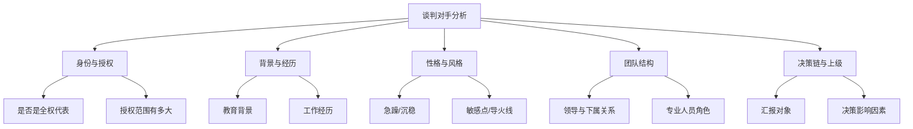
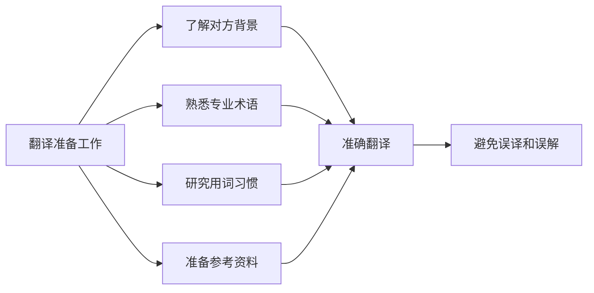

# 第06课：赢在谈判前

## 学习目标
- 理解谈判准备工作比谈判本身更重要的核心理念
- 掌握分析谈判对手的身份、授权、背景和性格的方法
- 学习通过调动多方竞争来获得谈判主动权的策略
- 了解不同国家和民族的谈判风格差异
- 掌握翻译和语言准备工作中的关键要点

## 核心内容

### 谈判的关键不在桌上，而在桌下

很多人认为谈判最关键的时刻是坐在谈判桌前、双方交锋的那一刻。这是一种误解。事实上，真正决定谈判成败的，是谈判开始之前的准备工作。准备工作做得越充分，谈判桌上的主动权就越大。

> [!TIP] 关键洞察
> 真正好的谈判，在正式坐到谈判桌前就已经有了眉目。谈判的胜负，往往在开始之前就已经决定了七成。

### 了解对手：从五个维度深入分析

在谈判开始之前，必须对谈判对手有深入的了解。以下是五个核心分析维度：

#### 1. 身份与授权

你需要搞清楚对方在组织中的角色和地位：

- 他是特命全权代表，还是一个过渡性的传话人？
- 他说的话、做出的决定是否具有最终约束力？
- 他的使命是什么？授权范围有多大？
- 如果谈判超出授权范围，他是否有渠道请示？

> [!WARNING] 常见陷阱
> 如果对对方的授权范围不了解，很容易在谈判中做无用功。你可能花了大量精力说服一个人，但他根本没有决策权。

#### 2. 教育与工作背景

了解对方的学历、专业、工作经历：

- 他的专业领域是什么？
- 他过去做过哪些重要决策？
- 他在哪些行业或政府部门工作过？

这些信息帮助你预测他的思维方式和决策偏好。

#### 3. 个人性格

每个人都有自己的风格和情绪特点：

- 他的性格是急躁还是沉稳？
- 他的"导火线"长还是短？什么话题容易激怒他？
- 他的敏感点在哪里？哪些话题需要谨慎处理？
- 他的定力和耐心如何？

#### 4. 团队结构

如果对方是一个团队来谈判：

- 谁是团队领导，谁是下属？
- 团队成员之间是什么关系？是否存在内部分歧？
- 有没有专业人员（律师、会计师）参与？他们的角色是什么？

#### 5. 上级与决策链

每个人的背后都有上级或决策影响者：

- 对方需要向谁汇报？
- 谁对他的决策有决定性影响？
- 对方的底线和灵活度受到哪些因素的制约？

### 铁道部高铁谈判：调动多方竞争的策略

中国铁道部在引进高铁技术时，采取了一个非常聪明的策略——同时邀请多个国家的公司参与谈判，包括德国、法国、日本、加拿大等国的企业。

这些公司的心态各不相同：

- **志在必得的公司**：自视甚高，不愿妥协，不愿意降价或调整方案。
- **灵活求胜的公司**：知道取胜把握不大，愿意提供附加方案，灵活度更高。
- **联合谈判的公司**：希望拉拢其他公司一起谈判，形成联盟。

铁道部的策略是利用这些公司之间的竞争关系，让他们之间形成"零和游戏"——你赢我就输——从而迫使各方拿出最好的条件。这种策略的核心是：**让对手之间竞争，而不是让自己陷入被动**。

### 不同国家民族的谈判风格

各国谈判风格差异巨大，了解这些差异是谈判准备的重要一环：

| 国家/民族 | 谈判风格特征 |
|----------|-------------|
| 某重要邻国 | 性格急躁、脾气暴躁、缺乏耐心和细腻 |
| 某"橡皮糖"型国家 | 表面什么都答应，但说一套做一套，变数大 |
| 某周边岛国 | 说是往往意味着否，说否往往意味着是，表面意思与实际意图不同 |
| 英国 | 重视程序和传统，善于利用外交辞令 |
| 美国 | 直接、目标导向，善于施压 |

撒切尔夫人1982年访华谈判香港问题是一个典型案例。她刚刚赢得了马岛战争（福克兰群岛战争），挟战胜阿根廷的余威来到北京，志气高昂、自信满满。然而中国掌握的是历史正义——英国发动的是非正义战争，签署的是不平等条约。中国坚持香港岛、九龙、新界一起收回，让英国的"续约"企图变成了零和博弈。在这场谈判中，中国对撒切尔夫人的性格、背景、政治处境做了充分研究，才能在谈判中占据主动。

### 翻译的准备工作

高志凯博士曾担任中国领导人的翻译，他分享了一个重要经验：**翻译绝不可以拿一张白纸走进会谈室**。

在每次会谈之前，翻译必须对来访的外国领导人做深入了解：

- 他的教育背景是什么？
- 他使用什么样的语言？用词有什么特点？
- 他的人生发展轨迹是什么？
- 他的性格特征如何？

只有做到这些，翻译才能准确无误地把握对方所说的话，避免误译和误解。

## 案例分析

### 案例一：中英香港问题谈判

1982年，英国首相撒切尔夫人挟马岛战争胜利之威访华，意图与中国谈判香港新界的"续约"问题。中国早已做好准备，坚持香港岛、九龙、新界必须全部收回，不接受任何形式的续约。

撒切尔夫人的策略是以"续约新界"为切入点，实际上希望维持英国对整个香港的统治。中国看穿了这一意图，以历史正义和国际法为依据，寸步不让。

这个案例说明：**了解对手的背景、性格和政治处境，才能在谈判中不被对方的声势所震慑。**

> [!EXAMPLE] 经验提炼
> 撒切尔夫人挟马岛战争余威来华，看似气势汹汹，但中国凭借充分准备和历史正义立场，在谈判中稳住了阵脚。谈判前的功课做得越足，谈判桌上的底气就越足。

### 案例二：板门店谈判

抗美援朝战争结束后，中国和美国在板门店进行谈判。中国寸土不让，原则性极强，体现了一个核心策略：**如果你不答应，我们战场上再打一仗**。

这种谈判风格背后是充分的准备——中国清楚自己的底线在哪里，也清楚美国的底线在哪里，知道在哪些问题上可以灵活，在哪些问题上必须坚持。

## 实战练习

> [!QUESTION] 思考题
> 假设你需要代表一家中国公司与一家日本企业谈判合作项目。按照本课所学的五个维度（身份授权、背景经历、性格风格、团队结构、决策链），列出你在谈判前需要调查了解的具体信息清单。其中，考虑到日本企业的谈判风格特点，你还需要做哪些额外的准备？

参考思路

1. **身份与授权**：确定对方谈判代表的职务等级、授权范围、是否需要总部批准。

2. **背景与经历**：了解对方的学历、行业经验、是否有过与中国公司合作的历史。

3. **性格与风格**：日本企业的沟通风格通常较为含蓄、注重面子和长期关系，不习惯直接说"不"，需要通过非语言信号来判断真实态度。

4. **团队结构**：日本企业往往重视集体决策（nemawashi），谈判团队成员可能有不同层级，需要关注谁是真正的决策者。

5. **决策链**：日本企业的决策过程通常较长，需要经过多层审批。了解对方的决策流程和时间周期，避免急于求成。

6. **额外准备**：邀请日方人员参加社交活动，在非正式场合增进了解；准备中日双语合同草案，避免语言理解偏差；了解日本商界的礼仪规范，如交换名片、座次安排等。

## 本节总结

"赢在谈判前"的核心思想是：**谈判的真正胜负，在双方坐到谈判桌前就已经决定了七成**。准备工作是谈判中最重要、最容易被忽视的环节。

本课的核心要点包括：

1. **深入分析对手**：从身份授权、背景经历、个人性格、团队结构、决策链五个维度全面了解对方。
2. **调动竞争机制**：在可能的情况下，引入多方竞争，让对手之间形成零和博弈，迫使各方拿出最优条件。
3. **了解文化差异**：不同国家民族的谈判风格差异巨大，必须提前研究和适应。
4. **做好翻译准备**：翻译不仅是语言的转换，更是文化和意图的桥梁，需要做大量功课。
5. **知己更要知彼**：了解自己的底线和灵活度的同时，也要了解对方的底线、压迫点和局限。

## 下节课预告

谈判中对方可能会设下各种圈套和陷阱，如何识别和防范？下一课我们将学习如何[[0007-jin-fang-tao-lu|谨防谈判套路，避免被误导]]。