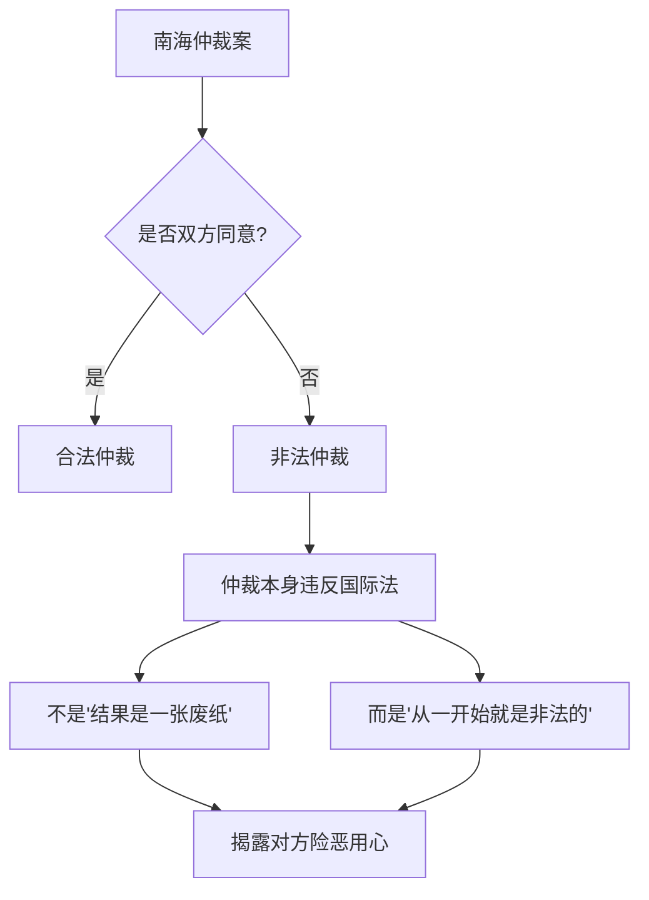

# 第07课：谨防谈判套路，避免被误导

## 学习目标
- 识别谈判中常见的圈套和陷阱类型
- 掌握合同起草权的战略意义
- 理解语言翻译中的陷阱——同一词语在不同语言中的含义差异
- 学会识破"表面标的"与"真实标的"的区别
- 了解国际法和仲裁中的程序陷阱

## 核心内容

### 对方的四种可能意图

在商务谈判中，对方的意图可以分为以下几种类型：

1. **以诚相待**：双方坦诚相见，就事论事，目标是达成双赢协议。
2. **设局钓鱼**：对方没安好心，设下圈套让你往里跳。
3. **表里不一**：表面上谈得很好，最后签的合同跟谈的内容不一样。
4. **合同埋雷**：在合同草案中埋下很多陷阱条款，等你签字后才发现问题。

> [!WARNING] 核心警示
> 谈判时既要与人为善，也要警惕对方可能与人为恶。不要天真地认为所有谈判对手都怀着善意。

### 警惕直接用英语谈判

高志凯博士特别提醒：**中方与外方谈判时，不要一开始就直接用英语谈**，尤其是英语水平不是很高的情况下。

直接用对方语言谈判的风险：

- 你可能以为自己听懂了，但实际上对方根本不是这个意思。
- 你可能在不知不觉中接受了对方用词背后的假设和前提。
- 中方对一些中文词汇的理解与英文对应词汇可能存在重大差异。

### 合同起草权之争

**谁拥有合同的起草权，谁就掌握了谈判的主动权。** 这是谈判中一个极其关键的环节。

为什么起草权如此重要？

- 起草过程中，起草方的假设、结构、程序和用词都是有选择性的。
- 起草方可以在合同条款中埋下对自己有利的预设。
- 对方要修改已经成文的草案，比从零开始起草要困难得多。

如果对方拿来一份英文合同草案，一定要警惕：这份合同中的假设和用词可能都是站在对方立场上的。

> [!TIP] 关键洞察
> 谈判开始时就要明确：过程是什么、程序是什么、分工是什么、谁来牵头起草。如果你方没有起草权，至少要保证充分的知情权和修改权。

### 语言陷阱：Acknowledge vs 承认

中美上海公报是语言陷阱的经典案例。

公报中涉及台湾问题的关键用词，中文版用"承认"，英文版用"acknowledge"。这两个词在各自语言中的含义存在微妙但重大的差异：

- **Acknowledge（英文）**：我知道有这么一回事，我认可这个事实的存在，但不代表我接受或同意。
- **承认（中文）**：既然我承认了，我就接受了，就意味着我认同。

基辛格博士精心选择了"acknowledge"这个词，使得美方可以在"知道"台湾是中国一部分这一事实的同时，不表示"接受"或"同意"。中方的理解与美方的理解从一开始就存在偏差，这也成为后来中美在台湾问题上反复摩擦的一个根源。

> [!WARNING] 语言陷阱
> 如果你跟美国人谈，直接使用英语而没有仔细核对中英文版本的含义差异，很容易造成重大误会。同一个词，在中文和英文中可能有完全不同的法律效力。

### 成语翻译的误区

中文成语在翻译成其他语言时，往往会产生误解，甚至被人故意利用：

| 成语 | 中文含义 | 翻译后的可能误解 |
|------|---------|----------------|
| 韬光养晦 | 隐藏锋芒、积蓄力量 | 对方可能理解为"暗藏心机、图谋不轨"，联想到刀光剑影 |
| 得陇望蜀 | 得寸进尺 | 直译可能让对方以为是甘肃和四川的地名，完全不知所云 |
| 好自为之 | 多为劝诫、警告 | 在不同语境下可以有多种不同的翻译，对方难以把握真实意图 |

在谈判中使用成语时，必须考虑：对方能否理解？是否需要解释？是否会被误解？

### 南海仲裁案的法律陷阱

2016年，菲律宾就南海领土纠纷提起国际仲裁，并在海牙进行所谓的"裁决"。中国的立场是：**这个仲裁是一张废纸**。

但高志凯博士指出，仅仅说"仲裁结果是一张废纸"还不够，需要从根本上揭露这个仲裁的非法性：

**仲裁与诉讼的关键区别：**

- **诉讼**：即使对方不同意，你也可以把对方告上法庭。对方不出席，可以进行缺席审判。
- **仲裁**：必须甲方和乙方双方都同意，才能进行仲裁。没有得到对方同意的仲裁，从一开始就是非法的，违反了国际法的基本原则。

菲律宾在没有得到中国同意的情况下提起仲裁，这本身就是违反国际法的。所以不能仅仅说"结果是一张废纸"，而要说"这个仲裁从一开始就是非法的"。

### 酒店名画案例：表面标的与真实标的

有一个经典案例：一个人要买一家破旧的酒店，谈判过程中显得非常积极。但后来发现，他真正看好的不是这个酒店本身，而是酒店大堂里挂着的一幅画。

这幅画已经挂了多年，别人都不知道它的真实来历。但这个人独具慧眼，认为这可能是一幅价值连城的名画。所以他表面上是买酒店，实际上是通过买酒店来获得这幅画。

这个案例揭示了一个重要问题：**怎样识别对方的真实目的？**

如果对方跟你谈表面上是张三的事，实际上是李四的事；表面上是酒店的出让，实际上是名画的处置，你该怎么办？

## 案例分析

### 案例一：中美上海公报的语言博弈

1972年尼克松访华，中美双方发表上海公报。在台湾问题上，美方使用的是"acknowledge"（认知到）而非"recognize"（承认），而中文版翻译为"承认"。

这一用词差异的影响持续至今。美方认为他们只是"认知到"一个中国的事实，而中方认为美方已经"承认"了一个中国原则。这种理解偏差导致了后来数十年的摩擦。

> [!EXAMPLE] 经验提炼
> 在跨国谈判中，每一个关键词都必须经过双方确认，确保在各自语言中的含义一致。最好请双方的法律专家共同审核双语版本，避免"同词不同义"的问题。

### 案例二：合同起草权的战略价值

某中外合资项目中，外方提供了一份英文合同草案。中方谈判代表没有仔细审核就直接以此为谈判基础。结果在合同中发现了多处对自己不利的条款——包括过高的违约金、过于宽泛的保密义务、以及不利的争议解决条款。

如果中方从一开始就坚持由自己起草或者双方共同起草，就可以避免这些陷阱。

## 实战练习

> [!QUESTION] 思考题
> 你正在与一家跨国公司谈判技术合作协议。对方提供了一份英文合同草案，其中有一条规定："The Supplier acknowledges that the Buyer owns all intellectual property rights arising from the collaboration."（供应商承认买方拥有合作产生的所有知识产权。）请分析这句话中可能的陷阱，并思考如何修改。再思考一下，如果你是买方，你会怎么设计这个条款？

参考思路

**分析可能的陷阱：**

1. "acknowledges"这个词类似于上海公报中的"acknowledge"——对方可能只是"认知到"你的主张，但并不代表"同意"或"接受"这一主张的法律效力。

2. "all intellectual property rights arising from the collaboration"（合作产生的所有知识产权）过于宽泛——没有区分"背景知识产权"（合作前各自已有的）和"前景知识产权"（合作中产生的），可能导致你方原有的知识产权也被纳入其中。

3. "所有"（all）意味着即使是你方独立研发的成果，只要与合作相关，知识产权都归对方。

**修改建议：**

- 将"acknowledges"改为"agrees"（同意）或"accepts"（接受），消除认知与接受之间的模糊空间。
- 明确区分背景知识产权和前景知识产权，约定各自保留背景知识产权。
- 约定前景知识产权的归属原则——根据双方贡献比例分配，或按功能领域划分。
- 增加"在本协议生效前已存在的知识产权不在本条款范围内"的明确规定。

**作为买方，更合理的条款设计：**

- 要求供应商明确列出其背景知识产权清单。
- 约定合作中产生的知识产权按贡献比例共有。
- 避免使用"所有"（all）这样的绝对化词汇，而是具体描述哪些知识产权归谁。

## 本节总结

谈判中"防人之心不可无"。本课的核心要点包括：

1. **识别对方意图**：对方可能是以诚相待，也可能是设局下套，必须有辨别能力。
2. **争夺起草权**：谁起草合同，谁就掌握了谈判的主动权。至少要有充分的知情权和修改权。
3. **警惕语言陷阱**：同一词汇在不同语言中含义可能完全不同（如acknowledge vs 承认），必须逐字核对。
4. **谨慎使用成语**：中文成语直译后可能被严重误解，需要在翻译时做充分解释。
5. **程序上的防线**：在国际仲裁中，程序合法性是第一道防线，必须在程序上就揭露对方的非法行为。
6. **识破真实目的**：对方声称的目标可能只是表象，真实意图需要透过现象看本质。

## 下节课预告

谈判不仅仅是准备和防范，还需要临场的表达能力。下一课我们将学习如何[[0008-ku-lian-ji-xing-fa-yan|苦练即兴发言，让谈判滴水不漏]]。