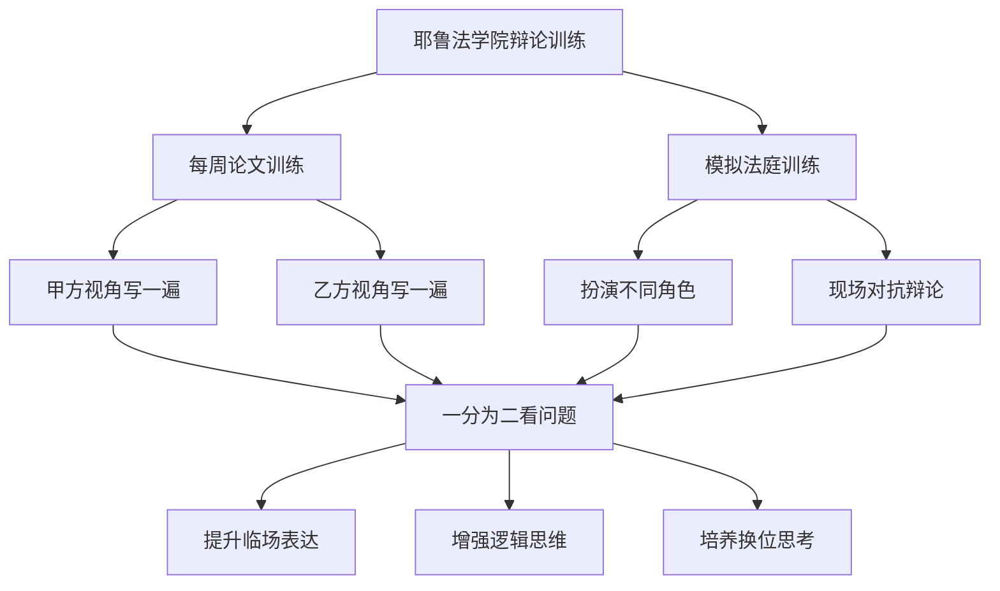
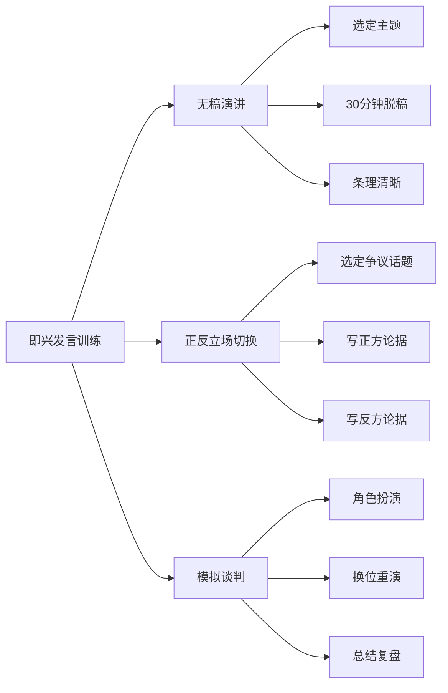

# 第08课：苦练即兴发言，谈判滴水不漏

## 学习目标
- 理解即兴发言在谈判中的关键作用
- 学习西方辩论训练体系的经验和方法
- 掌握"甲方乙方视角切换"的思维训练技巧
- 认识中国演讲训练体系的不足及改进方向

## 核心内容

### 即兴发言：谈判的核心技能

在谈判中，你需要经常发言。这种发言不是简单的"你问我答"，而是包括多种场景：

- **开场发言**：说明来意，设定谈判基调
- **观点陈述**：阐述己方立场和论据
- **即兴回应**：应对对方提出的问题和挑战
- **总结陈词**：归纳谈判要点，推进下一步

所有这些场景都要求你能够**脱口而出、滴水不漏**。你不可能每次都拿着稿子念，但又要说得有条理、有结构、有说服力。

> [!TIP] 关键洞察
> 中国目前有一个普遍的短板——很多人离开稿子就不会发言，或者有稿子也念得磕磕巴巴。要做到心里想透了一件事，没有稿子也能说清楚，这需要专业训练。

### 西方辩论训练体系

西方国家有成熟的演讲和辩论训练体系，值得借鉴。

#### 牛津大学辩论社与剑桥大学辩论社

Oxford Union（牛津大学辩论社）和Cambridge Union（剑桥大学辩论社）是世界上最著名的学生辩论组织。它们的辩论模式有严格的结构：

- 甲方和乙方分开，立场对立
- 有固定的程序和格式
- 辩手需要在规定时间内充分论证己方立场
- 观众和评委根据辩论表现投票

高志凯博士曾受邀参加剑桥大学辩论社的活动，对这套训练体系印象深刻。他强调，这种对抗性的辩论训练能够极大地提升参与者的逻辑思维和表达能力。

#### 耶鲁法学院模拟法庭训练

高志凯博士在耶鲁法学院读书时，经历了一种极其有效的训练方法：

**每周一篇论文，甲方乙方轮流写**
- 同一个事实，用甲方的角度写一遍，再用乙方的角度写一遍
- 这两个立场是对立的，非此即彼
- 你代表甲方时，要想方设法打败乙方；代表乙方时，要想方设法打败甲方
- 你整天在跟自己争辩，从两个对立的角度思考同一个问题

**模拟法庭**
- 十个人坐在一起，有人扮演法官，有人扮演陪审团
- 有人代表原告，有人代表被告
- 有人做原告律师，有人做被告律师
- 现场进行激烈的辩论

这种训练的核心价值在于：**让你学会把一件事一分为二**。任何一件事都不是绝对的，绝大部分事情都是相对的。你只有从甲方和乙方两个角度看问题，才能真正理解全局。

### 中国演讲训练体系的不足

中国的教育体系中，演讲和辩论训练相对薄弱：

1. **中小学阶段**：虽然有语文课要求学生回答问题、朗读课文，但专门的演讲训练很少。
2. **大学阶段**：除了法律专业有模拟法庭训练外，国际关系、政治学、商科等专业很少开设演讲和辩论课程。
3. **职场阶段**：大多数职场人士缺乏即兴发言的系统训练，遇到关键场合"有理说不出来"。

好消息是，北京等地的一些学校已经开始开设演讲课程，也有专门的老师提供培训。但这还不够——演讲和辩论应该被当作一门必备技能来培养。

> [!WARNING] 警醒
> 在国际舞台上，如果你只会用中文的逻辑来论证，而缺乏国际通用的辩论方法和框架，即使你有理也很难说服对方。这是中国走向世界舞台中央时必须补齐的短板。

### 如何进行有效的即兴发言训练

以下是一些可以自我训练的方法：

**方法一：无稿演讲练习**
- 面对一个空旷的房间，选定一个主题，讲30分钟
- 要求有条理、有结构、有顺序
- 从上下左右里外等多个角度把一个问题的说明白
- 目标不仅是说明白，而是说服对方

**方法二：正反立场切换训练**
- 选定一个争议性话题
- 先写一篇文章支持正方立场
- 再写一篇文章支持反方立场
- 对比两篇文章，找出各自的最强论点和最弱论点

**方法三：模拟谈判练习**
- 设定一个谈判场景
- 与同伴分别扮演甲方和乙方
- 结束后交换角色，重新来一遍
- 总结经验教训

## 案例分析

### 案例一：耶鲁法学院的论文训练

高志凯博士分享，在耶鲁法学院差不多每周都要写一篇论文。论文题目是同一个事实，但要求用甲方的角度写一篇，再用乙方的角度写一篇。这两个立场是对立的，意味着你要同时为两个对立面辩护。

这种训练的效果是惊人的——你学会了在任何问题上都看到两面性，知道了对方的论点可能会是什么，也知道了己方的论点哪里最脆弱。到了真实的谈判中，你就能够预判对方的攻击点，提前做好准备。

> [!EXAMPLE] 经验提炼
> 在准备每一次谈判时，不要只准备己方的论点。花同等的时间去思考：如果我是对方，我会怎么反驳？我会抓住哪些弱点？我会提出什么问题？这种"预演"能让你在谈判中游刃有余。

### 案例二：中国领导人的即兴发言

高志凯博士接触过很多著名人士和国家领导人。有些领导人绝对是"人中豪杰"——脱口成章，能够跟对方就任何问题滔滔不绝地进行沟通和争辩，无论是历史问题、哲学问题还是政治问题。

而有些领导人言语表达能力相对较弱，缺乏专业训练，遇到关键时候"有理说不出来"。这个对比说明：即兴发言能力不是天生的，而是可以通过训练提升的。

## 实战练习

> [!QUESTION] 思考题
> 选择当前一个具有争议性的商业话题（例如：企业是否应该要求员工每周五天回办公室办公）。按照本课学到的"甲方乙方视角切换"方法：
> 1. 列出支持"要求员工回办公室"的三个最强论据
> 2. 列出支持"允许远程办公"的三个最强论据
> 3. 找出你认为对方最可能攻击你论据的哪个弱点
> 4. 用1分钟时间，脱稿陈述其中一个立场

参考思路

**支持"回办公室"的论据：**
1. 面对面的交流更高效，能够产生"走廊上的创意碰撞"，这是远程办公无法替代的。
2. 对于新员工来说，在办公室环境中可以更快地学习和融入团队文化。
3. 企业可以更好地管理和评估员工的工作状态，减少"摸鱼"现象。

**支持"远程办公"的论据：**
1. 远程办公节省了通勤时间，员工可以有更多时间用于工作和生活，提升满意度和生产力。
2. 企业可以节省办公场地租金、水电等成本。
3. 远程办公打破了地域限制，企业可以招聘全球最优秀的人才。

**对方的攻击点预测：**
- 支持"回办公室"一方可能被攻击"缺乏数据支撑"——很多研究表明远程办公并不降低效率。
- 支持"远程办公"一方可能被攻击"忽视团队凝聚力"——长期的远程工作会弱化企业文化。

**关键技巧：**
在练习脱稿陈述时，先用一句话亮明观点，然后用"第一、第二、第三"的结构展开，最后用一句话总结。这种"观点-论证-总结"的结构是最稳妥的即兴发言框架。

## 本节总结

即兴发言是谈判中的核心技能，但很多人恰恰在这一项上存在短板。本课的核心要点包括：

1. **即兴发言不是天赋，而是可以训练的技能**。通过系统训练，任何人都可以提升临场表达能力。
2. **西方辩论训练体系值得借鉴**。牛津/剑桥辩论社的对抗式辩论、耶鲁法学院的甲方乙方视角切换训练，都是经过验证的有效方法。
3. **"一分为二"看问题是关键**。学会从甲方和乙方两个角度思考同一个问题，才能预判对方的攻击，提前做好应对。
4. **中国的演讲训练需要加强**。从学校到职场，都应该把演讲和辩论当作一项必备技能来培养。
5. **实用的训练方法**：无稿演讲、正反立场切换、模拟谈判，这些都是可以自我训练的方法。

## 下节课预告

即兴发言的能力让你能够在谈判中清晰表达，但如何通过提问来掌握谈判的主动权？下一课我们将学习如何[[0009-xue-hui-ti-wen|学会提问，拿下谈判主动权]]。