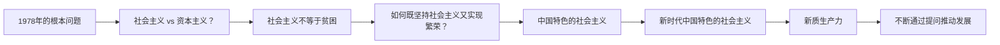

# 第09课：学会提问，拿下谈判主动权

## 学习目标
- 理解"没有错误的问题，只有错误的答案"这一核心理念
- 识别并应对"leading question"（诱导性问题）陷阱
- 掌握推翻误导性问题的技巧
- 学会用提问引导谈判方向、解决谈判难题

## 核心内容

### 没有错误的问题，只有错误的答案

高志凯博士提出一个核心观点：**没有错误的问题，只有错误的答案。**

这句话的意思是：不要以为别人提的问题就找一万个理由不去回答。你应当有勇气、有智慧、有能力来应对各种各样的问题。任何问题都可以开诚布公地交换意见，关键在于你如何回答。

> [!TIP] 关键洞察
> 提问本身不是问题，逃避回答才是问题。面对任何提问，都要有直面回答的勇气和智慧。

### 问题的分类

问题可以分为几种类型，每种类型都有不同的应对策略：

#### 1. 平铺直叙的问题

最简单的问答模式。例如"你贵姓？"——你回答"我姓王"即可。

但即使是这种简单的问题，也需要根据语境判断：警察问"你贵姓"是法律义务，你必须回答；普通人问"你贵姓"是社交礼貌，你可以选择回答的方式。

#### 2. 暗示性/关联性问题

例如："你爸爸是不是姓王？"

表面上是问你爸爸，实际上是想确认你姓什么。对方为什么要绕个弯子问？他真正的意图是什么？如果是想通过问你的爸爸来拐弯抹角地了解你，那你就需要思考：他到底想干什么？

#### 3. Leading Question（诱导性问题）

**这是最危险的问题类型。** 诱导性问题的特点是：无论你回答"是"还是"否"，都会掉入陷阱。

**经典案例：**

> 律师问："你是不是还在打老婆？"

- 如果你回答"是"——等于承认你现在还在打老婆，这是犯罪行为。
- 如果你回答"不是"——等于承认你以前打过老婆，只是现在不打了。

这种问题无论怎么回答都是错的。正确的做法是：**不回答这个问题的选项，而是推翻这个问题本身。**

```mermaid
flowchart TD
    A[对方提出诱导性问题] --> B{你如何回应？}
    B -->|回答"是"| C[掉入陷阱]
    B -->|回答"否"| D[掉入陷阱]
    B -->|推翻问题本身| E[跳出陷阱]
    E --> E1[指出问题的错误前提]
    E1 --> E2[重新定义问题]
    E2 --> E3[引导到正确的讨论方向]
```

### 如何应对诱导性问题

应对诱导性问题的核心策略是：**不要回答问题本身，而是推翻问题的前提。**

**案例一：中美谈判中的技术转让问题**

对方问："中国是否强迫外国企业转让技术？"

这个问题的陷阱：
- 回答"是"——等于承认中国有强迫技术转让的政策
- 回答"不是"——等于你承诺以后不再强迫

正确的回答方式应该是：
- "中国从来没有一个政府规定要强迫外国企业把技术转让给中国。这个问题本身就是一个误导性问题（misleading question），它的前提就是错误的。"

**案例二：台湾问题采访**

高志凯博士在接受外媒采访时，记者说："台湾2300万老百姓不想一国两制，不想回到中国的怀抱。"

高志凯博士没有直接回应台湾问题，而是用了一个类比：
- "林肯总统领导美国联邦打败了要求独立的南方邦联，血流成河，几十万人死亡。为什么美国人把林肯当作最伟大的总统之一？因为林肯不能容忍邦联脱离美利坚合众国。"

通过林肯的例子，高志凯博士把一个表面上是"台湾民意"的问题，转化成了"国家统一与分裂"的问题，掌握了对话的主动权。

> [!WARNING] 关键提醒
> 面对诱导性问题时，你的任务不是回答，而是**纠正问题的前提**。要把这个misleading question的误导性揭露出来，让对方重新审视他的问题本身是否有问题。

### 用提问引导谈判方向

提问不仅能用来回答问题，更是掌握谈判主动权的有力工具。

**好的问题解决一半的问题。** 如果你能够提出一个好的问题，实际上就解决了问题的一半。关键在于你的悟性和对问题的理解深度。

### 1978年中国道路问题：一个提问改变一个国家的命运

1978年，中国面临一个根本性的问题：**举什么旗、走什么路，才能给中国人民带来繁荣？**

当时的问题似乎是二选一的：
- 走社会主义道路（但当时中国很贫困）
- 走资本主义道路（与中国的根本制度矛盾）

当时的领导人提出了一个关键的问题转换：**"社会主义不等于贫困。"**

这个提问改变了整个论证框架：
- 社会主义不等于贫困
- 我们现在贫困，不等于社会主义不好
- 社会主义能够带来繁荣
- 问题变成：如何在坚持社会主义的前提下实现繁荣？
- 答案：走中国特色的社会主义道路

这一连串的提问和回答，最终形成了中国改革开放的理论基础。



这个案例生动地说明：**一个正确的问题，可以改变一个国家的命运。** 在谈判中同样如此——一个正确的提问，可以改变整个谈判的走向。

## 案例分析

### 案例一：法学院课堂的防御训练

在耶鲁法学院，老师经常教导学生：一定要小心诱导性问题。如果一个问题的形式是"你是不是还在做某件事"，你要立刻警觉——这个问题的前提本身就是有问题的。

这种训练让学生形成了条件反射：一听到诱导性问题的句式，立刻停止回答，转而质疑问题的前提。

> [!EXAMPLE] 经验提炼
> 在谈判中，当你听到一个让你感到"怎么回答都不对"的问题时，大概率是遇到了诱导性问题。这时不要急着回答，而是要停下来思考：这个问题的前提是什么？它的陷阱在哪里？

### 案例二：国际采访中的话语权争夺

高志凯博士在一次外媒采访中，记者反复强调"台湾2300万老百姓不想一国两制"。他用了林肯总统和南北战争的类比来回应：

- 记者谈的是台湾民意
- 高志凯谈的是国家统一的历史正当性
- 将话题从"台湾人想不想"转换为"国家能不能分裂"

这种转换的核心在于：**不要被对方设定的框架牵着走，要用你的问题重新设定框架。**

## 实战练习

> [!QUESTION] 思考题
> 在商务谈判中，对方突然问你："贵公司是否还在使用盗版软件？"请问：
> 1. 这个问题属于什么类型的问题？陷阱在哪里？
> 2. 如果你回答"是"，后果是什么？
> 3. 如果你回答"不是"，后果是什么？
> 4. 你该如何回答才能跳出陷阱并掌握主动权？

<details>
<summary>参考思路</summary>

**1. 问题类型分析：**
这是一个典型的诱导性问题（leading question），类似于"你是否还在打老婆"的模式。

**陷阱分析：**
- 回答"是"——等于承认你公司现在在使用盗版软件，构成侵权。
- 回答"不是"——等于承认你公司以前使用过盗版软件，现在不用了。

无论哪种回答，对方都已经预设了"你公司曾经或正在使用盗版软件"这一前提。

**2. 回答问题"是"的后果：**
对方可以立即要求你停止侵权、赔偿损失，甚至以法律诉讼相威胁。

**3. 回答问题"不是"的后果：**
对方可以说："所以你承认以前用过？那过去的侵权怎么赔偿？"

**4. 正确的应对方式：**

第一步：推翻问题的前提
- "您的问题隐含了一个错误的前提。我公司一直严格遵守知识产权法律，不存在使用盗版软件的情况，无论是过去还是现在。"

第二步：主动提问，掌握主动权
- "我想了解一下，您为什么会提出这个问题？是基于什么信息或证据？"
- "您是否愿意看一下我公司的软件授权清单？我们可以安排法务团队对接。"

这样既澄清了立场，又把对方假设的"错误前提"暴露出来，同时将对话引向建设性的方向。

</details>

## 本节总结

提问是谈判中最重要的技能之一。本课的核心要点包括：

1. **没有错误的问题，只有错误的答案**。任何问题都可以回答，关键在于回答的方式和策略。
2. **识别诱导性问题**。那些让你无论回答"是"还是"否"都会掉入陷阱的问题，都是诱导性问题。
3. **推翻问题前提**。面对诱导性问题，不要回答问题本身，而是指出问题的错误前提。
4. **用提问掌控方向**。一个好的问题可以解决一半的问题，一个关键的问题可以改变整个谈判的走向。
5. **转换对话框架**。不要被对方设定的框架牵着走，用你的类比和例子重新设定讨论框架。

## 下节课预告

学会提问掌握了主动权之后，如何让对抗性的谈判变成双赢？下一课我们将学习如何[[0010-cong-dui-kang-bian-shuang-ying|做到这3点，让谈判由对抗变双赢]]。