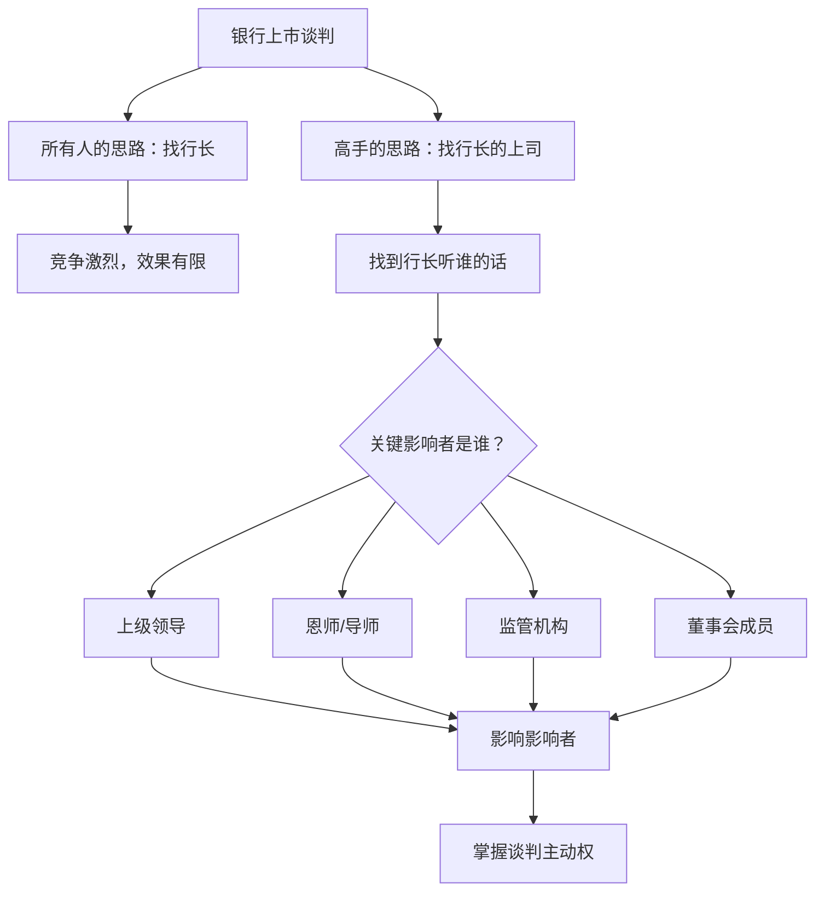
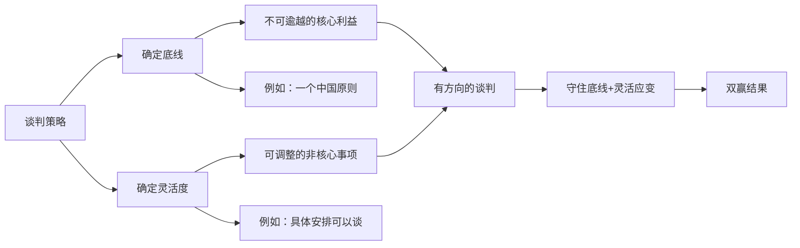

# 第10课：做到这3点，让谈判由对抗变双赢

## 学习目标
- 理解谈判中互动与试探的重要性——不仅是谈判桌上的交流
- 学会找到真正关键决策者的方法
- 掌握底线与灵活性的辩证关系
- 学会尊重专业人员意见的价值

## 核心内容

### 谈判的本质：互动与试探

绝大多数谈判不是单方向的，也不是一方强势地把结果压在另一方之上。绝大部分谈判是旗鼓相当的——甲方和乙方有不同的诉求、不同的优势和劣势。

谈判的过程就是一个**互动的过程**：

- 你把自己的立场说清楚
- 你收集对方的反馈
- 你关注对方周边上下左右的情况变动
- 你不断试探对方的底线和灵活度

这种互动和试探，不能仅限于谈判桌前，很多时候需要通过其他的方式进行。

> [!TIP] 关键洞察
> 谈判不是在谈判桌上开始的，而是在谈判桌之前就已经开始了。你对对方了解得越多，你的互动就越有效。

### 第一点：不上谈判桌的沟通——找到关键决策者

**经典案例：银行上市**

有一家重要银行要上市，华尔街的许多投资银行都争相去找这家银行的行长，这是很自然的思路——你要跟一把手谈。

但是，某家华尔街顶尖投资银行的董事长采取了完全不同的策略。他问了一个关键问题：**"你告诉我，这个行长听谁的话？"**

每个人都有自己的上级、自己的恩师、对自己有决定性影响的人。当所有人都在找行长的时候，这位董事长想的是：**怎么找到行长的上司？**

这个策略的背后逻辑是：

- 直接的谈判对手可能不是最终决策者
- 对方的决策受到多种因素的影响——上级、董事会、监管部门
- 如果能够影响到影响决策者的人，你就能改变整个谈判的格局
- 在合法的前提下，要跑到甲方的上面、背后、左右、前后去做工作

### 第二点：底线与灵活性的辩证关系

底线是你不能放弃的核心利益，灵活性是你为了达成协议可以做出的调整。底线和灵活性不是对立的，而是互补的。

**没有底线，就没有方向。** 你不知道自己的核心利益在哪里，就不知道哪些可以让步、哪些不能让。

**没有灵活性，就没有谈判空间。** 你如果抱着"要么全赢要么全败"的态度，谈判就会破裂。

**核心原则：**

- 在坚持核心利益的前提下，一切都可以谈
- 底线和灵活度是互动的、可以互相补充的
- 不要把对方逼到绝路上，让对方没有其他选择
- 一方全赢、一方全败往往不是最好的结果

> [!TIP] 关键洞察
> 真正好的谈判结果，往往是既照顾到自己的利益，又兼顾到对方的利益。战争可以有全胜全败，但谈判最好的结果往往是双赢。

#### 案例：一个中国原则下的所有问题都可谈

在台湾问题上，中国从80年代初就提出：**只要坚持一个中国，只要承认台湾是中国的一部分，其他所有的问题都可以谈。**

这是一种什么胸怀？它在坚持不可逾越的底线的同时，打开了无限的谈判空间：

- 底线：一个中国，台湾是中国的一部分
- 灵活度：其他所有问题都可以谈

这个框架让两岸的对话有了通道，打开了思路。如果只有底线没有灵活度，谈判就是僵局；如果只有灵活度没有底线，谈判就是投降。

### 第三点：尊重专业人员的意见

很多谈判之所以谈崩，是因为领导者意气用事、缺乏耐心、不听取专业人员的建议。

**反面案例：**

有些老板或企业领导人，性格上有缺陷——耐心不足、准备不足、不听取专业人员劝解。谈着谈着就拂袖而去、扬长而去，甚至做出极端过激的反应。这些都是不适合谈判的行为。

**正面案例：**

高志凯博士接触过一家华人圈中做得最大、最经久不衰的企业。这家企业的总部办公室设计很有意思：

- 一半楼层是律师的办公室
- 另一半是财务的办公室

这意味着：

- 所做的任何决定，在法律和政府关系上要站得稳
- 财务审计人员随时随刻参与其中
- 去跟别人谈判，背后有强大的法律支撑和财务支撑
- 他不会拍脑门做决定，一定会把项目想得很透

这家企业对项目的分析覆盖三个时间维度：
- **短期目标**
- **中期目标**
- **长期目标**

> [!WARNING] 警示
> 不要盲目相信专业人员，更不能完全不信任专业人员。关键是要建立一套机制——让法律和财务专业人员在谈判的全过程中提供支撑，但同时保持你的判断力。

## 案例分析

### 案例一：银行上市——找到行长的上司

一家重要银行要上市，华尔街投资银行蜂拥而至，都去找行长。但某家顶尖投行的董事长不走寻常路——他问的是"行长听谁的话"。

这个策略的精妙之处在于：
1. 当所有人都挤在同一个方向时，另辟蹊径可能是更好的选择
2. 找到真正有影响力的人，比直接找一把手可能更有效
3. 打"外围战"——从决策链的上游入手——可以避开正面竞争的激烈程度

> [!EXAMPLE] 经验提炼
> 当你发现所有竞争对手都在找同一个人的时候，问问自己：这个人听谁的话？谁能影响他的决策？这个问题的答案可能就是你的突破口。

### 案例二：中美关税战谈判

美国发动对华关税战后，中美进行了多轮谈判——从日内瓦到伦敦、从斯德哥尔摩到马德里、从吉隆坡到华盛顿。中国一直在谈，但始终守住底线：

- 美国不能欺负中国
- 美国必须尊重中国
- 美国不能把关税当作武器
- 不能把中国对美国的出口归零

在守住这些底线的同时，中国展示了灵活性——持续谈判本身就是在展现诚意和灵活度。

高志凯博士还提出一个观点：**应该开一门课叫"特朗普心理学"**。因为只有了解对方的为人为事、本性和性格特征，在中美谈判中才能做到有备无患。

## 实战练习

> [!QUESTION] 思考题
> 你是一家中型科技公司的CEO，正在与一家大型跨国公司谈判技术授权合作。对方实力远强于你，谈判中表现出强势态度，条件比较苛刻。请用本课学到的三点（找到关键决策者、底线与灵活性、尊重专业人员），制定你的谈判策略。

参考思路

**1. 找到关键决策者：**

- 对方的谈判代表是谁？他是否有充分的授权？还是需要向上汇报？
- 对方的决策链是怎样的？谁对最终决定有决定权？
- 除了谈判桌上的代表，还有哪些人可能影响对方的决策？例如：对方公司内部的业务部门负责人、技术部门负责人、法务负责人。
- 在合法合规的前提下，是否可以接触对方公司更高层级的决策者？

**2. 明确底线与灵活度：**

**底线（不可让步）：**
- 核心技术知识产权的归属——你方自主研发的技术不能授权给对手
- 客户数据的所有权和使用权
- 合理的价格底线

**灵活度（可以调整）：**
- 授权区域——可以从全球授权调整为特定区域授权
- 授权期限——可以从长期改为短期，设有续约条款
- 付款方式——可以接受分期付款或按销售提成
- 技术支持的范围和深度

**3. 尊重专业人员意见：**

- 邀请公司法务全程参与谈判准备，审核每一份文件
- 让财务团队做详细的成本效益分析，找到最优价格区间
- 技术团队评估对方的技术需求和可行性
- 在每次谈判后，组织内部复盘，听取各方专业意见
- 不要因为对方强势就仓促做决定，宁可暂缓也要确保每一步都有专业支撑

**核心策略：**

利用你方专业团队的数据分析，找到对双方都有利的方案。例如，通过财务模型向对方展示：接受你方的价格虽然比对方开价高，但考虑到你方的技术整合能力和售后支持，对方的总拥有成本（TCO）实际上更低。用数据和专业分析来说服对方，而不是硬碰硬地对抗。

## 本节总结

实现从对抗到双赢的转变，需要掌握三个关键点。本课的核心要点包括：

1. **找到关键决策者**：不要局限在谈判桌上，要跑到甲方的前后左右上下去做工作。当所有人都在找同一个人时，问自己"这个人听谁的话"。

2. **把握底线与灵活度的辩证关系**：底线让你有方向，灵活度让你有空间。在坚持核心利益的前提下，一切都可以谈。不要把对方逼到绝路上。

3. **尊重专业人员意见**：法律和财务专业团队是你谈判的坚实后盾。不要拍脑门做决定，要把项目想透——短期、中期、长期目标都要覆盖。

真正好的谈判结果，是既照顾到自己的利益，又兼顾到对方的利益。一方全赢、一方全败往往不是最好的结果。

## 下节课预告

恭喜你完成了本课程前10课的学习。接下来我们将进入新的阶段。请回顾前10课的内容，特别是[[0006-ying-zai-tan-pan-qian|赢在谈判前]]、[[0007-jin-fang-tao-lu|谨防谈判套路]]、[[0008-ku-lian-ji-xing-fa-yan|苦练即兴发言]]、[[0009-xue-hui-ti-wen|学会提问]]以及本课的内容，为后续课程做好准备。