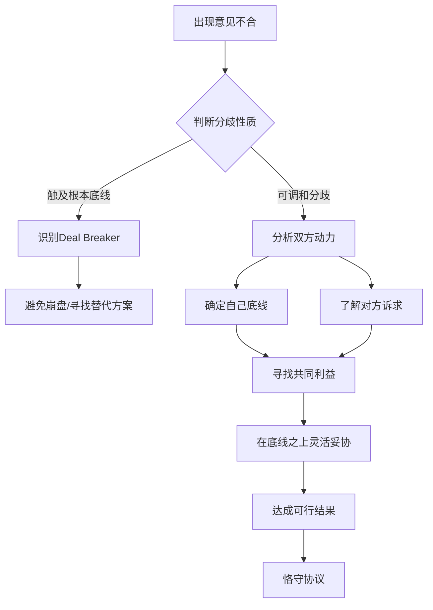

# 第11课：意见不合，求同存异

## 学习目标
- 能够准确区分 Deal Breaker（不可调和分歧）与可调和分歧
- 掌握"请示一下"策略，争取谈判暂停时间
- 理解中西诚信与契约精神的本质差异
- 认识西方违约责任条款占合同一半的文化根源
- 掌握求同存异的核心方法论，挖掘表面分歧之下的共同利益

## 核心内容

### 一、分歧的两类性质

谈判中意见不合不可避免，但首先要判断分歧的性质：

| 类别 | 定义 | 应对方式 |
|------|------|----------|
| **Deal Breaker（不可调和分歧）** | 触及根本底线，无法妥协 | 识别并提前规避，避免浪费时间 |
| **可调和分歧** | 立场差异，可通过协商解决 | 保持灵活，寻找替代方案 |

> [!TIP] 关键洞察
> 谈判本身就是妥协的过程。妥协不是坏事，而是甲方乙方通过接触、勾兑、相互了解，克服不合，使得利益趋同。

### 二、争取暂停谈判："请示一下"策略

当谈判陷入僵局或压力过大时，可以主动争取暂停：

1. **授权有限法**："我们这个层面暂时没有足够的授权，我请示一下，得到上面的指示才能进一步谈。"
2. **场景转换法**：暂停谈判，去放松一下，改变谈判的僵局氛围。
3. **时间缓冲法**：为双方创造冷静思考的空间。

暂停不是为了逃避，而是为了在空间和时间上获得喘息机会，为求同存异留出对话空间。

### 三、诚信与契约精神的中西差异

> [!WARNING] 文化差异警示
> 中国讲究"君子一言，驷马难追"，但西方合同法的逻辑完全不同。 西方人认为：如果违反协议带来的好处更大，你没有义务继续执行协议。

西方合同的特点：
- 违约责任条款通常占合同篇幅的一半左右
- 把"坏话说在前面"——明确违反的后果和罚则
- 执行过程中持续盘算：继续执行 vs 违反协议，哪个更有利

中国合同的特点：
- 往往一页两页三页，相对单薄
- 假定双方谈完会信守恪守合同
- 忽略了对方可能基于利益计算而违约

### 四、求同存异的核心方法论

关键步骤：
1. **先确定底线**：什么才是根本不能放弃的东西
2. **分析对方诉求**：对方真正关心什么，着急什么
3. **区分实质分歧与情绪对立**：时间表不同、紧迫性不同可能造成情绪冲突
4. **在底线之上灵活让步**：可以放弃的、可以妥协的，千万不要钻牛角尖

## 案例分析

### 案例一：丹麦与挪威的北海划界谈判

丹麦在谈判中占有优势，挪威相对贫困、资源匮乏。但挪威从一开始就确定：国家的突破点在于近海石油天然气，而非渔业资源。

- 挪威有意识地将丹麦的注意力引向北海渔业资源丰富的水域
- 丹麦"蒙虎下山"，全力争夺渔业水域
- 挪威最终获得了当时看不到任何确凿证据有油气储量的海面

> [!EXAMPLE] 案例启示
> 这一博弈彻底改变了挪威的国运。挪威从北欧最穷、资源最贫乏的国家，一跃成为拥有丰富石油天然气储量的国家，在国民财富和经济发展上领先瑞典和丹麦。

关键教训：
- 进行大量事先分析，确定自己的底线
- 知道对方真正想得到什么
- 不要跟对方争吵——争吵可能错过天大良机

### 案例二：资产出售的不对等动力

作为卖方，同一资产不能只跟一个对手谈，而应同时与十几家甚至更多公司接触。卖方的销售备忘录编号策略本身就是一种心理战。

## 实战练习

> [!QUESTION] 思考题
> 假设你是一家公司的CEO，正在与一家美国企业谈判合资协议。中方谈判团队准备了3页的简洁协议，而美方团队提交了200页的合同草案，其中违约责任条款占了100页。你感到对方"不信任"中方。请分析：
> 1. 美方为什么合同如此冗长？
> 2. 中西诚信观念差异如何影响双方的谈判策略？
> 3. 你应该如何应对，既保护自身利益又推进谈判？

参考思路

1. 美方合同冗长并非针对中方，而是西方商业文化的惯例。西方合同法的逻辑是"如果你违反协议带来更大好处，你没有义务继续执行"，所以必须把所有可能违反的情况和罚则事先写清。

2. 中方假定"君子一言"会自动履约，美方假定"利益计算"决定履约行为。这种差异如果不沟通清楚，中方会觉得美方"不信任"，美方会觉得中方"太随意"。

3. 应对策略：
   - 理解并接受这种文化差异，不将此视为"不信任"
   - 聘请熟悉国际合同的律师仔细审阅违约责任条款
   - 守住核心商业条款的底线，程序性条款可适当接受美方惯例
   - 在签约前明确双方的履约预期和违约处理机制

## 本节总结

- 谈判中意见不合，首先要区分Deal Breaker与可调和分歧
- "请示一下"策略是争取暂停、打破僵局的有效工具
- 中西诚信观念存在本质差异：中国重"君子协定"，西方重"利益计算"
- 西方合同违约责任条款占一半，源于"把坏话说在前面"的文化逻辑
- 求同存异的核心：确定自己的底线，了解对方的诉求，在底线之上灵活妥协
- 谈判重点不是限于僵局，而是解决问题

## 下节课预告

谈判中情绪波动是常态。如何控制自身情绪、识别对方的真假情绪波动、甚至安抚对方反应？下节课我们将深入探讨情绪管理在谈判中的应用。

继续学习[[0012-kong-zhi-qing-xu|第12课：控制自身情绪，安抚对方反应]]