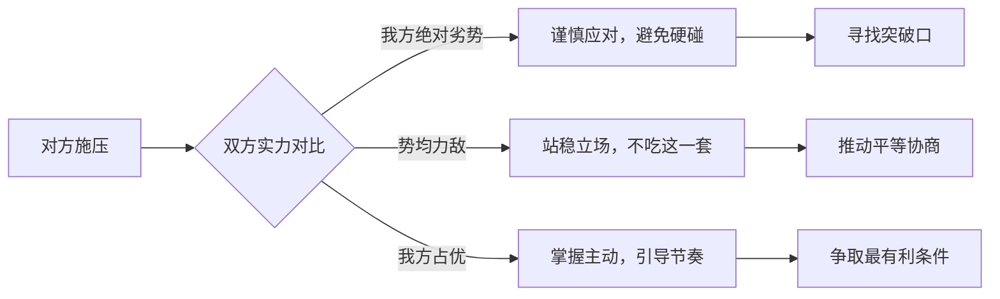

# 第12课：控制自身情绪，安抚对方反应

## 学习目标
- 掌握真假情绪波动的识别方法
- 理解愤怒作为目的与作为手段的区别
- 学会多层面多渠道的沟通策略
- 建立"不吃你这一套"的谈判气势
- 能够在高压下保持冷静、站稳脚跟

## 核心内容

### 一、真假情绪波动的识别

谈判中情绪波动经常出现，但必须分辨真假：

| 对方表现 | 可能为真 | 可能为假 |
|----------|----------|----------|
| 愤怒拍桌 | 触及核心利益 | 施压策略，想让你让步 |
| 拂袖而去 | 无法接受当前条件 | 制造紧迫感，给你下马威 |
| 感到委屈 | 确实受到不公平对待 | 博取同情，获取谈判优势 |
| 威胁退出 | 有更好的替代方案 | 试探对方底线的策略 |

> [!TIP] 关键洞察
> 愤怒是目的还是手段？很多时候，"我不谈了"只是一个姿态，目的是让自己的利益最大化、让对方利益最小化。

### 二、日军新加坡谈判：虚张声势的力量

第二次世界大战期间，日军攻陷新加坡后与英军谈判。当时日军弹药、兵力已用到极限，而英军实际上仍有实力。但英军错判了日军的真正实力。

在谈判僵持不下时，日军将领（战后被处死）虚张声势，把英方谈判对手吓坏，最终造成英军全面投降。

> [!WARNING] 核心教训
> 一定要知己知彼。对方做出的各种姿态、要挟、耀武扬威，要判断他是真正拥有实力还是在做作。

### 三、"不吃你这一套"的气势

近年来中美谈判中，中方讲过"我们不吃你这一套"、"不接受美国说的从实力地位跟我们谈判"。这背后是对双方实力的清醒判断。

### 四、多层面多渠道沟通

对方不是铁板一块，可以分解为几个层面：

1. **主谈人层面**：他是否有情绪障碍？他一人独大还是团队协作？
2. **谈判团队层面**：法律顾问、财务顾问、副代表各有什么立场？
3. **上级单位层面**：授权范围是什么？超过授权需要哪里批准？

沟通策略：万一与谈判对手谈不拢，可以通过更高层面与对方上级单位建立渠道。可能他的上级单位对问题的看法与他的谈判团队不同。

> [!TIP] 关键洞察
> 多层面、多渠道与对方保持沟通，可以帮助对方作为一个整体做出更好的决策。

### 五、欧洲水泥厂谈判案例

一家欧洲最大的建材公司要在全球选择收购标的，当时看好中国珠三角一带的水泥厂。但对方觉得中方提出的要求和市场前景描述与自己的分析背道而驰，提出"不谈了"，并表示正在与墨西哥的水泥厂商谈。

应对方法：
- 不要情绪失控，不要互相指责
- 顺理成章地讲述中国市场的独特前景
- 用数据说话：世贸组织加入后的经济增速、基础设施建设需求
- 告诉对方：失去中国就是失去未来发展的最大支撑

> [!EXAMPLE] 案例启示
> 最终这家欧洲公司收购了中国的水泥厂，几十年获利丰厚，赶上了中国经济蓬勃发展的黄金时期。

## 实战练习

> [!QUESTION] 思考题
> 你正在与一家美国科技公司谈判技术授权协议。对方首席谈判代表突然拍案而起，说你提供的数据"完全不可接受"，并威胁要终止谈判。你观察到以下细节：
> - 对方的律师在旁边低头记录，没有参与表态
> - 对方的财务顾问在计算器上快速按了几组数字，露出若有所思的表情
> - 对方的副代表微微摇头
> 
> 请分析：首席谈判代表的愤怒是真的还是策略？你应该如何回应？

参考思路

线索分析：
1. 律师低头记录而非参与——说明法律团队并没有准备好退出谈判，只是在记录过程
2. 财务顾问在计算——说明对方仍在评估数字可行性
3. 副代表微微摇头——可能对首席谈判代表的策略不认同

综合判断：首席谈判代表的愤怒很可能是策略性施压，而非真正要退出。

应对策略：
1. 保持冷静，不因对方拍案而慌乱
2. 可以说："我理解你对数据的关切，我们可以一起复核数据来源和计算方法。如果需要，我们也可以请双方的技术团队开个专题会议。"
3. 适时建议暂停："要不我们休息15分钟，大家各自整理一下思路？"
4. 如果条件允许，可以尝试通过对方的律师或财务顾问传达中方的合作诚意，利用多层面渠道打破僵局。

## 本节总结

- 谈判中的情绪波动需要分辨真假——愤怒可能是手段而非目的
- 日军新加坡谈判说明虚张声势可以有效，但前提是对方不了解你的真实实力
- "不吃你这一套"的气势来自于对双方实力的清醒判断
- 多层面多渠道沟通：不要把对方看作铁板一块，要区分主谈人、团队、上级单位的不同立场
- 当对方情绪失控或威胁退出时，不要情绪化回应，要用事实和逻辑稳住局势
- 保持心理平静、站稳脚跟，是应对一切情绪陷阱的根基

## 下节课预告

分歧是谈判的常态而非例外。下节课我们将学习如何在分歧中找到共同基础，运用创造性方案推动一致结论。

继续学习[[0013-hua-jie-fen-qi|第13课：在分歧中找共同基础，推动一致结论]]