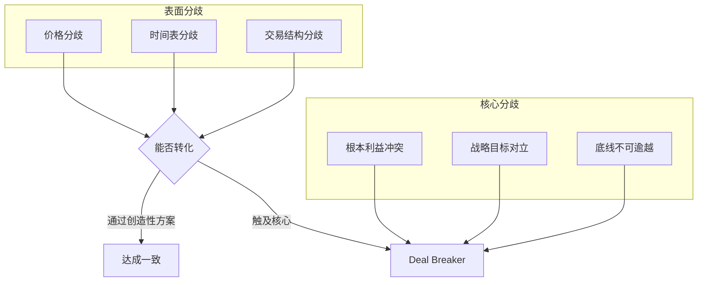

# 第13课：在分歧中找共同基础，推动一致结论

## 学习目标
- 理解分歧在谈判中的正常性及其分类
- 掌握区分表面分歧与核心分歧的方法
- 学会运用卖方备忘录编号策略等心理战术
- 熟悉现金、股票、期权等多种交易结构
- 掌握"多几个选择，不框在一棵树上"的谈判原则

## 核心内容

### 一、分歧的正常性

有分歧才是正常的，没有分歧一定有问题。谈判双方面临不同的动力和压力：

| 甲方（可能急于成交） | 乙方（可能从容不迫） |
|----------------------|----------------------|
| 资金盘出现问题 | 同时在与其他方洽谈 |
| 必须尽快出售资产 | 有多个可选项目 |
| 时间窗口有限 | 可以等待更好时机 |
| 现金流紧张 | 财务充裕，寻找最佳标的 |

> [!TIP] 关键洞察
> 好的项目不仅是做这一单买卖，更是为今后不断合作奠定基础。这一单多赚一点少赚一点并不重要。

### 二、表面分歧 vs 核心分歧

**表面分歧**：可以通过灵活性、创造性方案调和的分歧。
**核心分歧**：触及根本利益或战略目标的对立，可能构成Deal Breaker。

### 三、卖方备忘录的编号策略（心理战）

在并购项目中，卖方的销售备忘录（Selling Memorandum）编号方式本身就是一种心理战术：

| 编号策略 | 买方心理反应 | 效果 |
|----------|--------------|------|
| 从1开始编号（001号） | "只跟我谈？我会不会变成冤大头？" | 买方产生风险和疑虑 |
| 从大数开始（51号、52号） | "很多机构在谈，反馈不错" | 制造竞争氛围，推动买方积极出价 |

### 四、多种交易结构化解分歧

当单一交易方式无法达成一致时，可以通过灵活的交易结构来化解分歧：

1. **现金交易**：最直接，但对买方资金要求高
2. **股票置换**：避免大量现金流出，但需评估股价
3. **股票+现金组合**：平衡双方需求
4. **期权安排**：为未来留出调整空间
5. **资产置换**：以物易物，避免现金流问题

> [!TIP] 关键洞察
> 当一个项目到了最关键的时候，有些分歧使双方难以再向前迈进。但如果有足够的创造性和灵活性，尤其是充分利用资本市场的便利，最终也许能找到双方都能接受的模式。

### 五、李嘉诚的"什么都可以买卖，关键是价格"

长江和记黄埔集团老先生一直说的一句话：**什么都可以买卖，关键是价格**。

这句话传递的核心态度：
- 不拒绝任何交易可能
- 把分歧转化为价格问题
- 保持开放心态，不被固有立场束缚

> [!WARNING] 注意
> 这句话适用于纯商业属性的资产。当资产涉及地缘政治（如巴拿马运河码头），就不再是"只要价格合适"的问题。

## 案例分析

### 案例：长和集团巴拿马运河码头争端

长和集团拥有巴拿马运河东西两端的集装箱泊位。美国政府提出非分要求——必须控制这些泊位。这一问题已从商业谈判上升到地缘政治层面。

分歧分析：
- **表面分歧**：价格、交易结构、运营方式
- **核心分歧**：中美两国地缘政治博弈，商业企业难以招架

启示：谈判一旦上升到国与国层面，商业性企业必须依赖于国家之间的政治博弈，己方的灵活性和主动性会大幅降低。

## 实战练习

> [!QUESTION] 思考题
> 你是一家科技创业公司的创始人，正与一家大型互联网公司谈判收购事宜。对方报价1亿元全现金收购。你希望获得更高价格，但对方表示这是"最终报价"。你认为公司的潜力远超这个价格，同时也担心如果这次谈崩，市场窗口可能在半年内关闭。
> 
> 请设计至少三种不同的交易结构方案，既能满足你的价格预期，又能让买方接受。

参考思路

方案一：现金+股票组合
- 接受6000万现金 + 4000万等值股票
- 通过持有股票分享公司未来增长

方案二：底价+对赌条款
- 接受8000万现金作为底价
- 附加业绩对赌：未来两年达到特定收入目标，额外支付5000万
- 降低买方一次性现金压力，同时保留上行空间

方案三：现金+期权
- 接受9000万现金
- 获得未来三年内以约定价格回购部分业务的期权
- 给自己留出东山再起的可能性

原则：不要把谈判目标锁定在一个方案上。"多几个选择，不要把自己框在一棵树上。"

## 本节总结

- 分歧是谈判的常态，没有分歧才是问题
- 区分表面分歧与核心分歧：表面分歧可以通过创造性方案解决，核心分歧需判断是否为Deal Breaker
- 卖方备忘录编号策略是一种心理战，可以影响买方的竞争感知
- 现金、股票、期权、资产置换等多种交易结构为化解分歧提供灵活选择
- 李嘉诚"什么都可以买卖，关键是价格"代表开放态度，但要注意商业与地缘政治的边界
- "多几个选择，不要框在一棵树上"——无论是买方还是卖方，扩大选择范围是谈判成功的基础

## 下节课预告

谈判中对方可能会通过价格施压、时间限制、向上投诉等各种方式对你发起挑战。下节课我们将学习如何从容应对尖锐提问与高压挑战。

继续学习[[0014-cong-rong-ying-dui-tiao-zhan|第14课：从容应对尖锐提问与挑战]]