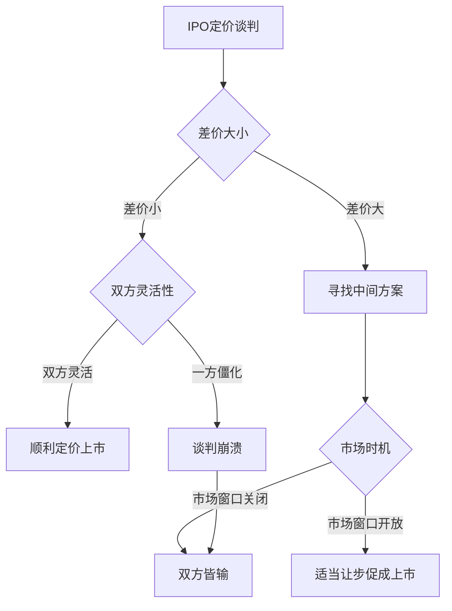
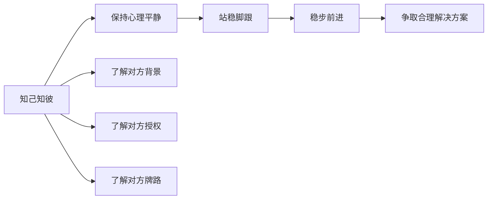

# 第14课：从容应对尖锐提问与挑战

## 学习目标
- 识别并应对对方的三种主要施压策略：价格、时间、投诉
- 理解IPO定价谈判中的崩盘风险及其防范
- 掌握De-escalate（降压降级）的艺术
- 学会通过场景转换打破谈判僵局
- 建立知己知彼的心理防线，站稳脚跟

## 核心内容

### 一、对方的三种施压策略

谈判中对方常用的施压手段：

| 施压类型 | 表现形式 | 常见话术 |
|----------|----------|----------|
| **价格施压** | 给出不合理的高价或低价 | "这是独一无二的资产，你爱买不买" |
| **时间施压** | 设置紧箍咒式的截止日期 | "两天之内必须答复，否则谈判结束" |
| **投诉施压** | 向你的上级告状 | "我找你董事长去"、"我找国资委投诉" |

> [!TIP] 关键洞察
> 对方施压的前提是他认为你"怕"。
> 破解之道：把对方的背景看透——谈判负责人的角色、授权范围、与上级单位的关系。

### 二、IPO定价谈判的崩盘风险

IPO最后一刻的定价是谈判的高危时刻：

- 账簿管理人/主承销商掌握更多二级市场信息
- 发行方有上级单位（如国资委）需要汇报
- 双方都缺乏足够的灵活性
- 实际差价往往并不大，但因为立场固化而谈崩

> [!WARNING] 风险警示
> 如果上市失败，市场窗口可能一关就是好几年。对于某些行业的公司，错失这一次机会，可能这辈子就没法再上市了。切记不要"因芝麻丢西瓜"。

### 三、De-escalate：降压降级的艺术

当谈判陷入僵局甚至濒临崩盘时，降压降级是最重要的技巧：

1. **暂停谈判**：先放一放
2. **置换场景**：改变谈判环境
3. **转移话题**：暂时搁置争议问题
4. **调整节奏**：从快节奏转向慢节奏

> [!TIP] 关键洞察
> De-escalate的核心不是认输，而是给双方喘息的空间，寻找更好的解决方案。

### 四、周总理的杭州之行：打破中美上海公报僵局

中美就上海公报进行谈判时，在台湾问题上出现僵局，几乎谈崩。

周恩来的应对：
1. **置换场景**：暂停在上海的谈判，去杭州放松
2. **争取时间**：让双方都得以喘息
3. **寻找新思路**：在轻松环境中重新思考

最终解决方案：基辛格博士提出用"海峡两岸"的说法，既避免了"中华人民共和国"或"中华民国"的政治性表述，又为双方所接受。

> [!EXAMPLE] 案例启示
> 这个案例说明：当谈判陷入僵局时，换一个环境、换一种气氛，往往能产生新的灵感和解决方案。

### 五、保持心理平静，站稳脚跟

应对施压的五个关键步骤：

知己知彼的具体内容：
- 对方谈判负责人的教育背景、职业发展轨迹
- 过去成功案例和失败案例
- 与上级单位的关系
- 授权范围的界定——什么事他能做决定
- 对方团队与中介机构（律师、会计师）之间的动力关系

## 实战练习

> [!QUESTION] 思考题
> 你作为一家国有企业的谈判代表，正在与一家跨国公司进行合资谈判。对方首席谈判代表突然拍桌子说："你们的报价完全是荒谬的。我已经给你们三天时间了。如果明天下午五点前你们不能接受我们的条件，我直接打电话给你的董事长。"
> 
> 请分析：
> 1. 对方使用了哪几种施压策略？
> 2. 你应该如何回应？
> 3. 你如何利用你对对方的了解来化解这次危机？

参考思路

1. 对方使用了三种施压策略的组合：
   - 价格施压（说你的报价"荒谬"）
   - 时间施压（"明天下午五点前"）
   - 投诉施压（"打电话给你董事长"）

2. 回应策略建议：
   - 保持平静，不卑不亢
   - 先区分对方是真的愤怒还是策略性施压
   - 可以说："我理解你们的关切。但我们对自己的报价有理有据，每一笔成本都经过了审计。如果你们对数字有疑问，我们可以安排技术团队逐一核对。至于董事长那边，我们内部有正常的沟通汇报机制，谈判的每一步都在他的知晓范围内。"
   - 建议暂停："双方目前的预期差距确实较大，建议我们安排一次专题会议来解决数字分歧。"

3. 利用对对方的了解：
   - 如果了解对方谈判代表的授权范围有限，可以判断他的"最后通牒"可能是虚张声势
   - 如果与对方上级单位有良好关系，可以提前沟通，避免对方"告状"策略生效
   - 了解对方的时间压力——如果他也有KPI压力，他同样急于成交

## 本节总结

- 对方的施压策略主要有三类：价格施压、时间施压、投诉施压
- IPO定价谈判的崩盘风险在于双方都缺乏灵活性，"因芝麻丢西瓜"
- De-escalate降压降级是关键技巧：暂停、置换场景、转移话题
- 周总理安排杭州之行破解中美上海公报僵局，展示了场景置换的力量
- 保持心理平静、站稳脚跟，是应对一切施压的根本
- 知己知彼是应对挑战的基础——了解对方的背景、授权、牌路

## 下节课预告

不同国家、不同文化的企业谈判风格迥异。出海谈判时，如何规避文化差异带来的误解和冲突？下节课我们将深入探讨跨文化沟通的策略。

继续学习[[0015-gui-bi-wen-hua-cha-yi|第15课：规避文化差异，实现有效沟通]]