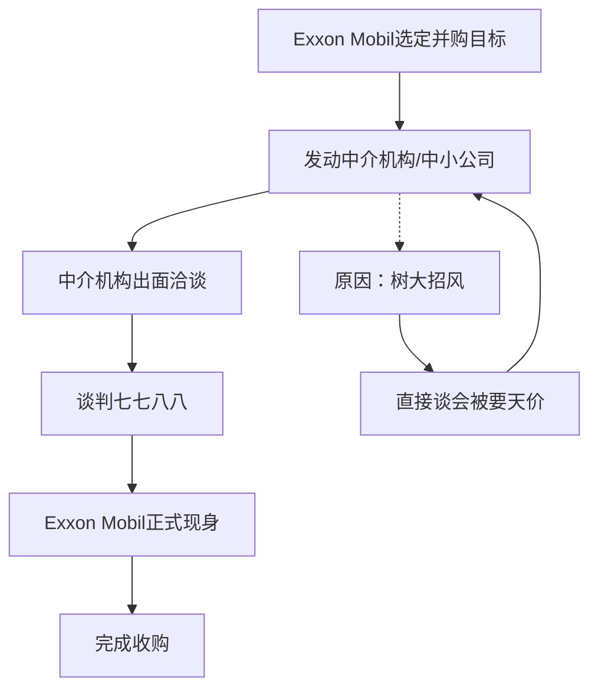
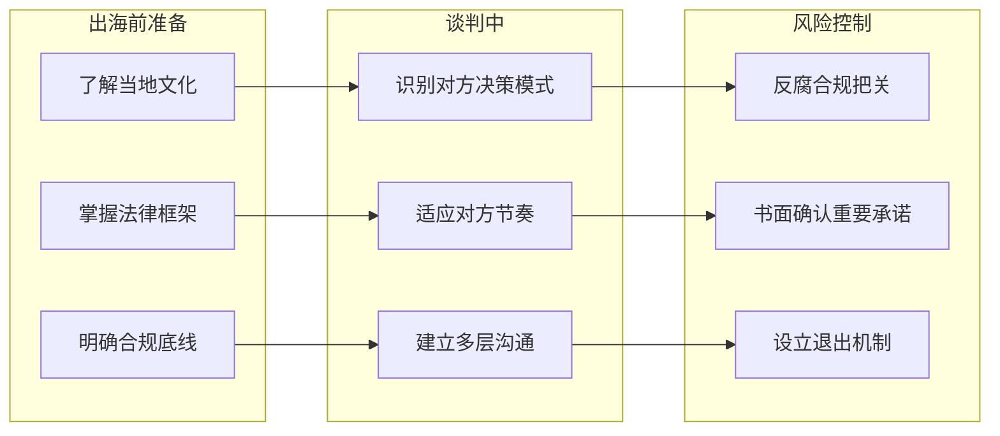

# 第15课：规避文化差异，实现有效沟通

## 学习目标
- 掌握英、美、日、东南亚、非洲、拉美等地的谈判风格差异
- 理解美国企业专业分工与中介机构角色
- 认识日本企业模糊表态的文化根源
- 了解东南亚家族企业的谈判特点
- 学会根据不同文化制定不同的谈判策略

## 核心内容

### 一、主要国家/地区谈判风格对比

| 国家/地区 | 谈判风格 | 主要特点 |
|-----------|----------|----------|
| **英国** | 一本正经、直奔主题 | 全副武装（律师、会计师、中介），明确时间表 |
| **美国** | 专业专注、直接了当 | 分工明确，中介机构作用大，注重合同细节 |
| **日本** | 老谋深算、模棱两可 | 表态模糊，"肯定"未必是肯定，善于变卦 |
| **东南亚（华侨企业）** | 灵活变通、多线作战 | 跨行业、跨国别，随时转向其他项目 |
| **非洲** | 关系导向、灰色地带多 | 军队势力大、家族影响大，需注意合规 |
| **拉丁美洲** | 慢节奏、家族企业为主 | 几百年延续的家族企业，承诺兑现需谨慎核实 |

> [!WARNING] 文化差异警示
> 文化差异不是小事。它往往会使谈判出现变数甚至谈崩。千万不能想当然，一定要做到知己知彼。

### 二、美国企业的专业分工与中介机构角色

美国公司的谈判特点：
- **高度专业**：如可口可乐只做可乐、麦当劳只做快餐，很少涉足不相关业务
- **中介机构权重高**：律师、会计师、投行在谈判中发挥重要作用
- **高管常征求中介意见**：企业高管在谈判中经常转向律师征求意见

对策略：在谈判中不仅要说服对方高管，还要说服对方的中介团队。可以提前与中介机构建立沟通渠道。

### 三、日本企业的模糊表态

> [!TIP] 关键洞察
> 与日本企业谈判，你经常搞不清楚对方是肯定还是否定。他的表态模棱两可，你以为他肯定了，最后他说否定了；明天他又变卦，说你误解他了。

应对日本企业模糊谈判的策略：
1. **书面确认**：每次会谈后发出会议纪要，要求对方确认
2. **逐条核实**：不要满足于笼统表态，要逐条确认
3. **建立多层面沟通**：不能只依赖主谈人的口头承诺

### 四、东南亚家族企业的谈判特点

东南亚家族企业与西方企业有显著不同：

| 维度 | 西方企业 | 东南亚家族企业 |
|------|----------|----------------|
| 决策方式 | 团队决策、层层审批 | 家族领导人拍板 |
| 中介机构 | 高度依赖 | 很少公开征求中介意见 |
| 专注度 | 专注单一行业 | 跨行业、跨国家 |
| 变数 | 按时间表推进 | 随时可能转向其他项目 |

> [!WARNING] 注意
> 跟东南亚企业谈一个项目时，他可能会突然跳到另一个国家的另一个项目。你需要确认自己是否具备这样的灵活度和授权，不要被对方带偏。

### 五、Exxon Mobil的并购代理策略

美国最大的石油公司Exxon Mobil（原洛克菲勒创建）的并购策略非常独特：

> [!EXAMPLE] 案例启示
> Exxon Mobil的策略说明了：大企业直接出面的代价可能很高。通过中介机构或表面无关联的公司先行接触，可以有效防止对方坐地起价。

### 六、出海不同地区的注意事项

关键注意事项：
1. **非洲市场**：注意军队势力、家族影响、政府官员行为准则。法律问题、反腐问题必须把好关。对方热情不一定可靠，谨防黑色地带和灰色地带。
2. **拉美市场**：家族企业延续几百年，承诺是否兑现需考虑再三。别以为"去一个国家只有一种方法能解决所有问题"。
3. **台湾地区企业**：同种同文但节奏和文化不同。注意对方在技术方面的"自视甚高"。需要真正了解对方，做到知己知彼。

## 实战练习

> [!QUESTION] 思考题
> 你的公司计划出海投资，有三个潜在合作对象：
> - A公司：日本大型综合商社，业务涵盖机械、能源、金融
> - B公司：墨西哥家族企业，经营建材业务已有80年
> - C公司：美国专业化工企业，全球行业前三
> 
> 针对这三家公司，你应该分别采取什么样的谈判策略？重点关注哪些文化差异？

参考思路

**针对A公司（日本综合商社）：**
- 预期对方表态模糊，每次会议后务必发出书面纪要要求确认
- 准备好对方随时可能转向集团内部其他业务线或项目
- 放慢节奏，日本企业重视长期关系建立，不急于求成
- 避免通过对方的"はい"（是）就理解为同意，要逐条确认

**针对B公司（墨西哥家族企业）：**
- 了解家族内部权力结构——谁是真正能拍板的人
- 预期谈判节奏较慢，需要有耐心
- 对口头承诺保持谨慎，重要的条件必须落实到书面
- 注意合规问题，与拉美家族企业打交道要特别注意反腐条款

**针对C公司（美国专业化工企业）：**
- 准备好全副武装的谈判团队，包括律师和财务顾问
- 内容直接了当，按时间表推进
- 不仅要说服对方高管，也要说服对方的律师和中介团队
- 注意对方可能会用中介机构作为"白手套"进行前期接触

**通用原则：**
- 无论对方是谁，都要"知己知彼"
- 不要把自己不擅长或不感兴趣的东西强推给对方
- 守住合规底线，不要因为项目心切而放松风险管控

## 本节总结

- 不同国家和地区的谈判风格差异巨大：英国一本正经、美国直接专业、日本模糊多变、东南亚灵活跳跃、非洲关系导向、拉美慢节奏家族化
- 美国企业高度依赖中介机构，谈判需要同时说服对方高管和中介团队
- 日本企业模糊表态是文化特征，需要通过书面确认、逐条核实来应对
- 东南亚家族企业决策快、变数大，不要被对方带偏行业和地域
- Exxon Mobil通过中介机构代理并购，避免树大招风，值得大型企业借鉴
- 出海谈判前必须做好文化功课，守住法律和合规底线

## 下节课预告

恭喜你完成了第11课到第15课的学习。从下一课开始，我们将进入新的主题——如何在高风险、高价值的谈判中做出最优决策。

继续学习第16课（待发布）