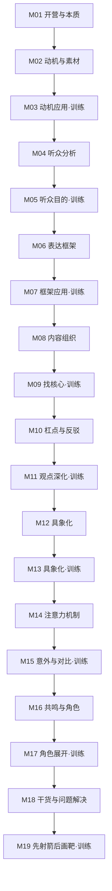

# 课程地图

> 从入门到精通，按模块递进学习。

## 模块依赖关系

## 模块详情

### M01：入门基础
| 课号 | 标题 | 类型 | 要点 |
|------|------|------|------|
| [第01课](lessons/0001-kai-ying-yi-shi.md) | 开营仪式 | 开营 | 课程安排、学习方法 |
| [第02课](lessons/0002-biao-da-ben-zhi.md) | 学表达，我们要学的是什么？ | 必修 | 表达不是口才、表达清单概览 |

### M02：动机与素材
| 课号 | 标题 | 类型 | 要点 |
|------|------|------|------|
| [第03课](lessons/0003-hua-jie-ya-li.md) | 如何化解压力？ | 必修 | 紧张本质、动机 vs 自信 |
| [第04课](lessons/0004-wa-jue-su-cai.md) | 如何挖掘素材？ | 必修 | 自我访问5问题 |
| [第05课](lessons/0005-xi-yin-ting-zhong.md) | 如何吸引听众？ | 必修 | 对话感、动机先行 |

### M03：动机应用·训练
| 课号 | 标题 | 类型 | 要点 |
|------|------|------|------|
| [第06课](lessons/0006-xun-lian-dong-ji-demo.md) | 小组训练教练演示 | 训练 | 小组训练示范 |
| [第07课](lessons/0007-dong-ji-xiang-wai-tui.md) | 如何将表达动机向外推？ | 训练 | 动机内外推练习 |

### M04：听众分析
| 课号 | 标题 | 类型 | 要点 |
|------|------|------|------|
| [第08课](lessons/0008-ting-zhong-qi-da-mu-di.md) | 如何拆解听众的7大目的？ | 必修 | 7大目的、场景分析 |
| [第09课](lessons/0009-cha-yi-ting-zhong.md) | 如何为差异大的听众设计内容？ | 必修 | 差异听众策略 |

### M05：听众目的·训练
| 课号 | 标题 | 类型 | 要点 |
|------|------|------|------|
| [第10课](lessons/0010-xun-lian-ting-zhong-demo.md) | 小组训练教练演示 | 训练 | 小组训练示范 |
| [第11课](lessons/0011-ting-zhong-mu-di-sheng-huo.md) | 如何在生活场景应用听众目的 | 训练 | 生活中的听众分析 |

### M06：表达框架
| 课号 | 标题 | 类型 | 要点 |
|------|------|------|------|
| [第12课](lessons/0012-li-jie-kuang-jia.md) | 如何理解表达的框架 | 必修 | 框架概念、好莱坞框架 |
| [第13课](lessons/0013-zhang-wo-kuang-jia.md) | 掌握清晰的框架 | 必修 | 三种实用框架 |
| [第14课](lessons/0014-xian-jie.md) | 如何完成表达的衔接 | 必修 | 框架衔接技巧 |

### M07：框架应用·训练
| 课号 | 标题 | 类型 | 要点 |
|------|------|------|------|
| [第15课](lessons/0015-xun-lian-kuang-jia-demo.md) | 小组训练教练演示 | 训练 | 小组训练示范 |
| [第16课](lessons/0016-bei-di-gu-kuang-jia.md) | 被低估的一种框架 | 训练 | 框架额外用法 |
| [第17课](lessons/0017-zhi-chang-kuang-jia.md) | 如何在职场应用表达框架 | 训练 | 职场框架应用 |

### M08：内容组织
| 课号 | 标题 | 类型 | 要点 |
|------|------|------|------|
| [第18课](lessons/0018-biao-da-zhe-zhi-ze.md) | 如何正确认识表达者的职责 | 必修 | 信息筛选、指挥官目标 |
| [第19课](lessons/0019-he-xin-nei-rong.md) | 找出次要内容和核心内容 | 必修 | 核心句提取 |
| [第20课](lessons/0020-pai-xu-nei-rong.md) | 用排序生产内容 | 必修 | 内容排序 |

### M09：找核心·训练
| 课号 | 标题 | 类型 | 要点 |
|------|------|------|------|
| [第21课](lessons/0021-zhao-he-xin-wen-ti-shang.md) | 找核心的常见问题（上） | 训练 | 核心误区 |
| [第22课](lessons/0022-zhao-he-xin-wen-ti-xia.md) | 找核心的常见问题（下） | 训练 | 核心误区 |

### M10：杠点与反驳
| 课号 | 标题 | 类型 | 要点 |
|------|------|------|------|
| [第23课](lessons/0023-gang-dian-mai-dian.md) | 杠点同时也是卖点 | 必修 | 应该 → 需要 |
| [第24课](lessons/0024-fan-bo-san-ji-qiao.md) | 应对质疑的反驳三技巧 | 必修 | 反驳方法 |

### M11：观点深化·训练
| 课号 | 标题 | 类型 | 要点 |
|------|------|------|------|
| [第25课](lessons/0025-chai-jie-guan-dian.md) | 如何拆解观点 | 训练 | 观点分析 |
| [第26课](lessons/0026-shen-hua-guan-dian.md) | 如何深化观点 | 训练 | 观点强化 |

### M12：具象化
| 课号 | 标题 | 类型 | 要点 |
|------|------|------|------|
| [第27课](lessons/0027-hao-wen-ti.md) | 吸引力的核心：好问题 | 必修 | 问题具体化的力量 |
| [第28课](lessons/0028-ju-xiang-si-kao.md) | 具象思考：如何分析一个问题？ | 必修 | 具象三忌 |
| [第29课](lessons/0029-ju-xiang-biao-da.md) | 具象表达：如何传播一个观念？ | 必修 | 具象输出技巧 |

### M13：具象化·训练
| 课号 | 标题 | 类型 | 要点 |
|------|------|------|------|
| [第30课](lessons/0030-ju-xiang-ying-yong.md) | 如何把「具体」用在别的场景 | 训练 | 具象化扩展 |
| [第31课](lessons/0031-liu-shui-zhang.md) | 讲话越「具体」越像流水账怎么办 | 训练 | 具象与详略 |

### M14：注意力机制
| 课号 | 标题 | 类型 | 要点 |
|------|------|------|------|
| [第32课](lessons/0032-yu-ce-ji-zhi.md) | 听众的预测机制 | 必修 | 预期与意外 |
| [第33课](lessons/0033-xi-yin-zhu-yi.md) | 如何吸引听众注意 | 必修 | 吸引力技巧 |
| [第34课](lessons/0034-wei-chi-zhu-yi.md) | 如何维持听众注意 | 必修 | 维持注意力 |

### M15：意外与对比·训练
| 课号 | 标题 | 类型 | 要点 |
|------|------|------|------|
| [第35课](lessons/0035-yi-wai-qing-dan.md) | 关于意外清单的三个知识 | 训练 | 意外运用 |
| [第36课](lessons/0036-xing-zhi-dui-bi.md) | 如何用好性质对比 | 训练 | 对比技巧 |

### M16：共鸣与角色
| 课号 | 标题 | 类型 | 要点 |
|------|------|------|------|
| [第37课](lessons/0037-gong-ming.md) | 如何让表达产生更多共鸣 | 必修 | 共鸣建立 |
| [第38课](lessons/0038-jiao-se-tiao-zhan.md) | 角色与挑战 | 必修 | 叙事结构 |

### M17：角色展开·训练
| 课号 | 标题 | 类型 | 要点 |
|------|------|------|------|
| [第39课](lessons/0039-zhan-kai-jiao-se.md) | 如何展开「角色与挑战」 | 训练 | 展开方法 |

### M18：干货与问题解决
| 课号 | 标题 | 类型 | 要点 |
|------|------|------|------|
| [第40课](lessons/0040-gan-huo.md) | 正确认识表达的干货 | 必修 | 干货价值 |
| [第41课](lessons/0041-jie-jue-wen-ti.md) | 解决问题的两种模式 | 必修 | 方法模式 |

### M19：先射箭后画靶·训练
| 课号 | 标题 | 类型 | 要点 |
|------|------|------|------|
| [第42课](lessons/0042-xian-she-jian-hou-hua-ba.md) | 如何具体操作「先射箭后画靶」 | 训练 | 操作方法 |

## 推荐学习路径

**最短路径**：M01 → M02 → M04 → M06 → M08 → M10 → M12 → M14 → M16 → M18（只学必修课）

**完整路径**：按模块编号顺序学习所有课程

**进阶路径**：完成完整路径后，重点复习 M10（杠点与反驳）和 M12（具象化），这是最实用的高阶技能

## 参考资源

- [[reference/glossary|术语表]] — 课程核心概念速查
- [[reference/frameworks-cheatsheet|框架速查表]] — 三种框架使用指南
- [[reference/key-concepts|核心概念总结]] — 课程知识体系总览