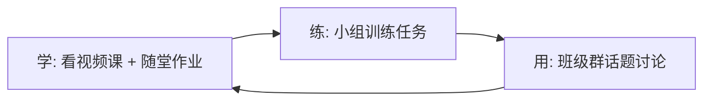

# 第01课：开营仪式

> 欢迎来到黄执中的表达课。在接下来的70天里，你将经历一段独特的表达成长之旅。

## 课程概览

### 时间安排

本课程为70天的线上训练营，分四个阶段：

| 阶段 | 周次 | 学习目标 |
|------|------|----------|
| 第一阶段 | 第1-4周 | 提升输出信息的价值 |
| 期中考 | 第5周 | 考核 + 彩蛋周（黄执中直播课） |
| 第二阶段 | 第6-9周 | 让内容产生吸引力 |
| 期末周 | 第10周 | 考核 + 彩蛋周 |

### 核心学习方法：学-练-用

表达能力的提升不是靠听课就能完成的，它需要"学练用"三位一体，像齿轮一样不断滚动。

**学** — 个人学习任务
- 观看黄执中的视频课程
- 完成随堂作业
- 周末参加教练直播课（约2小时）

**练** — 小组训练任务
- 每周结合知识点提供主题任务
- 3-5人自由组队，按执行手册进行训练
- 训练后提交作业，教练提供一对一反馈

**用** — 班级群讨论
- 每周提供热门话题
- 鼓励面对镜头表达，分享到群内交流

### 每周学习节奏

| 时间 | 任务 |
|------|------|
| 周五中午12:00 | 解锁下周全部学习任务 |
| 周一到周三 | 听课日：学习课程 + 完成随堂作业 |
| 周四 | 了解本周训练任务 |
| 周五到周日 | 小组训练 |
| 周六或周日 | 教练直播课（串讲 + 复盘） |

> [!TIP]
> 训练作业的提交截止时间是每周五晚上24:00，请留意班群提醒。

## 核心观念：表达不是口才

### 口才的误区

很多人认为表达能力好就等于"口才好"，黄执中对此有犀利的回应：

> "你夸一个作家，不会夸他的手。那为什么当一个人讲话有见解有逻辑的时候，你却说他口才好呢？"

一般人眼中的"口才好"通常指三种能力：
1. **有见解、有想法** — 这是脑袋里的东西
2. **条理分明、逻辑严谨** — 这也是脑袋里的东西
3. **真诚自信** — 这还是脑袋里的东西

没有一样跟"嘴"有关。

### 表达的本质

> 表达不是口才，表达是要教你输出一段对他人、对自己都有价值的信息。

传统的演讲训练往往注重"练嘴"——手势、表情、站姿、排比句。但这些恰恰是最不重要的。真正好的表达来自**内容本身的价值**，而不是外在的姿态。

### 表达清单

本课程围绕一张"表达清单"展开，包含四条检查项：

1. **我有表达的动机** — 我为什么想讲？
2. **我了解听众的目的** — 听众为什么想听？
3. **我有清晰的框架** — 我的内容如何组织？
4. **我能一句话总结核心思想** — 我的核心是什么？

> [!QUOTE]
> "表达不只是一种说话方式，事实上，它更是一种思考方式。你脑子里是糊涂的，讲出来的话就会是糊涂的。"

## 教练与支持

本课程提供四种教练服务：

- **一对一作业点评**：教练对你的训练作业进行个性化反馈
- **一对一答疑**：可私聊教练，工作时间回复
- **小组训练**：教练可能惊喜掉落参与训练
- **教练直播课**：每周六或日固定直播

## 优秀学员奖励

| 阶段 | 条件 | 奖励 |
|------|------|------|
| 第5周 | 课程完成率100% + 训练作业全部完成 | 神秘大礼（不限名额） |
| 第10周 | TOP30优秀学员 | 电子证书 + 学长姐资格 + 免费复训 |

## 课后任务

- 在群内完成破冰任务，认识小组成员
- 尝试发起第一次小组训练
- 思考：你为什么要学习表达？你的表达动机是什么？

---

**下一课：** [[0002-biao-da-ben-zhi|第02课：学表达，我们要学的是什么？]]