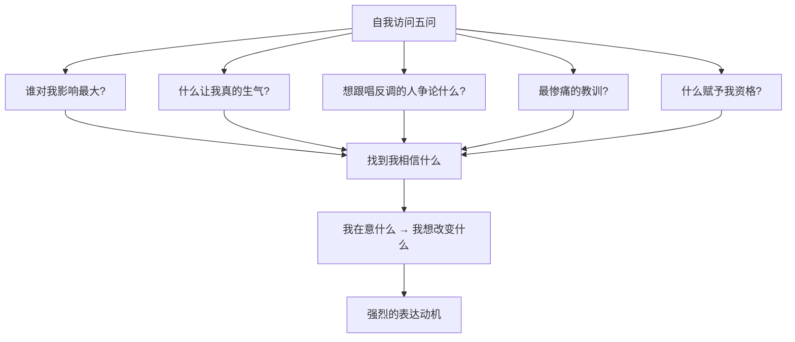

# 第04课：如何挖掘素材？

> 你不是没有素材，你只是没有问对问题。

## 练习：两种写法的差距

拿一张白纸，左边写上主题"我对上网课有什么看法"，花一分钟写下你能想到的关键词。然后看看右边——用下面这套方法，你会发现能写的东西多得多。

## 自我访问五问

这套方法源自NBA记者采访球员的技巧。运动员在场上生龙活虎，但拿到麦克风就不知道说什么。记者发明了一个方法：**问对问题，打开话匣子**。

### 问题一：谁对我影响最大？他做过或说过什么？

这个问题之所以好用，是因为它非常容易勾起回忆和情感。

黄执中的例子：高中社团学姐陈玉如对他说过一句话——**"一个人有了机会，就不能再有理由。"** 因为学姐给了他几乎所有上场机会，所以输掉比赛后抱怨裁判，得到的回应就是"你不够强"。这句话影响了他一辈子。

你可以问自己：
- 关于销售，谁对我影响最大？
- 关于创业，谁对我影响最大？
- 关于教育孩子，谁对我影响最大？

### 问题二：什么会让我真的生气？我最想吐槽什么？

愤怒和吐槽是最强的表达动机。黄执中分享了一个自己的例子：2002年第一次参加海峡两岸大学生辩论赛，临行前一位老师来"教"他们辩论技巧。他朋友说了一句话："我们如果是个乒乓球队去对岸交流，那个人敢教我们怎么打乒乓球吗？"——因为人们不把辩论当专业，人人都觉得可以教你两下。

你可以问自己：
- 作为管理者，什么会让你真的生气？
- 作为产品经理，什么让你最想吐槽？
- 作为职场人，什么让你忍无可忍？

### 问题三：我最想跟唱反调的人争论什么？

这非常容易激发表达欲。如果有人告诉你"保险就是智商税"，你想跟他争论什么？如果有人告诉你"老师就该无私奉献"，你想说什么？

> [!TIP]
> 这个问题的妙处在于：它假设了一个具体的反驳对象，让你不再面对"抽象的听众群体"，而是对具体的"那个人"说话。

### 问题四：我受过最惨痛的教训是什么？

惨痛的教训往往伴随着强烈的情绪和深入的思考。你在这件事上花了多少反思，就有多少素材可以分享。

### 问题五：是什么赋予我说这些的资格？

这让你找到自己的独特视角。你不仅是"一个分享育儿经验的妈妈"，你是"在三年全职带娃后把孩子送进重点小学的妈妈"。资格不是炫耀，而是你独特的经历让你有独特的观点。

## 自我访问的核心原理

这五个问题的共通点：**它是一个内在的采访，帮助你找到内在想要表达的动机。**

## 案例：杨天真的表达为什么有力量

黄执中在课程中播放了《奇葩说》中杨天真的发言片段。对比同样在场的李想和王小川，杨天真的表现明显更打动人——不是因为她口才更好，而是因为她的表达中充满了**强烈的动机**：

- "我去年六月份决定不做经纪人，做女装，每一天都在直播卖货，网上骂声一片。"
- "我在别的节目都是当导师的，来这里一分钱没有，为什么？因为我有话想说。"
- "当你知道心中什么事情更重要的时候，你不会在意这些评价的。"

她的整个表达，其实就是用自我访问五问提炼出来的。

> "动机大于知识大于技巧。一个有动机的人，你根本不会在意他的技巧熟不熟练。"

## 自我检查

你的自我访问练习做得怎么样？

做完练习后，对比左半边（直接写观点）和右半边（用五问引导），你的素材是不是翻了好几倍？如果某个问题没给你灵感，换一个。这五个问题是可选项，不是必答题。

## 课后任务

- 选一个你想表达的主题（工作汇报、产品介绍、生活分享都可以）
- 用自我访问五问，在纸上写下你的回答
- 找出其中最有表达欲的一条，把它变成一段1分钟的即兴表达，录下来听听

---

**相关资源：** [[../reference/glossary|术语表]]

**下一课：** [[0005-xi-yin-ting-zhong|第05课：如何吸引听众？]]