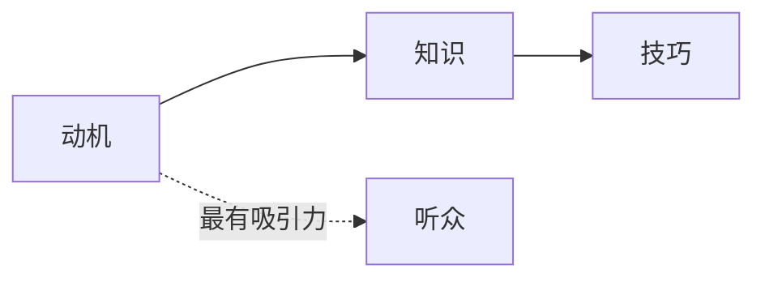

# 第05课：如何吸引听众？

> 听众永远能看出你是不是真的在乎。你在意，就是最大的吸引力。

## 什么是"对话感"？

李诞曾评价黄执中的表达："他讲话的对话感特别明确——让人感觉他在跟某一个人讲话，而不是对着一个抽象的群体。"

黄执中早年教辩论时就告诉学弟妹：**上台要设定一个"小明"**——小明就是你今晚真正想要对话的那个人。

> 你一旦是对一个抽象的群体说话，就很容易觉得自己只是个读稿的机器。

### 案例：奇葩说"频繁被渣是不是我的问题"

黄执中录制这一期时，脑海中浮现了前几天在辩论圈活动上遇到的一个学弟。学弟得知辩题后，猛一抬头说："不然嘞？"——他的表情太鲜明了，那一瞬间黄执中就知道：这就是我要对话的那个人。

整段表达都像是在对这个学弟解释：**"我要解释给你听，这件事不是这个样子的。"**

## 动机大于知识大于技巧

### 三个层次

- **动机**（最优先）：你想表达的欲望和你真正相信的东西
- **知识**（其次）：关于表达的书籍和方法
- **技巧**（最末）：手势、语速、姿态等

### 素人的优势

如果你是一个毫无经验的素人，但有强烈的表达欲望，你的**不熟练反而会成为特色**。

黄执中提到《奇葩说》选手张宏飞（飞飞是大王）的两次表现：

| 场景 | 辩题 | 效果 | 原因 |
|------|------|------|------|
| 第一次 | 该不该感谢生活的暴击 | 非常精彩 | 他有亲身经历，动机强烈 |
| 第二次 | 城市空气不好要不要离开 | 明显变弱 | 他没有真正在意这个题目 |

同样的选手，同样的场地，有动机和没有动机的表现天差地别。张宏飞讲话会结巴、会磕巴，但在第一段演讲中，这些磕巴反而成了他的特色——因为听众被他的内容吸引，根本不在意这些细节。

> "在热情和动机驱动下展现的不一样，叫特色。没有热情的情况下谈特色，都是骗人的。"

## 听众不是笨蛋

> "你把台下的人当南瓜，人家一定感受得出来。"

黄执中回忆线下课的一个学员：她用演讲比赛的腔调分享了一个"感人故事"——花了很长时间准备演讲比赛却输了，收到朋友的安慰短信后，觉得"人生最重要的不是胜负，而是身边好友的关怀"。

黄执中当场告诉她："我不相信你讲的东西。我也参加过比赛，投入了全部精力却输掉的时候，我想的是'我要烧掉整个会场'，而不是收到安慰短信就觉得人生有爱。"

**讲者自己都不在意的东西，听众不会在意。**

## 错误的动机 vs 正确的动机

### 错误的动机（让压力更大）

| 想法 | 潜藏的恐惧 |
|------|-----------|
| 我讲好了大家就会签约 | 万一讲不好就没人签约 |
| 我讲好了就能被录取 | 万一讲不好就完了 |
| 我讲好了就能红 | 万一讲不好就丢脸 |

### 正确的动机

- **我相信这个观点对别人有价值**
- **我在意这个问题，想让大家也知道**
- **我想改变一些事情**

## 课后任务

- 回顾你上一次向别人分享的经历：你有没有"小明"——那个你真正想对话的人？
- 如果你明天要在部门会议上分享一个观点，你的"小明"是谁？你想对他说什么？
- 尝试录一段1分钟的即兴表达，主题自选。回听时判断：你有"对话感"吗？还是像在读稿？

---

**相关资源：** [[../reference/glossary|术语表]]

**下一课：** [[0006-xun-lian-dong-ji-demo|第06课：小组训练教练演示视频]]