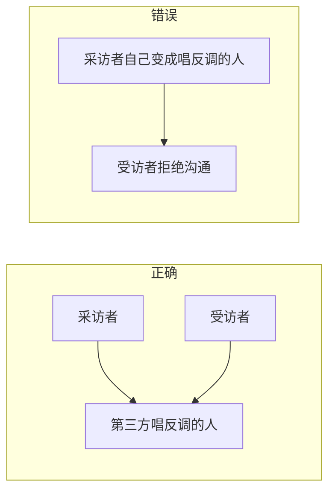

# 第06课：小组训练教练演示视频

> 本课是动机访谈的实操示范，三位教练分别扮演采访者、受访者和旁观者，演示如何通过提问挖掘表达动机。

## 训练目标

本周的小组训练任务是**动机访谈**——通过"自我访问五问"互相挖掘表达动机。目标是帮助每个人找到自己的"外星人"（那个让你充满表达欲的话题）。

## 角色分工

| 角色 | 职责 | 扮演者 |
|------|------|--------|
| **采访者** | 用动机五问进行提问，挖掘受访者的表达动机 | 黄鑫教练 |
| **受访者** | 保持自然，配合提问表达真实想法 | 阿峰教练 |
| **旁观者** | 记录提问技巧和受访者的反应，提供第三方反馈 | 欧阳教练 |

## 示范流程

### 第一步：开始采访

采访者从话题方向切入，用动机五问引导受访者。

**示例对话：**

> **采访者（黄鑫）：** 我看你这次选择的是"生活"这个话题。在这个领域，有你印象特别深刻的事情吗？
>
> **受访者（阿峰）：** 来北京后和伴侣一起生活，伴侣对我的影响比较大。
>
> **采访者：** 有什么特别惨痛的经历吗？
>
> **受访者：** 惨痛好像没有——因为我是亲密关系课的教练，有苗头就掐掉了。
>
> **采访者：** 那有什么想吐槽的地方吗？
>
> **受访者：** 我的伴侣特别懒。我上班走了他还在睡觉，约定好我做饭他洗碗，结果碗放一天都不洗。

### 第二步：使用"唱反调"技巧

当受访者提出吐槽点时，采访者可以引入"唱反调"的视角来激发更强的表达欲。

> **采访者：** 社会上有人说，男生在外面赚钱就够了，家务应该女生做。对这种唱反调的声音，你有什么想说的？
>
> **受访者：** 非常典型的大男子主义。现在大家都是社畜，凭什么我也有赚钱，家务却全是我做？家务应该是两个人共同分担的。就算以前那种模式，女生在家里做家务也是没有反馈的，男生在外面工作既有钱又有价值感——这不平等。

> [!TIP]
> 当受访者开始情绪激动、语速加快、语气加强时，说明你已经挖到了他的"外星人"——他真正在意的东西。

## 常见误区

### 误区一：死磕一个问题

**错误示范：**

> - "有没有印象特别深刻的事？"
> - "一时想不起来。"
> - "怎么可能？再想想？"
> - "确实没有很想说的。"

**正确做法：** 换一个问题。如果"印象深刻的事"打不开话匣子，就试试"什么让你生气"或"想吐槽什么"。

### 误区二：打断受访者

**错误示范：**

> 受访者正在讲猫的事情，采访者却打断说："猫的事我知道了，那还有什么其他印象深刻的事吗？"

**正确做法：** 受访者好不容易开始有表达欲，要**放大他的动机**，让他多说，而不是打断他换话题。

### 误区三：把自己当成唱反调的人

**错误示范：**

> 采访者自己开始长篇大论："我不得不跟你说，中国古代男子为天女子为地，男生做家务根本就不搭..."

**正确做法：** 树立一个**第三方的敌人**，和受访者一起对着这个"假想敌"反驳，而不是自己变成那个"敌人"。

## 给受访者的建议

1. **保持自然**：不需要刻意组织语言，真实就好
2. **适当夸张情绪**：当你有表达欲时，加重语气，让对方感受到
3. **及时说"不"**：如果问题涉及隐私或你还没想好的话题，直接告诉采访者"这个问题我还不想回答"

## 给旁观者的建议

1. 记录哪些提问是**有效的**，让受访者眼睛发亮
2. 记录哪些提问是**无效的**，让受访者沉默
3. 关注受访者**表达动机特别膨胀的瞬间**
4. 结束后提供**第三方视角的反馈**——不是教对方做事，而是分享观察

## 课后任务

- 在小组中完成一次动机访谈，三人轮流扮演采访者、受访者和旁观者
- 每人至少完成一轮完整的动机五问
- 将采访中挖掘到的素材整理成一段1分钟的表达内容

---

**相关资源：** [[../reference/frameworks-cheatsheet|框架速查表]]

**下一课：** [[0007-dong-ji-xiang-wai-tui|第07课：如何将表达动机向外推？]]