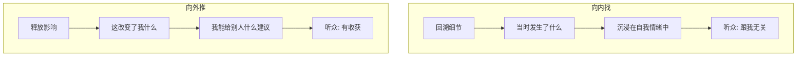

# 第07课：如何将表达动机向外推？

> 表达动机不仅要向内找，更要向外推。止步于"我想说"，不如进阶到"这对你有用"。

## 为什么只有内在动机不够？

学员萌萌的案例：她通过动机访谈找到了表达素材——吐槽老公恋爱时殷勤、结婚后懒散的巨大反差。她滔滔不绝地讲了很久，但听众的反应却是：

- "我对他家的事没那么感兴趣"
- "这跟我有什么关系呢？"
- "感觉他有些自我陶醉"

### 向内找 vs 向外推

**向内找**：追求细节回溯，讲的是"我怎样"——路越走越窄
**向外推**：讲的是"这让我明白了什么"——路越走越宽

## 如何把动机向外推？

以萌萌的案例为例，教练通过三个问题帮她完成了从"向内"到"向外"的转变：

### 问题一：这段经历让你对这件事有了什么新的理解？

> 萌萌：恋爱确实不是人生的常态，不可能一辈子享受激情浪漫，总要回归日常的琐碎和舒适。

### 问题二：如果回到过去，你会做什么不同的选择？

> 萌萌：可能还会选现在这个老公。男人都一样，说不定结了婚之后都一个样。

### 问题三：你会给身边有类似情况的人什么建议？

> 萌萌：作为过来人，安全感、舒适感和浪漫激情就像硬币的正反两面，不可能什么都要。建议姐妹们放低对婚姻的预期，以免失望。同时也可以了解一下"别居婚"这种新的婚姻模式。

第二天，萌萌的演讲大获成功。她的核心信息变成了"如何经营婚后的生活"，而不是"我的老公有多糟糕"。

## 向外推的本质

> 向外推不是让你"好为人师"，而是让你的经历**对别人产生影响**。

不同主题的向外推示例：

| 主题 | 向内找（无效） | 向外推（有效） |
|------|--------------|--------------|
| 校园暴力 | 我当时多么痛苦 | 我特别理解为什么有些青少年会选择轻生 |
| 保险行业 | 我的保险产品介绍 | 我希望重塑外界对保险的认知 |
| 抑郁症 | 我的病痛经历 | 希望消除外界对抑郁症的误解 |
| 职场吐槽 | 我的老板有多糟糕 | 教你几招怎么和老板处好关系 |

## 案例：石头的故事

石头在动机访谈中说：他小时候经常被欺负，被起外号"死肥猪"。向妈妈告状，妈妈说"别人怎么不欺负别人就欺负你"；向姐姐求助，姐姐说"你怎么那么多事"。当时他拿了一把剪刀躲在库房，盯着窗外，希望有个人能看到他。

**如果向内找**：继续追问妈妈怎么说的、姐姐怎么冷漠的——越来越窄。

**向外推的关键一问**：

> **教练：** 这段经历给你带来最大的影响是什么？
>
> **石头：** 我变得很自卑，但我养成了一个习惯——我特别在意别人的感受，甚至超过自己。因为我知道被忽视的感觉有多难受。
>
> **教练：** 如果这段经历可以分享给那些原生家庭也很糟糕的人，你会对他们说什么？
>
> **石头：** （一拍桌子）我女儿出生的那天，我把她抱在怀里，她像天使一样治愈了我所有童年不幸的经历。我心里头有一个裂缝，突然被填满了。

第二天的演讲感动了很多人。核心信息变成了"原生家庭的痛可以被治愈"，而不是"我的童年有多惨"。

## 理想状态：内外兼修

> 最理想的状态是既有内在动机，也能在后半段加入外在动机，让自己的内容产生影响。

**内外兼修的路径：**

1. 先用内在动机找到你有表达欲的点（**我想说**）
2. 再思考这个经历给你带来了什么改变（**这让我明白**）
3. 最后提炼出对听众有价值的建议（**这对你也有用**）

## 课后任务

取一张纸，左侧写下你最近最想吐槽的一件事（向内找）。然后回答以下三个问题（向外推）：

1. 这件事让你对相关领域有了什么新的理解？
2. 如果回到过去，你会做什么不同的选择？
3. 你会给有类似经历的人什么建议？

对比左右两侧，感受"向内"和"向外"的差异。

---

**相关资源：** [[../reference/glossary|术语表]]

**下一课：** [[0008-ting-zhong-qi-da-mu-di|第08课：如何拆解听众的7大目的？]]