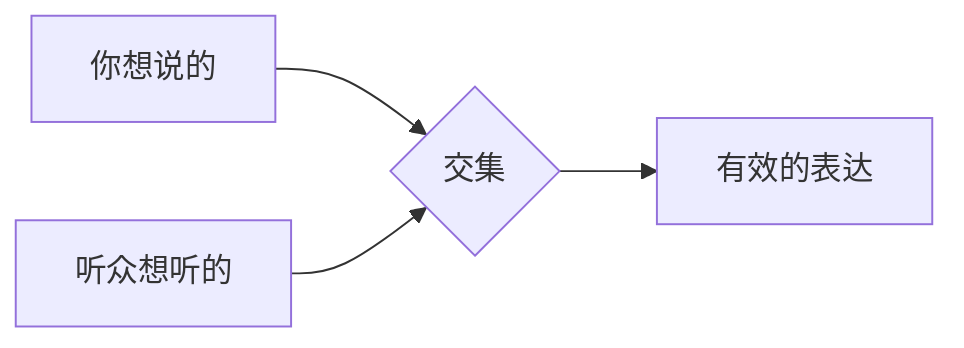

# 第08课：如何拆解听众的7大目的？

> 表达的本质是服务，不是自我展示。你能为听众提供什么价值？

## 表达的"交集"原则

表达永远是在找**你想说**和**听众想听**之间的交集。

表达和聊天的区别：
- **聊天**：大家开心就好，你说你的我说我的
- **表达**：本质是**利他行为**，主轴是"我能为你们提供什么"

## 听众的7大目的

职业演说家Scott Birken提出了一个实用的分析框架：听众在听你表达时，无非想满足以下7种需求之一。

| 序号 | 目的 | 说明 |
|------|------|------|
| 1 | **想学习** | 想在你这学到具体的方法或知识 |
| 2 | **想获得启发** | 想听到跨界的新角度，打开思路 |
| 3 | **想得到乐趣** | 想被逗笑、放松、获得愉悦 |
| 4 | **想看到你** | 想亲眼见到讲者本人，满足好奇心 |
| 5 | **想遇到同好** | 想确认"我们是一类人" |
| 6 | **想看看有什么新鲜事** | 想听到冷知识、新奇信息 |
| 7 | **想早点离开** | 不得不在场，只盼着准时结束 |

> [!TIP]
> Scott Birken是唯一一个把"想早点离开"也写进列表的人。这代表他是真的有实战经验——别担心，你总能满足一两个需求，最不济，准时收尾也能满足最后一项。

## 场景分析：不同场合的听众排序

### 场景一：企业年会（如新集团年会）

4000人的运动场，两天的活动全满。听众都是同行伙伴。

**黄执中的判断：**

| 排序 | 目的 | 原因 |
|------|------|------|
| 1 | 想得到乐趣 | 来参会不是来上课的 |
| 2 | 想遇到同好 | 借机会和伙伴交流 |
| 3 | 想获得启发 | 顺便听听新观点 |
| 4 | 想看到你 | 看看名人长什么样 |
| 5 | 想看看新鲜事 | 了解行业动态 |
| 6 | 想学习 | 不指望在这种场合深度学习 |
| 7 | 想早点离开 | 散场了他们还在交换微信 |

**应对策略：** 傅首尔上台全程讲段子，不讲"风雨交加砥砺前行"的严肃主题，因为大家要的是乐趣。黄执中则通过**强调背景相似**来满足"遇到同好"——分享自己年轻时被人说"打辩论不能当饭吃"的经历，让台下同样遭受过冷眼的如新伙伴感到"我们是一类人"。

### 场景二：TED演讲（三里屯）

不同背景、不同行业的讲者同台。听众来自各行各业。

**黄执中的判断：**

| 排序 | 目的 |
|------|------|
| 1 | 想获得启发 |
| 2 | 想看到你 |
| 3 | 想看看新鲜事 |
| 4 | 想得到乐趣 |
| 5 | 想学习 |
| 6 | 想遇到同好 |
| 7 | 想早点离开 |

**为什么"想学习"排这么低？** 因为要学辩论不会只靠TED这十几分钟，要学建筑也不会来听设计这一场。听众来TED是**跨界找启发**的——听听不同领域的思维方式，看能不能迁移到自己的领域。

**启发 vs 学习的区别：**

| 维度 | 学习 | 启发 |
|------|------|------|
| 语气 | "这件事很重要，来向我学" | "不知道对你有没有用，但可以给你参考" |
| 重点 | 强调重要性 | 强调可迁移性 |
| 例子 | "人人都该学辩论" | "辩论中的方法，拿到职场也很好用" |

### 场景三：学术讲座

黄执中（副教授，同名同姓的另一位）的"高分辨率超音波弹性影像"讲座。

**预期排序：**

| 排序 | 目的 |
|------|------|
| 1 | 想学习 |
| 2 | 想早点离开（很多人是不得不到场） |
| 3 | 想获得启发 |
| 4 | 想遇到同好 |
| 5 | 想看到新鲜事 |
| 6 | 想看到你 |
| 7 | 想得到乐趣 |

## 让"新鲜事"更有吸引力

当你想满足听众"想看看有什么新鲜事"的需求时，用三个标签包装你的内容：

| 标签 | 含义 | 示例 |
|------|------|------|
| **稀少** | 知道这件事的人是少的 | "只有我们这种在一线做保险的人才知道..." |
| **高价** | 为知道这件事付出了很大代价 | "一个人欠了几亿的男人，晚上睡觉会想什么？" |
| **受限** | 只在特定的场合才说 | "趁今天这个机会，我跟你们说一个秘密，别的地方我都不敢讲..." |

## 课后任务

- 选一个你即将面对的表达场景（工作汇报、分享会、团队发言）
- 用7大目的分析你的听众，给他们排序（1-7）
- 根据排序，调整你表达内容的侧重点
- 记录听众的反馈，验证你的判断是否准确

自检：你换位思考了吗？

问问自己：
- 如果我是台下的听众，我来这里是为了什么？
- 我讲的内容，真的能满足听众最主要的需求吗？
- 我有没有在"自嗨"——讲了自己想讲的，但听众并不在意？

---

**相关资源：** [[../reference/glossary|术语表]]

**下一课：** [[0009-cha-yi-ting-zhong|第09课：如何为差异大的听众设计内容？]]