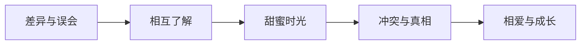

## 什么是框架

框架不是"套路"也不是"公式"。它的官方定义是：

> **在分析问题时，先设定框架，就能明确掌握思考范围，检验是否遗漏重要事项，便于反复练习修正，进而加快反应效率。**

但更直观的理解方式，是看一个经典例子。

## 好莱坞浪漫喜剧的五步框架

好莱坞电影工业为浪漫喜剧定下了一个标准化框架，包含五个元素：

1. **差异与误会**：男女主角一开始看起来绝对不适合——社会地位、个性、职业的差异制造冲突
2. **相互了解**：因某个理由必须接触，发现彼此和想的不一样
3. **甜蜜时光**：放下成见后产生愉快互动，让观众觉得"他们在一起真好"
4. **冲突与真相**：某个秘密或谎言被揭穿，制造最大转折
5. **相爱与成长**：双方都有所改变，最终在一起

> [!TIP]
> 梁山伯与祝英台也完全符合这个框架：求学相识（差异误会）→ 同窗相知（相互了解）→ 恋爱甜蜜（甜蜜时光）→ 马文才（冲突真相）→ 化蝶（相爱成长）。

### 框架的用处

有了这个框架之后：
- 可以**复盘**——电影卖座是因为哪一步做得好？失败是因为哪一步没做好？
- 可以**创作**——先找两个差异最大的对象（和尚与尼姑？债主与欠债人？），再一步步安排后续情节
- 可以**检验**——是否遗漏了某个重要环节

## 框架的两大特性

### 约束性（框子）

框架约束了你思考的范围，但**约束不限制创意，反而增加创意**。"写一个浪漫喜剧"什么限制都没有，反而不知从何下手。"先想两个差异最大的角色"——这个约束推动了想象力。

### 支撑性（架子）

框架提供了内容的基本结构，让你不必平地起高楼。有了架子，你就可以在上面填充内容。

> [!QUOTE]
> 框架就是**为了解决一个开放性问题，而设计出的一个具有约束性与支撑性的结构**。

## 生活中的框架示例：PUNCH

口语传播系教开场白的PUNCH框架：

| 字母 | 含义 | 说明 |
|------|------|------|
| P | Personal | 分享个人故事、小秘密 |
| U | Unexpected | 讲意料之外的话或提问 |
| N | Novel | 讲新鲜事、没听过的内容 |
| C | Challenge | 给听众一个挑战性问题 |
| H | Humor | 用幽默开场 |

> [!WARNING]
> 市面上常见的框架（PREP、AIDA、SCQA、黄金圈）虽然知名，但大多数在实际表达中并不好用。它们依赖英文首字母缩写，对中文母语者不够直观，应用场景也不够广泛。唯一值得推荐的是**金字塔原理**（先讲结论再讲理由），但它主要适用于职场向上汇报。

[[../reference/glossary|术语表]] | [[../reference/frameworks-cheatsheet|框架速查表]]

## 自我检查

框架的约束性和支撑性分别指什么？

- **约束性（框子）**：限定思考范围，让你不需要从头开始，在约束范围内发挥创意
- **支撑性（架子）**：提供基本结构，让你知道每一步该做什么，便于复盘和修正

两者合在一起，框架就成了一个既有方向感又有操作性的工具。

