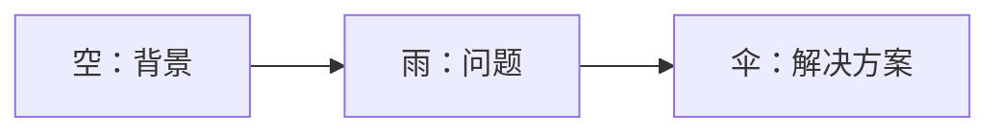
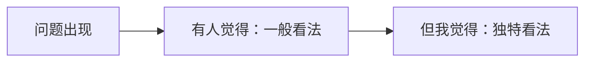

## 为什么这三个框架？

市面上常见的框架（PREP、AIDA、SCQA、黄金圈）有以下问题：

1. 依赖英文首字母缩写，对中文母语者不够直观，临场容易忘
2. 应用场景窄，大多数讲者自己平时也不用
3. 除了金字塔原理（主要用于向上汇报），其他框架实用性存疑

**本文介绍的三个框架，都是黄执中本人日常使用的。**

---

## 框架一：过去现在未来

适用场景：即兴发言、被问到看法、典礼致辞、感言分享

### 结构

```
过去（背景/起因/经历）→ 现在（现状/变化/感受）→ 未来（展望/期许/建议）
```

> [!TIP]
> 这个框架之所以好用，是因为它符合人类的叙事本能——时间顺序是最自然的逻辑。你不需要背稿，只需要知道"过去讲什么、现在讲什么、未来讲什么"三个方向即可。

### 案例一：早恋问题

问："您对小孩子早恋有什么看法？"

- **过去**：在八九十年代，人们会把早恋视为洪水猛兽，老师和家长严厉阻止
- **现在**：随着社会发展，人们对青少年身心发展规律有了更多了解，采取包容疏导的态度
- **未来**：相信未来人们对早恋的认知会更科学、更理性、更合理

### 案例二：婚礼致辞

- **过去**：我认识新郎的时候，他还是个毛头小子
- **现在**：看到他站在这里，身边有了想要共度一生的人
- **未来**：希望他们能一直这样幸福下去

### 案例三：母校致辞

- **过去**：当年我在这里念书的时候
- **现在**：今天再回到母校
- **未来**：希望学弟学妹们

> [!QUESTION]
> 这个框架的比例一定要是1:1:1吗？不必。你可以根据重点调整篇幅。如果你的重点是批判过去的做法，过去部分就可以讲得更长；如果你更关心未来趋势，未来部分可以更详细。

---

## 框架二：空雨伞

适用场景：任务简报、产品介绍、问题分析、职场汇报

这个框架源自日本麦肯锡公司：**空（背景）→ 雨（问题）→ 伞（解决方案）**



### 三种变体

| 顺序 | 说明 | 适用场景 |
|------|------|---------|
| 空→雨→伞 | 先背景、再问题、再方案 | 介绍性简报 |
| 雨→空→伞 | 先问题、再背景、再方案 | 问题驱动的汇报 |
| 伞→空→雨 | 先方案、再背景、再问题 | 提案或说服 |

### 案例：汽车保养

**空（背景）**：换轮胎、换雨刷，品质好坏看得见，消费者可以检验。但机油不一样——机油是加在车子里面的，它的纯度、品质好不好，在出问题之前不知道。

**雨（问题）**：你怎么确定你加的机油是正品？即便从正牌机油的盒子里倒出来的，里面都不一定装的是正牌机油。

**伞（解决方案）**：找有品牌、有信用的大保养厂，比如途虎。

> [!TIP]
> 空雨伞的比例不用一致。有的简报目的是分析背景（空占50%以上），有的目的是突出问题的严重性（雨占50%），有的目的是推广方案（伞占50%）。根据你的目的调整比例。

### 今晚吃什么？

- **雨**：问题特别难回答，为什么难回答？
- **空**：因为每个人的口味、身体状况、饮食习惯都不同
- **伞**：如果一定要推荐一道菜，我会推荐炖排骨

---

## 框架三：3C

适用场景：提出独特观点、说服性分析、表达不同立场

这个框架源自日本管理学家大前研一的3C战略模型（顾客、竞争者、公司），在表达中转化为：

> **问题出现 → 有人觉得（竞争者看法）→ 但我觉得（我的看法）**

### 结构



> [!WARNING]
> 3C的核心价值在于**对比**。没有"有人觉得"作为铺垫，你的"但我觉得"就显得平淡无奇。竞争力者的看法构成了你观点的参照系。

### 案例一：躺平

**问题出现**：很多年轻人在喊躺平。

**有人觉得**：代表年轻人不努力、放弃自我。

**但我觉得**：恰恰相反。一个社会只有安全了、基本富裕了，才会有人敢躺平——因为知道躺平不会死。如果是在战乱的年代，躺平就死了。所以年轻人喊躺平，是安全感充足的信号，是社会进步的表现。

### 案例二：早恋

**问题出现**：中小学生早恋现象。

**有人觉得**：早恋是因为情窦初开、性启蒙。

**但我觉得**：早恋往往与性无关，与**自我价值感**有关。调查发现，最容易早恋的反而是平常在家里管得特别严的乖孩子。原因是在家受到的是"有条件之爱"——你好好念书爸妈才爱你。一旦有人可以"只爱我本身"，几乎没有孩子能抗拒这种诱惑。

### 案例三：你最喜欢的菜

**问题出现**：问我最喜欢吃什么菜。

**有人觉得**：当然是和牛、帝王蟹、松露，越名贵越好吃。

**但我觉得**：越熟悉的越好吃。比起没吃过的名菜，我更愿意吃从小吃到大的家常菜。

## 三种框架对比

| 框架 | 适用场景 | 核心优势 |
|------|---------|---------|
| 过去现在未来 | 即兴发言、感言致辞 | 时间线最自然，永远不会忘 |
| 空雨伞 | 简报、产品介绍、问题分析 | 三要素清晰，可灵活调整顺序 |
| 3C | 说服、观点表达、辩论 | 对比产生说服力，让你的观点与众不同 |

> [!TIP]
> **框架不是三板斧**。三板斧的意思是只有三招，用完就技穷了。但框架越熟练越强大——同样用"过去现在未来"，苏东坡写《岳阳楼记》也是用这个框架，但人家写得好和一般人写得好，差距是物种级的。**框架只是帮你找内容的方向，内容的质量取决于你的积累和思考。**

## 练习

<details>
<summary>用"过去现在未来"框架谈谈你今天的状态。</summary>

**过去**：今天早晨起来感觉很疲惫，昨晚没睡好。
**现在**：随着工作推进，精神逐渐集中，效率在回升。
**未来**：希望今天能按计划完成任务，晚上早点休息，明天恢复状态。
</details>

<details>
<summary>用"空雨伞"框架介绍你最近参与的一个项目。</summary>

**空**：公司最近发现客户投诉率上升，集中在新产品线。
**雨**：调研后发现是界面交互流程过于复杂，用户学习成本高。
**伞**：我们重新设计了交互流程，将操作步骤从7步减少到3步。
</details>

<details>
<summary>用"3C"框架对你熟悉的一个观点发表不同看法。</summary>

**问题出现**：许多人认为学好表达需要多看多听。
**有人觉得**：只要输入足够多的知识和素材，自然就能讲得好。
**但我觉得**：学习表达应该**多说而不是多听**。表达是一门技能，技能必须通过练习来掌握。只看不练就像只看游泳教学视频却从不下水，永远学不会。
</details>

[[../reference/glossary|术语表]] | [[../reference/frameworks-cheatsheet|框架速查表]]