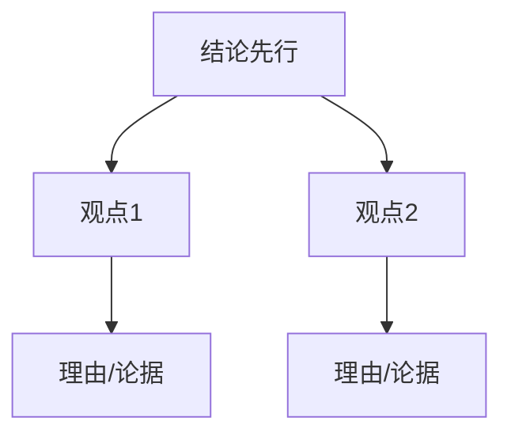

## 职场表达的困境

许多人在职场中能力不错，但向上汇报时常常遇到瓶颈：

- 不懂得如何保证每次汇报的稳定发挥
- 提需求时像"瞎猫碰上死耗子"，老板时答应时不答应
- 需要与同事竞争时，不知道如何通过表达让自己脱颖而出

核心问题在于：**表达者没有意识到，听众需要的是信息加工后的成品，而不是原材料。**

> [!QUOTE]
> 老板的内心活动是："我要怎么样从你的大段信息里面获取到我自己需要听到的那部分核心信息？"

## 场景：一段糟糕的汇报

因疫情原因，线下课需要暂停。一位员工向老板汇报了一大段信息，包含了财务老师的说法、各种细节数据……但老板听完完全抓不住重点。

问题在于：信息是**网状思考**的结果，但听众需要**线性接收**。表达者的工作，就是把网状的思考整理成线性的表达。

## 金字塔模型：结论先行 + 观点分类

这是[[0013-zhang-wo-kuang-jia]]中提到的核心框架，尤其适合**短汇报**和**明确需求**的场景。

### 结构

### 使用方法

1. **结论先行**：把核心重点前置，让听众第一时间知道你的目的
2. **观点分类**：分点给出支持结论的理由

### 案例对比

**改造前（冗长版）**：
"大师兄，财务老师阿明跟我说……那个场地那边又说……然后我们现在的情况是……"

**改造后（金字塔模型）**：
"大师兄，我们这次的线下大课需要暂停。原因有二：一是账面上的现金不够；二是会议场地无法给到准信。基于这两点，项目需要重新调整。"

### 练习

如果你是表达课的项目负责人，需要给教练团布置任务，如何用金字塔模型重组以下信息？

> 从周一开始，表达课的小训练……请大家先暂停思考一下……

**参考答案**：
"教练们需要在这周督促学员完成周作业。原因有二：一是学员参与训练才能检验知识掌握情况；二是项目团队需要收集学情状况以便迭代更新。"

## 复杂场景：空雨伞框架

当面对**信息量大、涉及多个部门和因果链**的复杂汇报时，金字塔模型可能不够用，此时需要回归[[0013-zhang-wo-kuang-jia]]中的**空雨伞**框架。

### 通过调整篇幅来强调重点

空雨伞的三个要素（背景、问题、方案）的篇幅分配，决定了听众的注意力方向：

#### 强调问题（寻求帮助）
> **背景**（一句话略过）：老板，疫情严重了，线下课无法如期开课。
>
> **问题**（详细展开）：问题的发生过程、需要在什么阶段解决、如果不解决会面临多大损失……
>
> **方案**（简要提及）：我们目前有两个方向……
>
> 潜台词：**我需要您提供帮助。**

#### 强调方案（展现能力）
> **背景**（简要提及）：疫情导致线下课暂停。
>
> **问题**（简要提及）：我们需要做出调整。
>
> **方案**（详细展开）：方案一（投入更多成本）的利弊；方案二（缩减成本）的利弊……
>
> 潜台词：**我已经有了解决方案，请您做选择。**

> [!TIP]
> 在职场中提出方案时，记得**把选择权交还给老板**。你的工作是分析利弊，决策是老板的事。

## 说服场景：3C框架

3C框架（[[0013-zhang-wo-kuang-jia]]）适合**有明确说服导向**的场景：

1. **很多人觉得**（社会共识）：以低认知成本引入话题
2. **有的人觉得**（对立的观点）：衬托你的观点
3. **但我觉得**（个人观点）：通过与对立观点的对比，彰显价值

### 案例：疫情下的项目策略

> **很多人觉得**：疫情时期大家都不好过。（社会共识）
>
> **有的人觉得**：线上教育行业应该缩减成本，保守过冬。（衬托观点）
>
> **但我觉得**：我们还可以继续投入更多生产成本。因为在忙碌时没有机会丰富课程体系，现在正好静心打磨内容，疫情之后才能打好翻身仗。（个人观点）

## 认知习惯原理

- **思考方式**：网状的、并列的、权衡利弊的
- **接收方式**：线性的、单向的、顺序的

表达者需要迎合听众的认知习惯，对信息进行**重新排列组合加工**，才能让听众以最低的认知成本理解你的意思。

> [!QUOTE]
> 我们之所以使用框架，是希望给信息进行重新加工，进而满足听众线性获取信息的需要。

## 关键总结

| 场景 | 推荐框架 | 适用条件 |
|------|----------|----------|
| 短汇报、清晰指令 | 金字塔模型 | 结论先行 + 观点分类 |
| 复杂汇报、多方信息 | 空雨伞 | 调整篇幅突出侧重点 |
| 说服、提方案 | 3C | 有明确个人观点需要表达 |

## 课后练习

选择一个你近期需要做的职场汇报，尝试用以上三种框架之一重新组织内容，比较改造前后的表达效果。