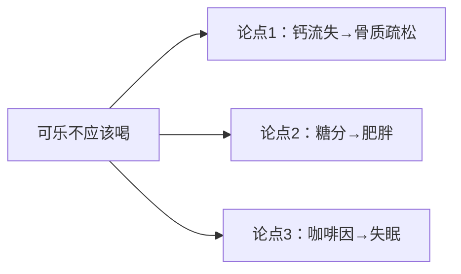

## 问题三：不知道核心思想总结得对不对

上集解决了"无法提炼"和"不知选哪个"的问题。本集解决第三个问题：**自己总结了一个核心思想，但不确定对不对。**

导致这个问题的原因通常不是表达技巧问题，而是**没有想清楚**。这涉及的是思维逻辑，不只是表达技巧。

## 逻辑小测试

一段演讲：

> "我觉得现在的年轻人应该少喝可乐等碳酸饮料。因为可乐里含有大量的磷，这会导致骨质疏松。而且可乐的危害是悄无声息的，多数没有明显的表现，一旦出现通常骨量已经减少到50%了，短期医疗很难见效。"

**问**：这段演讲中有几个观点？

很多同学会说"两个"——一个关于磷导致骨质疏松，一个关于骨质疏松难发现难医治。但实际上**只有一个观点**：

> 可乐会导致骨质疏松 → 骨质疏松是难以发现、难以医治的疾病 → 所以不应该喝可乐

这只是一个论点在同一条逻辑链上的延展，叫做**横向论点**。

## 横向论点 vs 纵向论点

### 横向论点

一个论点在同一条逻辑链上的延展。看似说了"三点"，实际上都在说同一件事。

**例子**：
> "跑步可以强身健体 → 强身健体让你加班更有活力 → 年轻人运动太少需要跑步补充"

→ 都是在说"跑步让你更健康"这件事。

### 纵向论点

不同逻辑链上的独立论点，彼此不是延展关系，而是并列关系。

**例子**——"不应该喝可乐"的三个独立理由：

1. 可乐导致钙流失 → 骨质疏松
2. 可乐含大量糖 → 诱发肥胖、口腔问题
3. 可乐含咖啡因 → 导致失眠、注意力不集中

这是三个**纵向论点**。

## 判断核心思想对不对的步骤

### 第一步：寻找逻辑观点

区分哪些是横向论点（同一线索），哪些是纵向论点（不同线索）。

### 第二步：用场景测试来明确核心

通过设计场景，测试自己在两难困境中的真实选择。

### 案例：死刑制度

一位检察官转行做律师的学员，演讲核心是**"死刑是非人道的"**。但他的内容包含三个论点：

1. 死刑执行过程很痛苦，犯人有尊严
2. 中国法治不完善，可能导致误判
3. 一个犯人的眼神让他坚定了反对死刑

**如何判断核心对不对？**

用场景问他：

> **"如果法律制度健全，每一个被判死刑的人都是罪有应得之人——你还会反对死刑吗？"**

- 如果你的答案是"不反对了"，说明你真正的核心是**"法治不完善可能误判"**（而不是死刑本身不人道）
- 如果你的答案依然是"反对"，说明你真正的核心是**"死刑本身就是不人道的"**

> [!TIP]
> 场景测试帮你剥离表面论点，找到真正的核心。你的真实立场，往往在极端场景中才会暴露。

## 逻辑能力为什么重要

逻辑不是表达之外的东西——**逻辑本身就是让表达更有魅力的根基**。

表达学堂的优秀老师（黄执中、席瑞、陈铭）都有深厚的辩论背景，这让他们在表达中自然注意到逻辑上的细节。

> [!QUOTE]
> 很多人觉得"我不想学逻辑，我只想在台上畅快淋漓地说"——但逻辑不好的人，说的内容容易零散、跳跃、缺乏推论。

## 关键总结

| 概念 | 定义 | 例子 |
|------|------|------|
| 横向论点 | 同一逻辑链上的延展 | "A导致B→B导致C→所以不要A" |
| 纵向论点 | 不同逻辑链上的独立理由 | A导致B、A导致C、A导致D |

判断核心对不对的方法：
1. 区分横向论点与纵向论点
2. 对纵向论点进行排序
3. 用**场景测试**找到真实立场

## 课后练习

1. 找一个你熟悉的标语或守则（比如公司的价值观、学校的校训），分析其中的横向论点和纵向论点
2. 在所有论点中找出你认为最重要的一个，问自己：**"如果在极端情况下，这个论点还站得住吗？"**