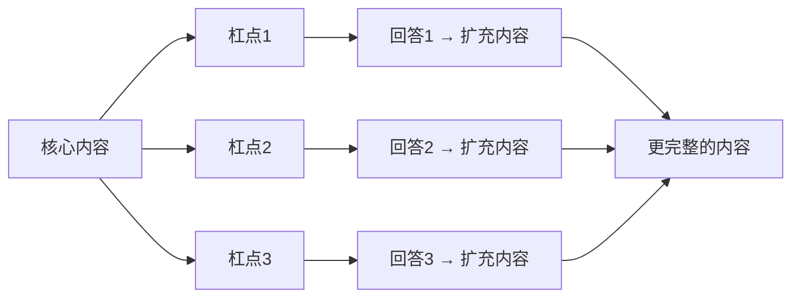

## 表达者的新挑战

现代社会中，听众对表达者的"杠"已经不可避免：

- 过去：看到大咖演讲，觉得自己渺小，听不懂也是自己的错
- 现在：每个人都有机会表达，台上的人不再有神圣光环，听众随时会质疑你的内容

**质疑不是坏事**。质疑是听众与讲者之间内心的暗暗对抗，而**对抗本身就是一种吸引元素**——辩论总比朗诵好看，吵架总比独白吸引人。

## 经典案例：别说你应该，改说我需要

这是[[../reference/glossary]]中最重要的知识点之一。

### 场景

春娇和志明是情侣，情人节志明要加班：

> **春娇**：情人节你应该要有所准备吧？
> **志明**：加班呢，你应该要体谅我吧。
> **春娇**：你应该要把我排在更前面！
> **志明**：你应该要理解，我更委屈。
> **春娇**：你现在应该要来哄哄我！

你听到"你应该来哄哄我"时，会想哄她吗？大多数人不会——"应该"会激发人的**反抗机制**。

### 解决方案

把"你应该"换成"我需要"：

| 原先 | 改写 |
|------|------|
| 你应该有所准备 | 我需要你有所准备 |
| 你应该体谅我 | 我需要你的体谅 |
| 你应该哄哄我 | 我很需要你来哄哄我 |

感觉完全不同。"你应该"带有强迫感，让人想反抗；"我需要"承认了这是自己的需求，同时给了对方选择权。

## 杠点如何变成卖点

如果课程只教到这里，就是一个半成品。真正的深度来自于**主动寻找并回应杠点**。

### 杠点一："本来就是对方应该做的"

> **质疑**：你说得轻松，但有些事本来就是对方该做的啊！

**回应**：哪有什么"本来应该"？你仔细想想——全部都是"我需要"。

- "小孩应该把房间收干净" → 是**爸妈需要**看到房间是整齐的。小孩不在乎脏乱，所以才会不收。
- "小孩应该考个好成绩" → 是**爸妈需要**看到成绩好。如果考好是小孩自己的需要，他自己就会去做。
- "你应该找对象了" → 是**爸妈需要**看到你有对象。不是你时间不多了，是他们时间不多了。

### 杠点二："说我需要听起来很自私"

> **质疑**：一天到晚说我需要我需要，听起来很自私。

**回应**：恰恰相反。"说你应该"才是自私。

- 说"我需要被哄" = 我承认这是我的需求，你**有权利决定**是否满足我
- 说"你应该来哄我" = 我包装自己的需求，把它变成你的责任，**剥夺了你的选择权**

拒绝了"我需要"的人，最多是"没帮忙"；拒绝了"你应该"的人，却成了"不应该的人"。

### 杠点三："这样说好不习惯"

> **质疑**：这样说话好别扭，不习惯。

**回应**：沟通的目的不是迁就你的习惯，是迁就对方的需求。

这个世界不是顺着你的习惯运作的。说话要顺着**人性**，不是顺着**习惯**。不习惯？那就试着去习惯。

### 杠点四："万一对方说干我屁事"

> **质疑**：我都说"我需要"了，万一对方说"干我屁事"呢？

**回应**：学沟通学说服，**千万不要学必杀技**。

世界上没有万无一失的方法。所有的沟通方法教的都是"成功机会比较大的方式"，不是"一定能成功的方式"。

即使被拒绝，说"我需要"也永远好过说"你应该"：

- "我需要你的课程免费" → 我被拒绝，但对方至少不生气，甚至可能有点歉疚
- "你的课程应该是免费的" → 我可能被揍——哪怕对方理亏，他也不会内疚

## 核心原理

> **那些表达中的杠点，同时也是卖点。**

当你能够**主动预判**听众会在哪里质疑、在哪里抬杠，并主动加以回答——这些杠点就会成为你内容的亮点，让听众觉得"这个老师讲得细，掰开揉碎了讲"。

## 关键概念

- 质疑不是敌人，质疑是帮助扩充内容的朋友
- 每一个杠点都是你完善内容的契机
- 回应杠点的过程，就是你从"普通表达者"走向"专业表达者"的阶梯

## 课后练习

选一个你常讲的知识点或观点，列出听众可能会提出的**至少三个质疑**，然后为每个质疑准备回应。你会发现，你的内容因此变得更加完整。