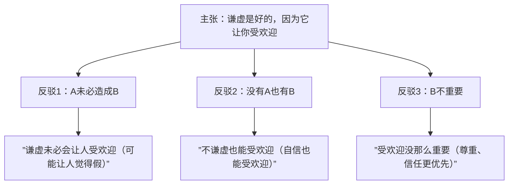

## 前提：你的问题可能不是"没逻辑"，而是"没主张"

很多人说自己"讲话没逻辑"，但实际上他们的问题是**没有提出主张的习惯**。

一个完整的**主张**包含三个要素：

1. **议题**：要讨论的问题是什么（如：电动车是不是未来的趋势？）
2. **结论**：你对这个问题的立场是什么（如：我认为是）
3. **理由**：为什么你有这个立场（如：因为一二三）

> [!QUOTE]
> 凡有意义的话都有可能错，不可能错的话都没有意义。

### 两个常见误区

**误区一：空话（没有议题/结论）**

经典话术——"这种事情既不能太过，也不能完全没有，关键还是要讲一个度，见仁见智，不能一概而论，还得具体问题具体分析。"

这句话可以套在所有议题上，但不传递任何信息。它**不可能错，但也没有意义**。

**误区二：咏叹（有结论没理由）**

"语文是什么？语言和文字？不，它是祖国的灵魂，是空灵而且动人的……"——不断重复结论，不给出任何具体理由。

> [!WARNING]
> 如果你的表达不符合"议题 + 结论 + 理由"的结构，那就不是逻辑问题，而是主张缺失的问题。

## 主张的基本模型

所有提出理由的主张，都可以简化为一个公式：

> **A是好的/坏的，因为A造成了B（好的/坏的结果）**

例子：
- 谦虚是好的，因为谦虚让你**受欢迎**
- 谦虚是不好的，因为谦虚让你**被人看轻**

### 三种合逻辑的反驳

以"谦虚是好的，它让你受欢迎"为例：

### 三种反驳详解

| 反驳类型 | 含义 | 例子 |
|----------|------|------|
| **A未必造成B** | 前提未必成立 | 谦虚未必受欢迎——太谦虚可能让人觉得很假 |
| **没有A也有B** | 有其他方式达到同样结果 | 不谦虚也能受欢迎——自信、骄傲有时更吸引人 |
| **B不重要** | 所追求的价值不优先 | 受欢迎没那么重要——尊敬、信任比受欢迎更优先 |

## "B不重要"——最有价值的一类反驳

B不重要的反驳方式之所以特别，是因为它能揭示**你内心隐藏的价值观**。

> 要注意那些你认为**理所当然**的理由。

### 例子：小明不写作业 → 坏孩子

你说"小明是坏孩子，因为他都不写作业"——这个理由暴露了你的价值观：**你认为写作业足以衡量一个人的好坏**。

什么对你来说是"理所当然的"？那些你觉得"这还用说吗"的事情，恰恰是你的价值观所在。

### 例子：忘不了前任

一个经典的情感问题："我放不下前任，因为他对我很好。"

用三种反驳来分析：

1. **A未必造成B**：前任未必对你有多好。你觉得好，可能只是**见识少**——那只是正常操作，你却以为很特别。有些被家暴的女性还会说"他对我很好，因为我哭了他就不忍心打了"——这叫好吗？

2. **没有A也有B**：其他人也会对你好。别的男生也会送你花、会幽默、会关心人——这不是前任专属的优点。

3. **B不重要**：对你好这件事，**其实没那么重要**。因为"对你好"不是你伴侣的优点，**是你的优点**。一个男生对林志玲超级好，证明的是林志玲很好，不是他很好。他会对你好，是因为你值得——你可爱、你善良、你漂亮、你有趣——这是你的优点，不是他的。

## 反向应用：用反驳强化你的主张

知道自己会在哪里被反驳，就可以反向组织你的内容。

一个好的演讲结构通常是：

1. **B很重要**——先讲清楚你要追求的价值为什么重要
2. **A能造成B**——你的方案/观点能实现这个价值
3. **没有A很难有B**——其他方式不容易达到同样效果

> [!EXAMPLE]
> 黄执中在奇葩说"外星蛋"辩题中的结构：
>
> 1. 这道题真正在问什么？——好奇心和安全感的冲突
> 2. 好奇心为什么重要？——它是探索和尝试的动力
> 3. 没有好奇心会怎样？——"虽生犹死"
> 4. 为什么有人要拍碎这颗蛋？——他们要的是"安全感的声音"
>
> 整个演讲按"B重要 → A造成B → 没有A就没有B"的结构推进。

## 这个工具的真正价值

三种反驳方法不仅可以用来检查自己的内容，还可以用来**思考生活中的具体问题**。

当你看到自己提出的理由时，不妨问问自己：**"我为什么会把这个当成理由？"** 答案往往就是你内心真正在意的价值。

> [!QUOTE]
> 内容的盲点就是自我的盲点。质疑其实就是一个自我检视的过程——去检查自己是不是暗藏着某种没有注意到的价值取向。

## 关键总结

| 步骤 | 内容 |
|------|------|
| 第一步 | 学会提出完整的主张（议题 + 结论 + 理由） |
| 第二步 | 用三种方式检查主张的漏洞 |
| 第三步 | 反向组织内容——用反驳顺序构建演讲 |

## 课后练习

1. 针对一个你持立场的议题，写下一个主张（A是好的/坏的，因为B）
2. 用三种反驳方式测试自己的主张
3. 如果有漏洞，调整你的主张
4. 用反向顺序（B重要 → A造成B → 没有A难有B）组织成一段完整的表达