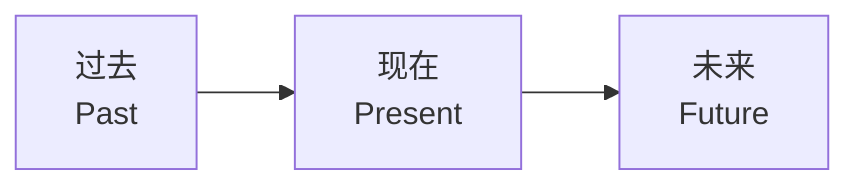
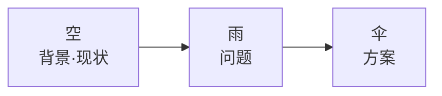
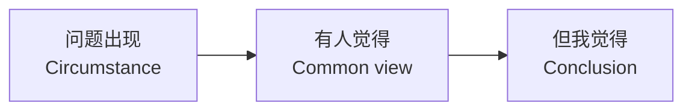

# 框架速查表

> 三种最实用的表达框架，熟记于心，即兴表达不再紧张。

## 第一框架：过去现在未来

**适用场景**：即兴发表看法、致辞、评论、感言

**结构**：

**用法**：任何话题按时间线切成三段——过去怎么样、现在怎么样、未来会怎么样。

**示例**：
- 被问到"对早恋的看法"：过去人们视如洪水猛兽 → 现在越来越包容 → 未来会更加科学理性
- 婚礼致辞：过去认识新郎时 → 现在看到他已成长 → 未来我相信他会如何
- 回到母校：过去我在这里读书时 → 现在母校的变化 → 未来我对母校的期望

**技巧**：三段比例不必相同，根据表达目的可侧重其中一段。例如想强调变化，可以把"过去"和"现在"拉长对比。

---

## 第二框架：空雨伞

**适用场景**：工作简报、产品介绍、问题分析、建议提案

**结构**：

**三种变体**：

| 顺序 | 结构 | 适用场景 |
|------|------|----------|
| 空→雨→伞 | 先说背景，再说问题，最后方案 | 标准简报 |
| 雨→空→伞 | 先抛出问题，再解释成因，最后方案 | 问题导向讨论 |
| 伞→空→雨 | 先说方案或结论，再讲背景和原因 | 提案或说服 |

**示例**（汽车保养）：
- 空（背景）：汽车保养中，轮胎、雨刷的品质看得见，但机油品质看不见
- 雨（问题）：你无法确定倒进车里的机油是否正品
- 伞（方案）：找有品牌信誉的大平台

**技巧**：
- 三段比例不必平均，可根据目的侧重某一段
- 在段与段之间加接口词："这个问题的背景是什么呢..."、"那这会造成什么问题呢..."

---

## 第三框架：3C

**适用场景**：观点陈述、说服分析、展现独特见解

**结构**：

**用法**：先描述一个现象或问题，再呈现主流或他人的看法，最后提出自己独特的观点。

**示例**（讨论年轻人躺平）：
- 问题出现：越来越多年轻人在网上喊"躺平"
- 有人觉得：这是年轻人不努力、不上进的表现
- 但我觉得：恰恰相反，有人敢喊躺平是社会进步的标志——只有基本富裕安全的社会，人才敢躺平

**技巧**：
- 可以通过否定或补充别人的看法，来凸显自己观点的价值
- 不一定要完全否定"有人觉得"，也可以做补充或差异化
- 这个框架很容易帮你输出"不一样的内容"

---

## 框架选择指南

| 场景 | 推荐框架 | 原因 |
|------|----------|------|
| 即兴被点名发言 | 过去现在未来 | 无需准备，任何话题都能套 |
| 工作汇报/产品介绍 | 空雨伞 | 逻辑清晰，层层递进 |
| 观点陈述/说服 | 3C | 通过对比凸显价值 |
| 致辞/感言 | 过去现在未来 | 有时间感和温度 |
| 问题分析 | 空雨伞或3C | 取决于重点是分析还是说服 |

## 使用心得

1. **三套好过三十套**：熟用三种框架比记住几十种更有用。紧张时你不可能回想几十种选项。
2. **框架不是三板斧**：框架越用越强，同样的"过去现在未来"，高手和初学者的内容天差地别。
3. **框架替代逐字稿**：有框架就有逻辑，有逻辑就不需要背稿子。框架决定方向，不决定每一句话。
4. **比例可调**：不要把框架当成"各占三分之一"，根据表达目的灵活分配篇幅。
5. **框架是辅助轮**：先靠框架站稳，熟练后可以自由变体、组合使用。

> [!TIP] 温习提示
> 回到课程深入学习：
> - [[../lessons/0013-zhang-wo-kuang-jia|第13课：掌握清晰的框架]]
> - [[../lessons/0012-li-jie-kuang-jia|第12课：如何理解表达的框架]]
> - 更多术语见[[glossary|术语表]]