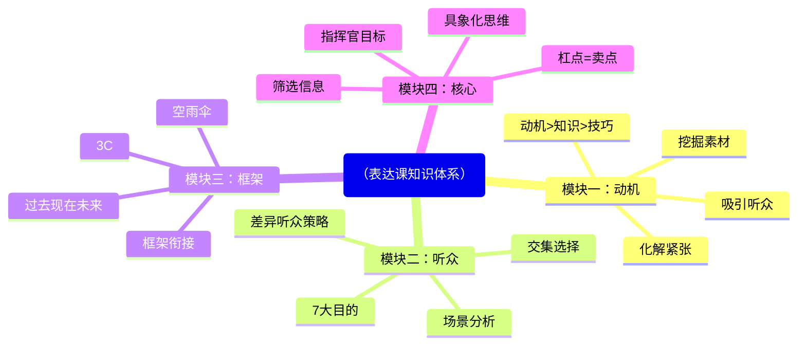
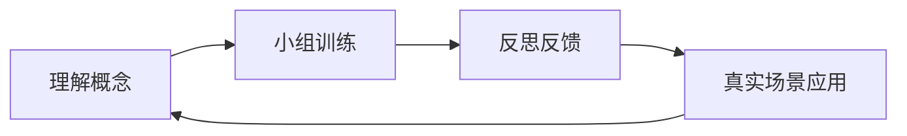

# 核心概念总结

> 课程四大板块的核心知识与关键方法，全局概览。

## 课程全景

## 模块一：表达的动机

### 核心理念
- **表达不是口才，是思考方式**：你的语言呈现的是你脑子的状态
- **动机 > 知识 > 技巧**：有动机的人，一切瑕疵都是特色；没动机的人，一切技巧都是伪装
- **自信是结果，不是原因**：是因为做成了事才有自信，不是因为自信才做成事

### 化解紧张
| 错误方法 | 正确方法 |
|----------|----------|
| 把听众当南瓜（隔绝） | 找到动机（饥饿感） |
| 培养自信（自我暗示） | 强化动机（爽感压倒痛感） |
| 习惯丢脸（脸皮厚） | 理解紧张是生物本能 |

### 挖掘素材：自我访问五问
1. 谁对我影响最大——他做过或说过什么
2. 什么会让我真的生气——我最想吐槽什么
3. 我最想跟唱反调的人争论什么
4. 我受过的最惨痛的教训是什么
5. 是什么赋予我说这些的资格

### 动机向外推
向内找→越讲越窄，听众不感兴趣
向外推→从自身经历推及对他人/社会的理解和改变

## 模块二：听众的目的

### 7大目的速查

| 目的 | 讲者策略 | 典型场景 |
|------|----------|----------|
| 想学习 | 强调**重要性** | 培训、教学、工作汇报 |
| 想获得启发 | 强调**可迁移性** | TED、跨界分享 |
| 想得到乐趣 | 提供幽默和趣味 | 年会、庆典、娱乐活动 |
| 想看到你 | 分享个人故事和特质 | 粉丝见面会、名人演讲 |
| 想遇到同好 | 强调背景/态度**相似** | 行业会议、校友会 |
| 想看看新鲜事 | 使用稀少/高价/受限标签 | 兴趣类演讲 |
| 想早点离开 | 准时、简洁 | 被迫参加的会议 |

### 新鲜事三标签
- **稀少**：知道的人很少的事
- **高价**：付出大代价才学会的事
- **受限**：只在特定场合说的秘密

## 模块三：表达的框架

### 三大框架速览

| 框架 | 要素 | 适用场景 |
|------|------|----------|
| 过去现在未来 | 时间三段论 | 致辞、即兴表达 |
| 空雨伞 | 背景-问题-方案 | 简报、提案 |
| 3C | 问题-别人看法-我的看法 | 说服、观点表达 |

### 框架要点
- **约束性**：帮你限定思考范围，不漫无边际
- **支撑性**：帮你找到表达顺序，不一片空白
- **可复盘**：有了框架才能知道哪里好、哪里不好
- **比例可调**：三段不必平均，根据目的灵活分配

### 衔接技巧
框架之间需要"接口词"来让听众感受到段落转换，如：
- "为什么会出现这个问题呢？这就要从背景说起了..."
- "很多人可能会觉得...但我不这么看..."

## 模块四：核心思想

### 表达者的职责
- **筛选信息**，不是搬运信息
- **为听众的注意力负责**
- **让听众"少知道一点"**

### 指挥官目标
问自己：如果这个表达只能说一句话，那会是什么？
- 找到这句话，它就是你的核心句
- 听众不可能带走所有信息，他们带走的就是核心句

### 具象化三忌
1. **不要用大词**：格局、初心、做自己——这些词你自己都说不清
2. **不要谈大道理**：真诚、小心——谁都知道，没有操作价值
3. **不要迷恋大问题**：如何成功、如何幸福——只能得到大道理

### 具象化三问
1. **"你所谓的XX具体指的是什么？"** — 澄清概念
2. **"不用这个词你会怎么描述？"** — 打破包装
3. **"你是怎么看出来的？"** — 检验反馈的含金量

### 杠点 = 卖点
- 听众可能质疑的点，恰恰是你内容最该展开的地方
- 主动预见并回应质疑，会让表达显得完整、透彻
- "别说你应该，改说我需要"——一个经典案例

## 学习方法论

### 学 → 练 → 用 三阶段
1. **学**：听课 + 做作业（理解概念）
2. **练**：小组训练（内化技能）
3. **用**：在实际场景中应用（形成习惯）

### 成长路径

### 常见误区
- 不要依赖逐字稿 —— 有逻辑就不需要背稿
- 不要追求完美 —— 有动机比有技巧重要
- 不要害怕重复 —— 你是第100次讲，听众是第1次听

> [!TIP] 快速导航
> - 详细术语见 [[glossary|术语表]]
> - 框架实操见 [[frameworks-cheatsheet|框架速查表]]