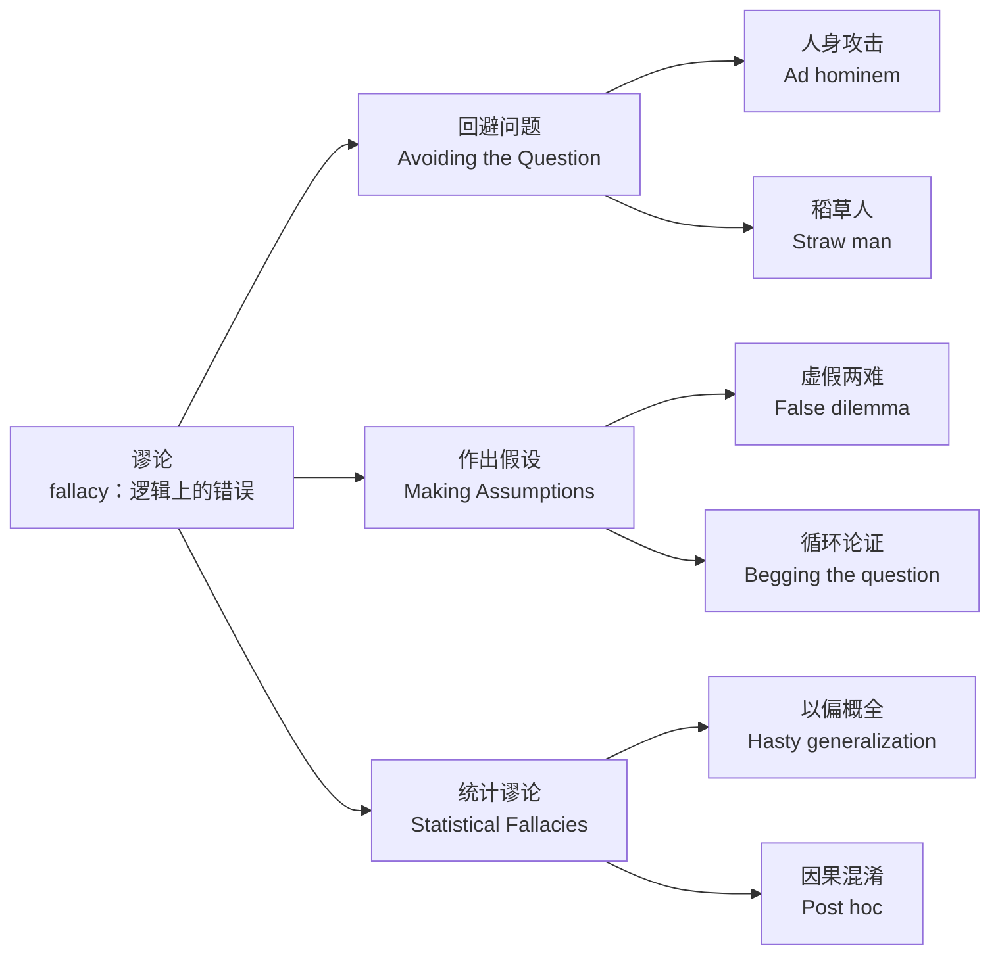

## 导言

什么是谬论？谬论(fallacy)是指逻辑上的错误-------一个人在思维上犯了错误的地方。

什么是逻辑？ 逻辑：用可靠规则从真前提推出真结论的思维工具。

什么是错误？错误就是把不成立的理由当成真理，用来支持一个结论。

我们将推理中最常见的错误分为三个部分： 回避问题（avoiding the question) 作出假设(making assumptions) 统计谬论(statistical fallacies )

## 逻辑学的分支

![[Pasted image 20250816173313.png]]

## 第一部分 好奇心

### 第1课锻炼你的大脑

> 当一个人年纪大了意识到自己的人生是多么短暂时，他开始意识到如果他在人生早期就学会了智慧，那他的人生将是多么的有价值。如果说从这本书中你只能学到一件事，我们想激励你锻炼你的大脑一一不要让它变胖变松弛了。

坏了，那我无论是身体还是精神都有些松弛需要锻炼了

这里的“智慧”不是指书上的知识或考试能考出的聪明，而是一种看清并拆解谬论、识别思维陷阱的“清醒”。它更像是一双经过训练的侦探之眼：  
– 能在纷乱的信息里迅速找出谁在偷换概念、谁在循环论证；  
– 能在看似雄辩的洪流里捕捉到那一丝逻辑裂缝；  
– 能在情绪煽动中保持冷静，把“听起来对”还原成“到底对不对”。  

简单说，这是一种把“我怎么会被这句话忽悠”变成“这句话是怎么忽悠我”的能力。

思考是一项艰苦的工作。只有时常锻炼，用起来才不会痛苦，这是好奇心第一个要素

### 第2课乐于倾听

一个谦虚、乐于倾听的人可能会表现出这些特点：
1.他更喜欢听别人说话，而不是让别人听他说话。谦虚会带来对他人和他人思想的尊重
2.他对自己的观点给予适度的评价
3.当他不懂的时候，他乐意承认自己不懂。当他不理解某些事情时，他就会坦然面对。
4.他愿意质疑自己在某个问题上的立场

乐于倾听的人，就是好奇心的另一个要素

##### 什么是适度的评价?

适度的评价是指基于充分证据、无偏见且比例恰当的判断，既不过分夸大也不刻意贬损，其范围和强度与评价对象的实际属性相匹配。
#### “什么是某个问题的立场” 
**对某个具体议题或问题所持有的明确观点、态度或主张**。  

它通常包含以下要素：  
1. **核心判断**（支持/反对/中立）  
   *例：对“是否应禁止塑料吸管”的立场可能是“支持禁止，因为可减少海洋污染”。*  
2. **理由依据**（事实、价值观、利益权衡）  
   *例：立场背后的科学依据是“塑料微粒危害生态系统”。*  
3. **可能隐含的行动倾向**（倡议、抵制、妥协）  
   *例：立场若极端，可能号召“全面抵制一次性塑料”；若温和，则可能提倡“逐步替代”。*  

**注意区分**：  
- 立场≠事实（“地球升温1.5°C”是事实，“应强制减少碳排放”是立场）。  
- 立场可能因信息变化而调整（如新证据出现）。  

**谬误警示**：  
若有人用“这是公认立场”代替论证，可能犯“诉诸大众”谬误——多数人的立场未必合理。

要区分不乐意倾听和累了/不喜欢吵闹

### 第3课对立的观点

我们听到的观点越多，我们就越能了解全局情况,我们只从这个角度看问题，任何一方似乎都是合乎逻辑的, 对立的观点带来新的信息量，学到新的东西

两个好处：
1. 如果我们错了，就可以改变自己的观点
2. 了解如何为观点辩护，和他人交流自己的观点

了解其他观点是好奇心的一部分

## 第二部分 回避问题

>每当我们在争论中引入一些不相关的东西时，我们就是在回避问题。

红鲱鱼是一种有难闻气味的死鱼，训狗师使用红绯雨的气味影响狗的嗅觉，使狗忽略真实要追踪的目标

在这里的语境中，红鲱鱼是一个无关的话题，它会分散我们对真实问题的注意力。

正在和某人谈论你不同意的事情，过了一段时间，你意识到你不是在讨论你开始讨论的事情。这是因为在争论的某个地方，有人引入了一条红鲱鱼，而你从此就一直在争论这条红鲱鱼。

说不知道，不是红鲱鱼

### 识别红鲱鱼

说的可能没错，但和目标无关系

回答这些问题：
(1)争论的问题是什么？
(2)说话者是否在回答问题，并紧扣主题？如果他不是在回答问题，而是在引入一些不相关的东西，那就特别大声地喊“红鲱鱼

### 第六课诡辩

人们利用红鲱鱼来回避问题，常用双重标准(double standards)逃避。双重标准使他人或其看法受到不公正的对待。

判断是否是双重标准，核心是检查**规则或评判标准是否对“自己人”和“外人”不一致**。  
简化成一句话：**把角色互换，看你还用同一套说法吗？**  

举例：  
- A 迟到你说“真不守时”，B 迟到你说“路上堵车了吧”——把 B 换成 A，若你立刻改口批评，就是双重标准。

表示道理是这样，但自己是个例外，”大多数人不应该抢银行，但我是个例外。我需要钱！“

后退一步，回想为什么这个例外是相关的，是否本分散了对相关稳妥的注意力

P76 