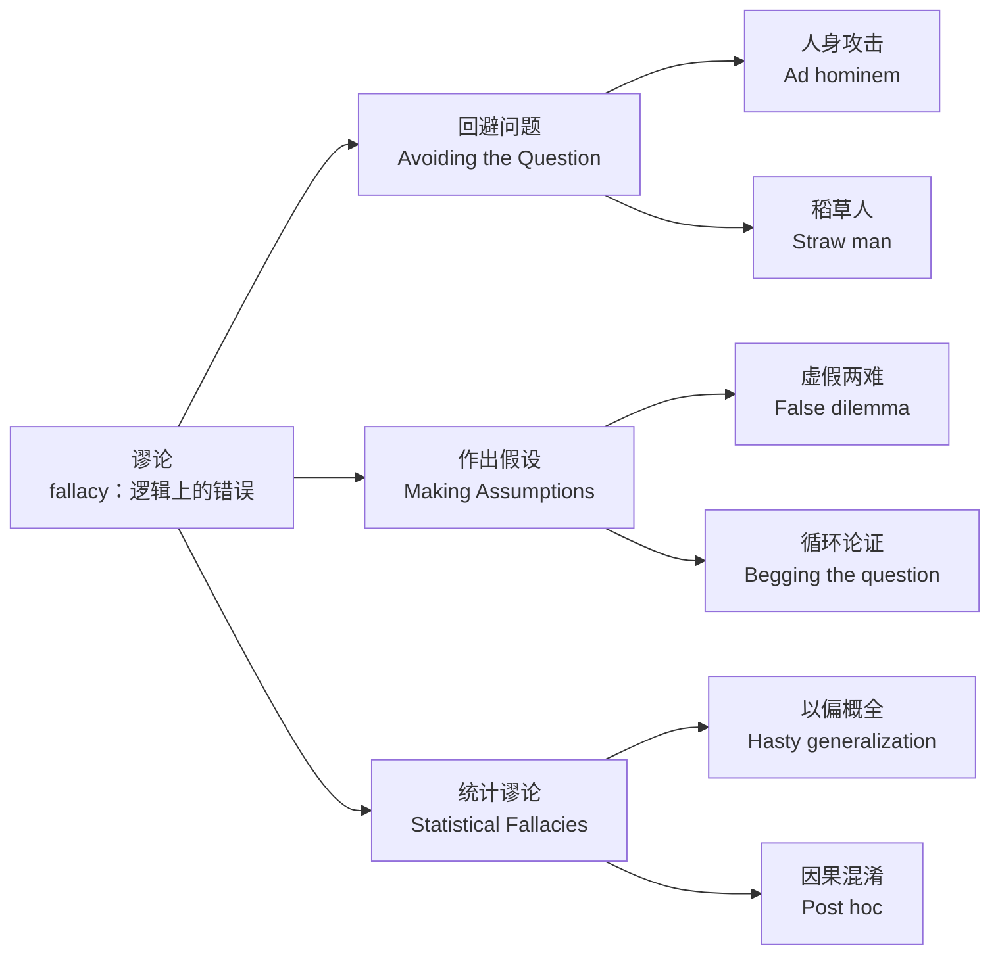

什么是谬论？谬论(fallacy)是指逻辑上的错误-------一个人在思维上犯了错误的地方。

什么是逻辑？ 逻辑：用可靠规则从真前提推出真结论的思维工具。

什么是错误？错误就是把不成立的理由当成真理，用来支持一个结论。

我们将推理中最常见的错误分为三个部分：
回避问题（avoiding the question)
作出假设(making assumptions)
统计谬论(statistical fallacies )

使用mermaid画图总结下上面错误三种部分

## 逻辑学的分支

![[Pasted image 20250816135505.png]]

